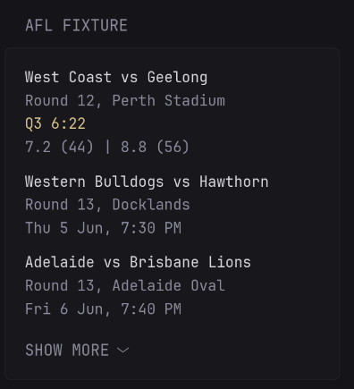

# AFL Widgets

## Fixture
Detailed list of upcoming AFL games including teams, round, venue, and kick-off time. If the game is in progress it shows the current time and score.

In its collapsed (default) state the widget shows the next 3 games, with the option to expand it and view all upcoming games.



```yaml
- type: custom-api
  title: AFL Fixture
  url: https://api.squiggle.com.au/?q=games;complete=!100
  cache: 1m
  template: |
    {{ $games := .JSON.Array "games" }}
    {{ if eq (len $games) 0 }}
      <div>No upcoming AFL games scheduled.</div>
    {{ else }}
      <div class="list list-gap-10 collapsible-container" data-collapse-after="3">
        {{ range $games }}
          <div>
            {{ if ne (.String "hteam") "" }}
              <p class="color-highlight">{{ .String "hteam" }} vs {{ .String "ateam" }}</p>
            {{ else }}
              <p>TBC</p>
            {{ end }}
            <p>{{ .String "roundname" }}, {{ .String "venue" }}</p>

            {{ if ne (.String "timestr") "" }}
              <p class="color-primary">{{ .String "timestr" }}</p>
              <p>{{ .Int "hgoals" }}.{{ .Int "hbehinds" }} ({{ .Int "hscore" }}) | {{ .Int "agoals" }}.{{ .Int "abehinds" }} ({{ .Int "ascore" }})</p>
            {{ else }}
              {{ $layout := "2006-01-02 15:04:05" }}
              {{ $dt := parseLocalTime $layout (.String "date") }}
              <p>{{ formatTime "Mon 2 Jan, 3:04 PM" $dt }}</p>
            {{ end }}
          </div>
        {{ end }}
      </div>
    {{ end }}
```

## Ladder
Displays the current AFL ladder showing points, wins, losses, draws and percentage for each team. The ladder is sorted by points, with teams sharing the same points sorted by percentage.

In its collapsed (default) state the widget shows the top 8 teams, with the option to expand it and view all teams.


```yaml
- type: custom-api
  title: AFL Ladder
  url: https://api.squiggle.com.au/?q=standings
  cache: 15m
  template: |
    {{ $standings := .JSON.Array "standings" }}
    {{ if eq (len $standings) 0 }}
      <div>No standings data available.</div>
    {{ else }}
      <ul class="list collapsible-container" data-collapse-after="8">
        {{ range $i, $team := $standings }}
          <li class="flex items-center {{ if eq $i 0 }}color-primary{{ else if lt $i 8 }}color-highlight{{ end }}">
            <span class="grow min-width-0 text-truncate">
              {{ add $i 1 }}. {{ $team.String "name" }}
            </span>
            <span class="shrink-0 text-right">
              {{$team.Int "pts"}} ({{ $team.Int "wins" }}.{{ $team.Int "losses" }}.{{ $team.Int "draws" }})
              {{ printf "%.1f" ($team.Float "percentage") }}%
            </span>
          </li>
        {{ end }}
      </ul>
    {{ end }}
```