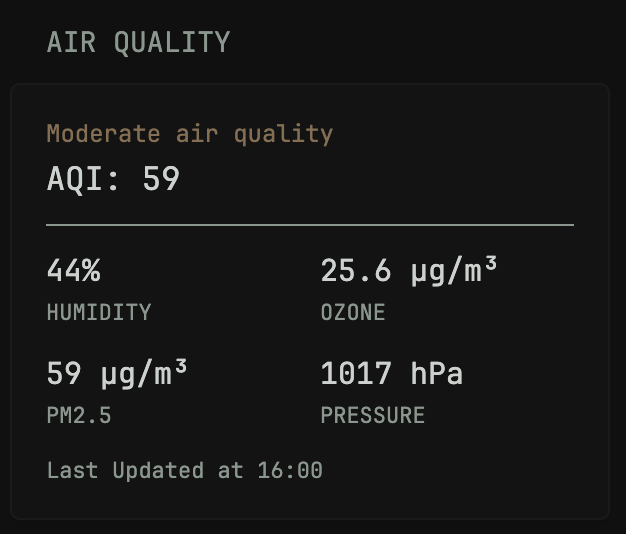

# Air Quality Widget

Displays real-time air quality information from your nearest weather station using data from the World Air Quality Index (WAQI) API.

## Widget Type
`custom-api`

## Features
- Air Quality Index (AQI) rating with dynamic color-coding (Good, Moderate, Bad)
- Humidity
- Ozone (O₃) concentration
- PM2.5 level
- Barometric Pressure
- Last updated timestamp

## Update Frequency
Every 10 minutes (cache: 10m)
Each station varies how often their data is updated.

## Data Source
[World Air Quality Index (WAQI)](https://waqi.info/)

> Note: You’ll need a free WAQI API token to use this widget. Replace `YOUR_TOKEN` in the `url:` with your own token. You can get one from https://aqicn.org/data-platform/token/

## Preview



## How to Use
1. Copy the contents of the file below into your glance.yml file. (This works best as a -size: small widget)
2. Copy your API token from above and place it into the ${YOUR_TOKEN} field.
3. As an exmaple:

For Monterey, California, USA
`url: https://api.waqi.info/feed/geo:36.6002;-121.8947/?token=${YOUR_TOKEN)`

## Note
Make sure your theme has these defined:
- primary-color
- negative-color
- positive-color

```yaml
- type: custom-api
  title: Air Quality
  cache: 10m
  url: https://api.waqi.info/feed/geo:${LAT};${LON}/?token=${YOUR_TOKEN}
  template: |
    {{ $aqi := printf "%03s" (.JSON.String "data.aqi") }}
    {{ $aqiraw := .JSON.String "data.aqi" }}
    {{ $updated := .JSON.String "data.time.iso" }}
    {{ $humidity := .JSON.String "data.iaqi.h.v" }}
    {{ $ozone := .JSON.String "data.iaqi.o3.v" }}
    {{ $pm25 := .JSON.String "data.iaqi.pm25.v" }}
    {{ $pressure := .JSON.String "data.iaqi.p.v" }}

    <div class="flex justify-between">
      <div class="size-h5">
        {{ if le $aqi "050" }}
          <div class="color-positive">Good air quality</div>
        {{ else if le $aqi "100" }}
          <div class="color-primary">Moderate air quality</div>
        {{ else }}
          <div class="color-negative">Bad air quality</div>
        {{ end }}
      </div>
    </div>

    <div class="color-highlight size-h2">AQI: {{ $aqiraw }}</div>
    <div style="border-bottom: 1px solid; margin-block: 10px;"></div>

    <div class="margin-block-2">
      <div style="display: grid; grid-template-columns: 1fr 1fr; gap: 10px;">

        <div>
          <div class="size-h3 color-highlight">{{ $humidity }}%</div>
          <div class="size-h6">HUMIDITY</div>
        </div>

        <div>
          <div class="size-h3 color-highlight">{{ $ozone }} μg/m³</div>
          <div class="size-h6">OZONE</div>
        </div>

        <div>
          <div class="size-h3 color-highlight">{{ $pm25 }} μg/m³</div>
          <div class="size-h6">PM2.5</div>
        </div>

        <div>
          <div class="size-h3 color-highlight">{{ $pressure }} hPa</div>
          <div class="size-h6">PRESSURE</div>
        </div>

      </div>

      <div class="size-h6" style="margin-top: 10px;">Last Updated at {{ slice $updated 11 16 }}</div>
    </div>
```
