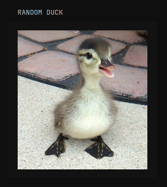

# Animals Display
Simple custom-api widget to display various of animals. Duck as an example. 

**Random Dogs**
```
 - type: custom-api
   height: 200px
   title: Random Dog
   cache: 2m
   url: https://dog.ceo/api/breeds/image/random
   template: |
     </img>
```
**Random Cats**
```
 - type: custom-api
   height: 200px
   title: Random Cat
   cache: 2m
   url: https://cataas.com/cat?json=true
   template: |
     </img>
```
**Random Ducks**
```
 - type: custom-api
   height: 200px
   title: Random Duck
   cache: 2m
   url: https://random-d.uk/api/v2/random
   template: |
     </img>
```
**Random Fox's**
```
- type: custom-api
  height: 200px
  title: Random Fox
  cache: 2m
  url: https://randomfox.ca/floof/?ref=public_apis&utm_medium=website
  template: |
  </img>
```

<hr>
Request more animals via discord: @blue.dev

Made by: Artur Flis
