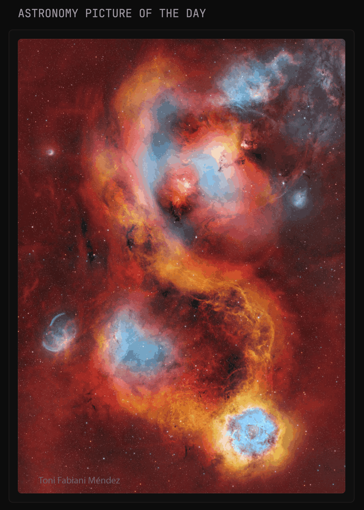
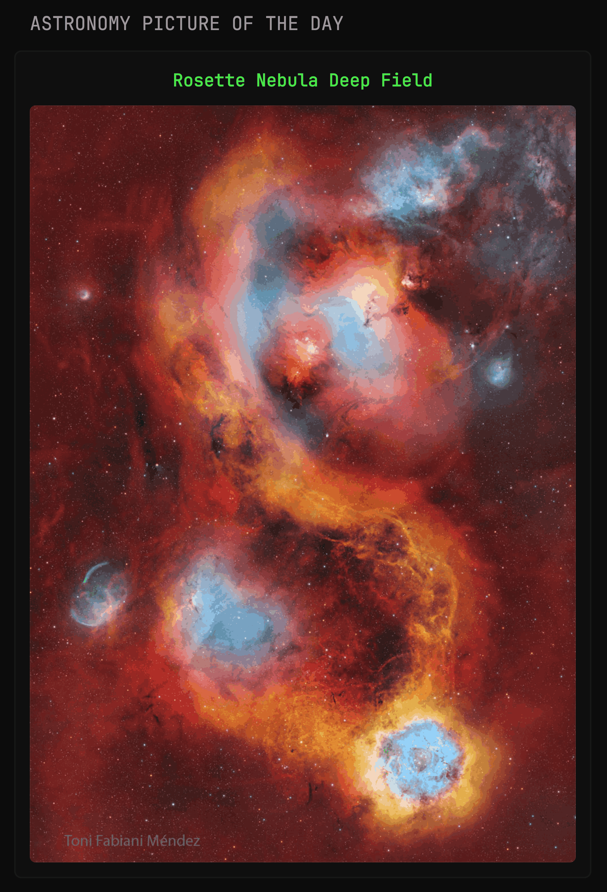
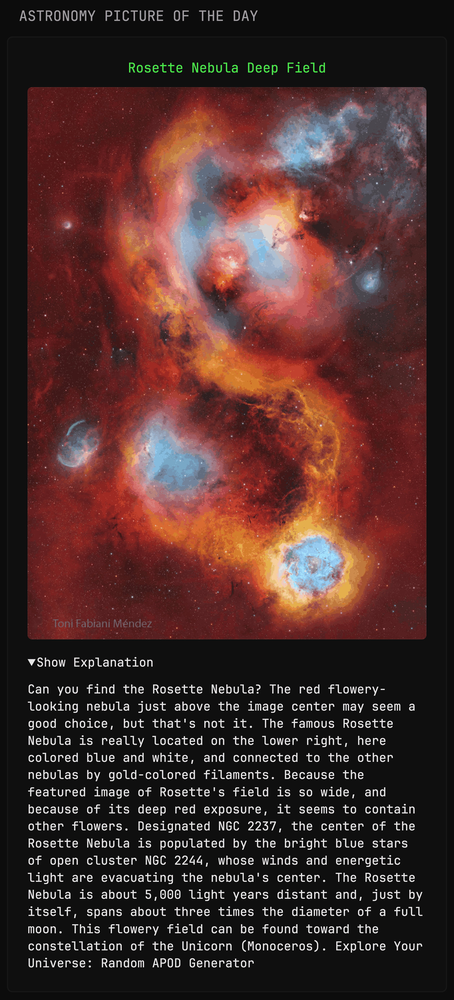

# Astronomy Picture of the Day from NASA

A Glance **custom‑api** widget that pulls NASA’s daily APOD image. Just supply your API key and choose one of three layouts— `image only`, `image + title`, or `image + title + explanation` and you’re set!

## Configuration

Generate a free API key by signing up at [api.nasa.gov](https://api.nasa.gov/) Just provide your `first name`, `last name`, and `email` and you’ll receive your key via email instantly.

Then replace `${NASA_API_KEY}` with your generated API key.

```
url: https://api.nasa.gov/planetary/apod?api_key=${NASA_API_KEY}
```

Cache is set to `cache: 1d` — daily cache, since APOD updates once every 24 hours.

## Variants

Below are three ready‑to‑paste code. Copy the code according to style you want.

### 1) Just Image

**Preview**



**Code**

```
- type: custom-api
  title: Astronomy Picture of the Day
  cache: 1d
  url: https://api.nasa.gov/planetary/apod?api_key=${NASA_API_KEY}
  headers:
    Accept: application/json
  template: |
    {{- if eq (.JSON.String "media_type") "image" -}}
      <div style="display:flex; justify-content:center; align-items:center; width:100%; height:100%;">
        
      </div>
    {{- else -}}
      <p class="color-negative" style="text-align:center;">No image available today.</p>
    {{- end }}
```

### 2) Image with Title

**Preview**



**Code**

```
- type: custom-api
  title: Astronomy Picture of the Day
  cache: 1d
  url: https://api.nasa.gov/planetary/apod?api_key=${NASA_API_KEY}
  headers:
    Accept: application/json
  template: |
    {{- if eq (.JSON.String "media_type") "image" -}}
      <div style="display:flex; flex-direction:column; justify-content:center; align-items:center; width:100%; height:100%;">
        <p class="color-primary" style="margin-bottom:8px; font-weight:bold; text-align:center;">
          <a
            href="https://apod.nasa.gov/apod/astropix.html"
            target="_blank"
            rel="noopener noreferrer"
            style="color: inherit; text-decoration: none;"
          >
            {{ .JSON.String "title" }}
          </a>
        </p>
        
      </div>
    {{- else -}}
      <p class="color-negative" style="text-align:center;">No image available today.</p>
    {{- end }}
```

### 3) Image with Title & Explanation

**Preview**



**Code**

```
- type: custom-api
  title: Astronomy Picture of the Day
  cache: 1d
  url: https://api.nasa.gov/planetary/apod?api_key=${NASA_API_KEY}
  headers:
    Accept: application/json
  template: |
    {{- if eq (.JSON.String "media_type") "image" -}}
      <div style="display:flex; flex-direction:column; align-items:center; width:100%; padding:8px; box-sizing:border-box;">
        <!-- Clickable title -->
        <p class="color-primary" style="margin:0 0 8px; text-align:center;">
          <a 
            href="https://apod.nasa.gov/apod/astropix.html" 
            target="_blank" 
            rel="noopener noreferrer"
            style="color: inherit; text-decoration: none;"
          >
            {{ .JSON.String "title" }}
          </a>
        </p>

        <!-- Image -->
        

        <!-- Explanation dropdown -->
        <details style="width:100%; margin-top:12px;">
          <summary class="color-highlight size-h5" style="cursor:pointer;">
             Show Explanation
          </summary>
          <p class="color-highlight size-h5" style="margin-top:8px; text-align:left; line-height:1.4;">
            {{ .JSON.String "explanation" }}
          </p>
        </details>
      </div>
    {{- else -}}
      <p class="color-negative" style="text-align:center;">
        No image available today.
      </p>
    {{- end }}
```

**Made by: [Saisamarth21](https://github.com/Saisamarth21)**