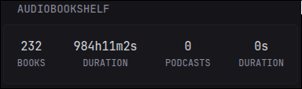

```yaml
- type: custom-api
  title: Audiobookshelf
  title-url: ${AUDIOBOOKSHELF_URL}
  options:
    base-url: ${AUDIOBOOKSHELF_URL}
    api-key: ${AUDIOBOOKSHELF_KEY}
  cache: 5m
  template: |
    {{ $baseURL := .Options.StringOr "base-url" "" }}
    {{ $apiKey := .Options.StringOr "api-key" "" }}

    {{ define "errorMsg" }}
      <div class="widget-error-header">
        <div class="color-negative size-h3">ERROR</div>
        <svg class="widget-error-icon" xmlns="http://www.w3.org/2000/svg" fill="none" viewBox="0 0 24 24" stroke-width="1.5">
          <path stroke-linecap="round" stroke-linejoin="round" d="M12 9v3.75m-9.303 3.376c-.866 1.5.217 3.374 1.948 3.374h14.71c1.73 0 2.813-1.874 1.948-3.374L13.949 3.378c-.866-1.5-3.032-1.5-3.898 0L2.697 16.126ZM12 15.75h.007v.008H12v-.008Z"></path>
        </svg>
      </div>
      <p class="break-all">{{ . }}</p>
    {{ end }}

    {{ $bearer := printf "Bearer %s" $apiKey }}
    {{ $librariesRequestURL := concat $baseURL "/api/libraries" }}
    {{ $librariesResponse := newRequest $librariesRequestURL
      | withHeader "Content-Type" "application/json"
      | withHeader "Authorization" $bearer
      | getResponse }}

    {{ if $librariesResponse.JSON.Exists "libraries" }}
      {{ $all_libraries := $librariesResponse.JSON.Array "libraries" }}

      {{ $books_count := 0 }}
      {{ $books_duration := 0 }}
      {{ $podcasts_count := 0 }}
      {{ $podcasts_duration := 0 }}

      {{ range $library := $all_libraries }}
        {{ $lib_id := $library.String "id" }}
        {{ $lib_request_url := concat $baseURL "/api/libraries/" $lib_id "/stats"}}
        {{ $lib_stats := newRequest $lib_request_url
          | withHeader "Content-Type" "application/json"
          | withHeader "Authorization" $bearer
          | getResponse }}
        {{ $lib_type := $library.String "mediaType" }}
        {{ $lib_item_count := $lib_stats.JSON.Int "totalItems" }}
        {{ $lib_total_duration := $lib_stats.JSON.Int "totalDuration" }}
        {{ if eq $lib_type "book" }}
          {{ $books_count = add $books_count $lib_item_count }}
          {{ $books_duration = add $books_duration $lib_total_duration }}
        {{ else if eq $lib_type "podcast" }}
          {{ $podcasts_count = add $podcasts_count $lib_item_count }}
          {{ $podcasts_duration = add $podcasts_duration $lib_total_duration }}
        {{ end }}
      {{ end }}

      {{ $books_duration = duration (concat (printf "%d" $books_duration) "s") }}
      {{ $podcasts_duration = duration (concat (printf "%d" $podcasts_duration) "s") }}

      <div class="flex flex-column gap-5">
        <div class="flex justify-between text-center">
          <div>
            <div class="color-highlight size-h3">{{ $books_count }}</div>
            <div class="size-h5 uppercase">Books</div>
          </div>
          <div>
            <div class="color-highlight size-h3">{{ $books_duration }}</div>
            <div class="size-h5 uppercase">Duration</div>
          </div>
          <div>
            <div class="color-highlight size-h3">{{ $podcasts_count }}</div>
            <div class="size-h5 uppercase">Podcasts</div>
          </div>
          <div>
            <div class="color-highlight size-h3">{{ $podcasts_duration }}</div>
            <div class="size-h5 uppercase">Duration</div>
          </div>
        </div>
      </div>
    {{ else }}
      {{ template "errorMsg" "Could not fetch data from API!" }}
    {{ end }}
```

## Environment variables

- `AUDIOBOOKSHELF_URL` - the URL of the Audiobookshelf server (for example: https://audiobookshelf.example.org)
- `AUDIOBOOKSHELF_KEY` - the API key of the server which can be found in the `Admininterface -> go to the config -> users page, and click on your account.`
