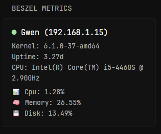
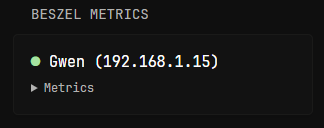

# Beszel Metrics


Collapsible Option Turned ON


## Configuration
### 1. Grab your API token
To setup Beszel API grabbing your token is required, to get it use a command below. Remember to replace `USERNAME`, `PASSWORD` and `IP:PORT`
```sh
curl -X POST "http://IP:PORT/api/collections/users/auth-with-password" \
  -H "Content-Type: application/json" \
  -d '{"identity":"USERNAME","password":"PASSWORD"}'
```
### 2. Set your env variables
Beszel token can be find under: `"token":"XXXXXXX"` from the curl reply. 
```yaml
BESZEL_URL=IP:PORT
BESZEL_TOKEN=GET_FROM_POINT_1
```
### 3. Use beszel code
```yaml
- type: custom-api
  title: Beszel Metrics
  url: http://${BESZEL_URL}/api/collections/systems/records
  method: GET
  options:
    redirect-url: "" # You must use "" and http:// or https://
  headers:
    Authorization: Bearer ${BESZEL_TOKEN}
    Accept: application/json
  template: |
    {{ $redirect := .Options.StringOr "redirect-url" "" }}
    {{ $newTab := .Options.BoolOr "in-new-tab" false }}
    {{ $hideKernel := .Options.BoolOr "hide-kernel" false }}
    {{ $hideUptime := .Options.BoolOr "hide-uptime" false }}
    {{ $hideCPUInfo := .Options.BoolOr "hide-cpu-info" false }}
    {{ $hideIP := .Options.BoolOr "hide-ip" false }}
    {{ $collapsible := .Options.BoolOr "collapsible" false }}
    {{ $items := .JSON.Array "items" }}
    {{ range $items }}
      {{ $info := .Get "info" }}
      {{ $name := .String "name" }}
      {{ $link := "" }}
      {{ if ne $redirect "" }}
        {{ $link = printf "%s/system/%s" $redirect $name }}
      {{ end }}
      <div style="font-size: 1.15em;">
        {{ if eq (.String "status") "up" }}
          <span class="status-dot color-positive">●</span>
        {{ else }}
          <span class="status-dot color-negative">●</span>
        {{ end }}
        {{ if ne $redirect "" }}
          <a class="color-highlight text-truncate" href="{{ printf "%s/system/%s" $redirect $name | safeURL }}" {{ if $newTab }}target="_blank" rel="noopener"{{ end }}>
            {{ $name }}{{ if not $hideIP }} ({{ .String "host" }}){{ end }}
          </a>
        {{ else }}
          <span class="color-highlight text-truncate">
            {{ $name }}{{ if not $hideIP }} ({{ .String "host" }}){{ end }}
          </span>
        {{ end }}
      </div>
      {{ if $collapsible }}
        <details class="margin-top-5">
          <summary class="size-h5 color-subtle" style="cursor: pointer;">Metrics</summary>
          <div class="margin-top-5">
            {{ if not $hideKernel }}
              <p style="font-size: 1em;">Kernel: {{ $info.String "k" }}</p>
            {{ end }}
            {{ if not $hideUptime }}
              {{ $uptimeSec := $info.Float "u" }}
              {{ if ge $uptimeSec 86400.0 }}
                <p style="font-size: 1em;">Uptime: {{ printf "%.2f" (mul $uptimeSec 0.000011574) }}d</p>
              {{ else }}
                <p style="font-size: 1em;">Uptime: {{ printf "%.2f" (mul $uptimeSec 0.000277778) }}h</p>
              {{ end }}
            {{ end }}
            {{ if not $hideCPUInfo }}
              <p style="font-size: 1em;">CPU: {{ replaceAll "CPU " "" ($info.String "m") }}</p>
            {{ end }}
            <p style="font-size: 1em; margin-top: 0.5em;">📊 Cpu: {{ $info.Float "cpu" }}%</p>
            <p style="font-size: 1em;">🧠 Memory: {{ $info.Float "mp" }}%</p>
            <p style="font-size: 1em;">💾 Disk: {{ $info.Float "dp" }}%</p>
          </div>
        </details>
      {{ else }}
        <div class="margin-top-5">
          {{ if not $hideKernel }}
            <p style="font-size: 1em;">Kernel: {{ $info.String "k" }}</p>
          {{ end }}
          {{ if not $hideUptime }}
            {{ $uptimeSec := $info.Float "u" }}
            {{ if ge $uptimeSec 86400.0 }}
              <p style="font-size: 1em;">Uptime: {{ printf "%.2f" (mul $uptimeSec 0.000011574) }}d</p>
            {{ else }}
              <p style="font-size: 1em;">Uptime: {{ printf "%.2f" (mul $uptimeSec 0.000277778) }}h</p>
            {{ end }}
          {{ end }}
          {{ if not $hideCPUInfo }}
            <p style="font-size: 1em;">CPU: {{ replaceAll "CPU " "" ($info.String "m") }}</p>
          {{ end }}
          <p style="font-size: 1em; margin-top: 0.5em;">📊 Cpu: {{ $info.Float "cpu" }}%</p>
          <p style="font-size: 1em;">🧠 Memory: {{ $info.Float "mp" }}%</p>
          <p style="font-size: 1em;">💾 Disk: {{ $info.Float "dp" }}%</p>
        </div>
      {{ end }}
    {{ end }}
```
### 4. Set up options
`redirect-url` - Where clicking your server name will redirect you to - format `https://example.com`

`in-new-tab` - Link should be oppened in new tab or not

`hide-kernel` - Hide kernel info

`hide-uptime` - Hide uptime info

`hide-cpu-info` - Hide CPU info

`hide-ip` - Hide server IP from the title

`collapsible` - Show metrics info in collapsible form
