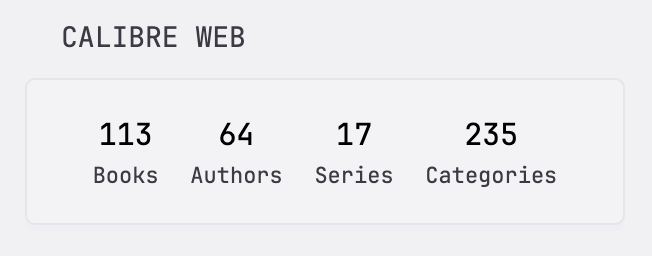

```yaml
- type: custom-api
    title: Calibre Web
    url: ${CALIBREWEB_URL}/opds/stats
    headers:
        Authorization: Basic ${CALIBREWEB_CREDS_B64}
    template: |
        <div class="flex justify-evenly text-center">
            <div>
                <div class="color-highlight size-h3">{{ .JSON.Int "books" | formatNumber }}</div>
                <div class="size-h6">Books</div>
            </div>
            <div>
                <div class="color-highlight size-h3">{{ .JSON.Int "authors" | formatNumber }}</div>
                <div class="size-h6">Authors</div>
            </div>
            <div>
                <div class="color-highlight size-h3">{{ .JSON.Int "series" | formatNumber }}</div>
                <div class="size-h6">Series</div>
            </div>
            <div>
                <div class="color-highlight size-h3">{{ .JSON.Int "categories" | formatNumber }}</div>
                <div class="size-h6">Categories</div>
            </div>
        </div>
```

## Environment variables

`CALIBREWEB_URL` - the URL of your Calibre-Web instance, including the `http://`/`https://` prefix.
`CALIBREWEB_CREDS_B64` - Calibre username and password encoded with Base64.

Example:

```ini
CALIBREWEB_URL=https://calibre.mydomain.com
CALIBREWEB_CREDS_B64=Ym9iOmh1bnRlcjIK
```

## Remarks

You can use the [base64](https://linux.die.net/man/1/base64) utility or any other tool to encode.

```sh
# using base64: echo 'username:password' | base64
> echo 'bob:hunter2' | base64
Ym9iOmh1bnRlcjIK

# using openssl: openssl enc -base64 <<< 'username:password'
> openssl enc -base64 <<< 'bob:hunter2'
Ym9iOmh1bnRlcjIK

```
