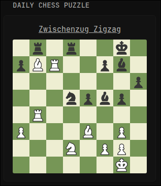

# Daily chess.com puzzle


Simple widget for displaying daily puzzle from chess.com website. 

```
        - type: custom-api
          title: Daily Chess Puzzle
          cache: 6h
          url: https://api.chess.com/pub/puzzle
          template: |
            <div style="text-align: center;">
              <h3 style="font-size: 1.5rem; margin: 0 0 8px 0;">
                <a href="{{ .JSON.String "url" }}" target="_blank" style="text-decoration: underline;">
                  {{ .JSON.String "title" }}
                </a>
              </h3>
              
            </div>
```
