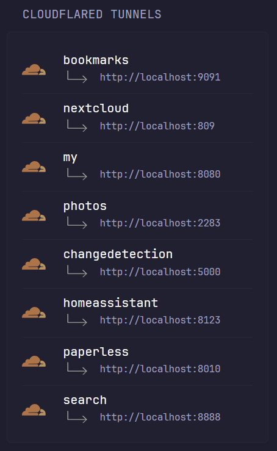

# Cloudflare tunnels
External and local links to your cloudflare tunnels. Theme is consistant with inbuild `Docker Containers` widget.



```yaml
- type: custom-api
  title: Cloudflared Tunnels
  css-class: "widget-type-cloudflared"
  cache: 4h
  url: https://api.cloudflare.com/client/v4/accounts/${CLOUDFLARE_ACCOUNT_ID}/cfd_tunnel/${CLOUDFLARE_TUNNEL_ID}/configurations
  headers:
    Authorization: Bearer ${CLOUDFLARE_API_KEY}
  template: |
    {{ $domain_name := ".example.com" }}  {{/* Set your domain name */}}

    <style>
      .widget-type-cloudflared li {
        margin-top: var(--list-half-gap); 
        border-top: 1px solid var(--color-separator);
        padding-top: var(--list-half-gap);
      }
    </style>
    <ul class="dynamic-columns list-gap-15 list-with-separator">
    {{ range .JSON.Array "result.config.ingress" }}
      {{ if (.String "hostname") }}
      <li class="flex items-center gap-20">
          <div class="shrink-0">
              
          </div>
          <div class="min-width-0 grow">
            <a href='https://{{ .String "hostname" }}' class="color-highlight size-title-dynamic block text-truncate" target="_blank" rel="noreferrer">{{ .String "hostname" | trimSuffix $domain_name }}</a>
            {{ if (.String "service") }}
            <div class="flex items-center gap-10" style="margin-bottom: 5px">
              <div class="text-left">
                
              </div>
              <div class="size-h6 flex-1 text-left">
                <a href='{{ .String "service" | replaceAll "localhost" "192.168.0.150" }}' target="_blank" rel="noreferrer">{{ .String "service" }}</a>
              </div>
            </div>
            {{ end}}
          </div>
      </li>
      {{ end }}
    {{ end }}
    </ul>
```

## Environment variables
- `CLOUDFLARE_ACCOUNT_ID` - Cloudflare Account ID
- `CLOUDFLARE_TUNNEL_ID` - Cloudflare Tunnel ID
- `CLOUDFLARE_API_KEY` - Cloudflare API Key

## Assets
Upload to your glance `assets` folder.

1. <a href="link-down-right.png">img/link-down-right.png</a> file