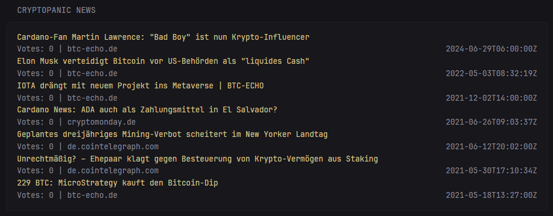
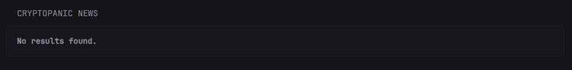
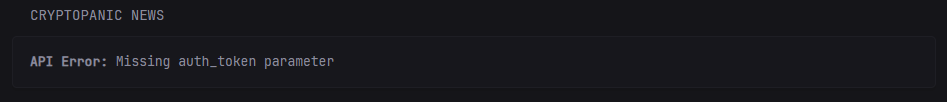

# CryptoPanic News Widget

This widget displays cryptocurrency news from CryptoPanic.com, allowing you to stay updated with the latest crypto news based on various filters and parameters.

## Features
- Real-time cryptocurrency news updates
- Configurable filters for news type (hot, rising, bullish, bearish, important)
- Region-based filtering
- Currency-specific news filtering
- Vote count display
- Collapsible news list

## Widget Configuration

### Basic Setup
```yaml
- type: custom-api
  title: CryptoPanic News
  url: https://cryptopanic.com/api/v1/posts/?auth_token=${CRYPTOPANIC_TOKEN}&public=true&filter=${filter}&currencies=${currencies}&regions=${regions}&kind=${kind}
  cache: 1h  # Reduced cache for real-time filtering
  parameters:
    auth_token: ${CRYPTOPANIC_TOKEN}
    #filter: hot # Options: rising|hot|bullish|bearish|important
    #currencies: "SOL" # Example: BTC,ETH for multiple currencies
    #regions: de # Example: en,de for multiple regions
    #kind: "" # Optional: news|media
  template: |
    <div class="stack gap-2">
      {{ if .JSON.Array "results" }}
        <ul class="list collapsible-container" data-collapse-after="10">
          {{ range .JSON.Array "results" }}
            <li class="list-item">
              <div class="flex items-center gap-1">
              <a href="{{ .String "url" }}" target="_blank" class="text-truncate-2 color-primary-if-not-visited">
                {{ .String "title" }}
              </a>
              </div>
              <div class="flex justify-between text-sm">
                <span>Votes: {{ .Int "votes" }} | {{ .String "domain" }}</span>
                <span>{{ .String "published_at" }}</span>
              </div>
            </li>
          {{ end }}
        </ul>
      {{ else }}
          {{ if .JSON.Array "info" }}
            <div class="alert alert-error">
              <strong>API Error:</strong> {{ .JSON.String "info" }}
            </div>
          {{ else }}
            <div class="alert alert-warning">
              <strong>No results found.</strong>
            </div>
          {{ end }}
      {{ end }}
    </div>
```

### Parameters

| Parameter | Description | Example Values |
|-----------|-------------|----------------|
| filter | News filter type | hot, rising, bullish, bearish, important |
| currencies | Comma-separated cryptocurrency codes | BTC,ETH,SOL |
| regions | Language/region codes | en,de |
| kind | Content type filter (optional) | news, media |

## Environment Variables

Required environment variable:
- `CRYPTOPANIC_TOKEN`: Your CryptoPanic API authentication token (get it from CryptoPanic.com)

Add this to your `.env` file:
```env
CRYPTOPANIC_TOKEN=your_cryptopanic_api_token_here
```
**Note**: Keep your `.env` file secure and never commit it to version control.

## Known Issues

There appears to be a bug when using filters together with the auth_token parameter. Current workarounds:

1. Using auth_token in the URL instead of parameters (recommended)
2. Removing specific filters
3. Adjusting region settings

## Display States

The widget has three possible display states:

1. **Normal Display**: Shows news items when data is successfully retrieved

   

2. **No Results**: Shows a warning message when no news items are found

   

3. **API Error**: Displays an error message when API encounters an issue
   
   

## Cache Configuration

The widget uses a 1-hour cache to balance between real-time updates and API rate limits:
```yaml
cache: 1h
```

For more information about the CryptoPanic API, visit [CryptoPanic.com](https://cryptopanic.com/).

