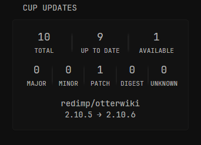

# Cup Updates Widget Documentation

## Overview

The Cup Updates widget provides a dashboard interface to monitor container update status across your Docker environment. It displays summary statistics and detailed information about containers that need updates.

[](./preview.png)
## Features

- **Quick Status Overview**: View total monitored images, up-to-date images, and available updates at a glance
- **Update Type Breakdown**: See the distribution of updates by type (Major, Minor, Patch, Digest, Unknown)
- **Container Details**: For each container with available updates, view:
  - Container repository name with link to source (Docker Hub, GitHub, etc.)
  - Current version and new version
  - Digest information when available

## Setup

### Configuration

Add the following to your dashboard configuration:

```yaml
- type: custom-api
  title: Cup Updates
  cache: 1h
  url: http://${CUP_URL}/api/v3/json
  method: GET
  template: |
    {{ $defaultServerName := "Glance" }}  {{/* Set your default server name here */}}
    {{ $showUpdateKind := true }}  {{/* Toggle this to false to hide the Update Kind row */}}

    <style>
      .vertical-separator-cup {
        width: 3px;
        height: 3.5rem;
        margin: 0 1rem;
        border-radius: 2px;
        align-self: center;
        background: linear-gradient(to bottom, transparent, rgba(255,255,255,0.05) 20%, rgba(255,255,255,0.05) 80%, transparent);
      }
      .container-list-cup li {
        text-align: center;
        margin-top: 1.5rem;
      }
      .container-list-cup {
        padding: 0;
        margin: 0;
        line-height: 1.2;
      }
      .container-list-cup a {
        text-decoration: none;
        display: block;
        padding: 1px 0;
        font-size: 1.1rem;
        margin-top: 1rem;
      }
      .status-values-cup {
        font-size: 1.8rem;
      }
    </style>

    <div class="flex flex-column gap-4">
      <div class="flex items-center text-center">
        <div class="flex-1">
          <div class="status-values-cup size-h3">{{ .JSON.Int "metrics.monitored_images" }}</div>
          <div class="size-h6">TOTAL</div>
        </div>
        <div class="vertical-separator-cup"></div>
        <div class="flex-1">
          <div class="status-values-cup size-h3">{{ .JSON.Int "metrics.up_to_date" }}</div>
          <div class="size-h6">UP TO DATE</div>
        </div>
        <div class="vertical-separator-cup"></div>
        <div class="flex-1">
          <div class="status-values-cup size-h3">{{ .JSON.Int "metrics.updates_available" }}</div>
          <div class="size-h6">AVAILABLE</div>
        </div>
      </div>

      {{ if $showUpdateKind }}
        <div class="flex items-center text-center" style="margin-top: 1rem;">
          <div class="flex-1">
            <div class="status-values-cup size-h3">{{ .JSON.Int "metrics.major_updates" }}</div>
            <div class="size-h6">MAJOR</div>
          </div>
          <div class="vertical-separator-cup" style="width: 2px; margin: 0 0.25rem;"></div>
          <div class="flex-1">
            <div class="status-values-cup size-h3">{{ .JSON.Int "metrics.minor_updates" }}</div>
            <div class="size-h6">MINOR</div>
          </div>
          <div class="vertical-separator-cup" style="width: 2px; margin: 0 0.25rem;"></div>
          <div class="flex-1">
            <div class="status-values-cup size-h3">{{ .JSON.Int "metrics.patch_updates" }}</div>
            <div class="size-h6">PATCH</div>
          </div>
          <div class="vertical-separator-cup" style="width: 2px; margin: 0 0.25rem;"></div>
          <div class="flex-1">
            <div class="status-values-cup size-h3">{{ .JSON.Int "metrics.other_updates" }}</div>
            <div class="size-h6">DIGEST</div>
          </div>
          <div class="vertical-separator-cup" style="width: 2px; margin: 0 0.25rem;"></div>
          <div class="flex-1">
            <div class="status-values-cup size-h3">{{ .JSON.Int "metrics.unknown_updates" }}</div>
            <div class="size-h6">UNKNOWN</div>
          </div>
        </div>
      {{ end }}

      <div class="container-list-cup">
        <ul class="list list-gap-10-cup collapsible-container" data-collapse-after="3">
          {{ $hasUpdates := false }}
          {{ range .JSON.Array "images" }}
            {{ if .Bool "result.has_update" }}
              {{ $hasUpdates = true }}
              <li>
                {{ $registry := .String "parts.registry" }}
                {{ $repository := .String "parts.repository" }}
                {{ $url := "#" }}

                {{ if eq $registry "registry-1.docker.io" }}
                  {{ $url = printf "https://hub.docker.com/r/%s" $repository }}
                {{ else if eq $registry "ghcr.io" }}
                  {{ $url = printf "https://github.com/%s" $repository }}
                {{ else if eq $registry "lscr.io" }}
                  {{ if .String "url" }}
                    {{ $url = .String "url" }}
                  {{ else }}
                    {{ $url = printf "https://fleet.linuxserver.io/%s" $repository }}
                  {{ end }}
                {{ end }}

                <a class="block text-truncate" href="{{ $url }}" target="_blank" rel="noreferrer" style="font-size: 1.47rem;">{{ $repository }}</a>

                {{ $currentVersion := .String "result.info.current_version" }}
                {{ $newVersion := .String "result.info.new_version" }}
                {{ $localDigests := .Array "result.info.local_digests" }}
                {{ $remoteDigest := .String "result.info.remote_digest" }}
                {{ $serverName := .String "server" }}

                {{ if or (eq $serverName "") (eq $serverName "null") (not $serverName) }}
                  {{ $serverName = $defaultServerName }}
                {{ end }}

                <div style="margin: 0.5rem 0; font-size: 1rem; color: #6c757d;">
                  Server: {{ $serverName }}
                </div>

                {{ if and $currentVersion $newVersion }}
                  <div style="margin: 0.2rem 0;">
                    <span>{{ $currentVersion }}</span>
                    <span> → </span>
                    <span class="size-h4 color-positive">{{ $newVersion }}</span>
                  </div>
                {{ end }}

                {{ if $localDigests }}
                  {{ $digest := index $localDigests 0 }}
                  {{ $digestStr := printf "%s" $digest }}
                  {{ $remoteDigestStr := printf "%s" $remoteDigest }}

                  {{ $shortLocal := slice $digestStr 8 14 }}
                  {{ $shortRemote := slice $remoteDigestStr 7 13 }}

                  <div class="flex gap-10 justify-center items-center" style="margin-top: 0.5rem;">
                    <span>Dig: {{ $shortLocal }}</span>
                    <span>→</span>
                    <span class="size-h4">Dig: <span class="color-positive">{{ $shortRemote }}</span></span>
                  </div>
                {{ end }}
              </li>
            {{ end }}
          {{ end }}

          {{ if not $hasUpdates }}
            <div class="flex items-center justify-center">
              <span class="color-positive size-h4">All images are up to date!</span>
            </div>
          {{ end }}
        </ul>
      </div>
    </div>
```

### Environment Variables

- `CUP_URL`: The IP address or hostname of your Cup Update server
  - Example: `CUP_URL=IP:PORT`

## Customization Options

### Toggle Update Type Display

You can show or hide the update types section (Major, Minor, Patch, Digest, Unknown) by changing the `$showUpdateKind` variable:

```
{{ $showUpdateKind := true }}  {{/* Toggle this to false to hide the Update Kind row */}}
```

- Set to `true` to show the update type breakdown (default)
- Set to `false` to hide this section for a more compact view

## Understanding the Display

### Status Indicators

- **TOTAL**: Total number of monitored container images
- **UP TO DATE**: Number of images running the latest version
- **AVAILABLE**: Number of images with updates available

### Update Types

- **MAJOR**: Number of images with major version updates (e.g., v1.x → v2.x)
- **MINOR**: Number of images with minor version updates (e.g., v1.1 → v1.2)
- **PATCH**: Number of images with patch updates (e.g., v1.1.1 → v1.1.2)
- **DIGEST**: Number of images with digest changes but no version change
- **UNKNOWN**: Number of images with unclassified update types

<hr>

**Created by:**
- [**Artur Flis**](https://github.com/panonim) - Updated the code to make it accessible for everyone added styling and made bug fixes.
- [**Gaodes**](https://github.com/gaodes) – Base of the code.

**Contact:** @blue.dev on the project’s Discord
