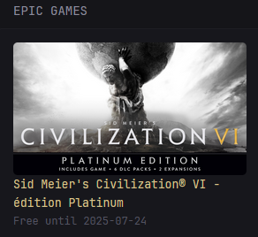

# Epic Games Free Games Widget Documentation

## Overview

The Epic Games Free Games widget displays the current free games available on the Epic Games Store. It shows game titles, promotional images, and availability periods for currently free games.



## Features

- **Free Games Display**: View all currently free games from Epic Games Store
- **Game Information**: For each free game, see:
  - Game title and promotional image
  - Direct link to the game's Epic Games Store page
  - Availability period (when the promotion ends)
- **Responsive Design**: Cards layout that adapts to different screen sizes
- **Real-time Updates**: Automatically fetches the latest free games promotions

## Setup

### Configuration

Add the following to your dashboard configuration:

```yaml
- type: custom-api
  title: Epic Games
  cache: 1h
  url: https://store-site-backend-static.ak.epicgames.com/freeGamesPromotions?locale=en&country=US&allowCountries=US
  template: |
    <div>
      {{ if eq .Response.StatusCode 200 }}
        <div class="horizontal-cards-2">
          {{ range .JSON.Array "data.Catalog.searchStore.elements" }}
            {{ $price := .String "price.totalPrice.discountPrice" }}
            {{ $hasPromo := gt (len (.Array "promotions.promotionalOffers")) 0 }}
            {{ if and $hasPromo (eq $price "0") }}
              <a href="https://store.epicgames.com/en-US/p/{{ .String "productSlug" }}" target="_blank" class="card">
                {{ $title := .String "title" }}
                {{ range .Array "keyImages" }}
                  {{ if eq (.String "type") "OfferImageWide" }}
                    
                  {{ end }}
                {{ end }}
                <div class="card-content">
                  <span class="size-base color-primary">{{ $title }}</span><br>
                  <span class="size-h5 color-subdue">
                    {{ if $hasPromo }}
                      {{ $promotions := .Array "promotions.promotionalOffers" }}
                      {{ if gt (len $promotions) 0 }}
                        {{ $firstPromo := index $promotions 0 }}
                        {{ $offers := $firstPromo.Array "promotionalOffers" }}
                        {{ if gt (len $offers) 0 }}
                          {{ $firstOffer := index $offers 0 }}
                          Free until {{ slice ($firstOffer.String "endDate") 0 10 }}
                        {{ else }}
                          Free this week!
                        {{ end }}
                      {{ else }}
                        Free this week!
                      {{ end }}
                    {{ end }}
                  </span>
                </div>
              </a>
            {{ end }}
          {{ end }}
        </div>
      {{ else }}
        <p class="color-negative">Error fetching Epic Games data.</p>
      {{ end }}
    </div>
```

### Configuration Options

You can customize the widget by modifying the following parameters in the URL:

- `locale`: Language/region code (e.g., `en`, `fr`, `de`, `es`)
- `country`: Country code for regional pricing and availability (e.g., `US`, `FR`, `DE`, `ES`)
- `allowCountries`: Comma-separated list of allowed countries

#### Examples for Different Regions

**French (France):**
```yaml
url: https://store-site-backend-static.ak.epicgames.com/freeGamesPromotions?locale=fr&country=FR&allowCountries=FR
```

**German (Germany):**
```yaml
url: https://store-site-backend-static.ak.epicgames.com/freeGamesPromotions?locale=de&country=DE&allowCountries=DE
```

**Spanish (Spain):**
```yaml
url: https://store-site-backend-static.ak.epicgames.com/freeGamesPromotions?locale=es&country=ES&allowCountries=ES
```

### Cache Settings

The widget uses a 1-hour cache (`cache: 1h`) to avoid excessive API calls to Epic Games servers. You can adjust this value:

- `cache: 30m` for 30 minutes
- `cache: 2h` for 2 hours
- `cache: 6h` for 6 hours

## Understanding the Display

### Game Cards

Each free game is displayed as a card containing:

- **Game Image**: Promotional artwork from Epic Games Store
- **Game Title**: Name of the free game
- **Availability**: Shows when the free promotion ends
- **Clickable Link**: Direct link to claim the game on Epic Games Store

### Error Handling

If the Epic Games API is unavailable or returns an error, the widget will display:
- Error message indicating the issue
- Red text styling to highlight the problem

## Troubleshooting

### No Games Displayed

- Check if there are currently any free games available on Epic Games Store
- Verify your internet connection
- Ensure the Epic Games API is accessible from your network

### Regional Issues

- Make sure the `country` and `allowCountries` parameters match your region
- Some games may not be available in all regions due to licensing restrictions

<hr>

**Created by:** [**marocainperdu**](https://github.com/marocainperdu)