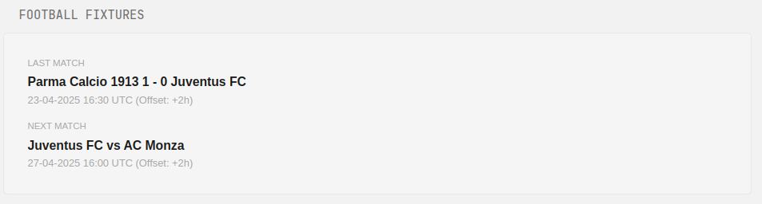

```yaml
- type: custom-api
  title: Football Fixtures
  cache: 30m

  url: https://api.football-data.org/v4/teams/${TEAM_ID}/matches?status=SCHEDULED,FINISHED

  headers:
    X-Auth-Token: ${FOOTBALL_DATA_TOKEN}

  template: |
    <div class="football-fixtures" style="font-family: sans-serif; padding: 10px;">
      {{ $timezoneOffsetHours := ${TZ_OFFSET_HOURS} }}

      {{ $jsonData := .JSON }}
      {{ $matches := $jsonData.Array "matches" }}
      {{ $matchCount := len $matches }}

      {{/* --- Last Match --- */}}
      <div style="margin-bottom: 12px;">
        <div class="color-subdue" style="font-size: 0.8em; margin-bottom: 2px; text-transform: uppercase;">Last Match</div>
        {{ $lastFound := false }}
        {{ $lastHomeTeam := "N/A" }}
        {{ $lastAwayTeam := "N/A" }}
        {{ $lastHomeScore := "?" }}
        {{ $lastAwayScore := "?" }}
        {{ $lastDate := "N/A" }}

        {{ range $matches }}
          {{ $matchData := .Value }} {{/* Get underlying map/object */}}
          {{ $status := index $matchData "status" }}
          {{ if and $status (eq ($status | printf "%s") "FINISHED") }}
            {{ $lastFound = true }}

            {{ $homeTeamObj := index $matchData "homeTeam" }}
            {{ $awayTeamObj := index $matchData "awayTeam" }}
            {{ if $homeTeamObj }}{{ $lastHomeTeam = index $homeTeamObj "name" | printf "%s" }}{{ else }}{{ $lastHomeTeam = "N/A" }}{{ end }}
            {{ if $awayTeamObj }}{{ $lastAwayTeam = index $awayTeamObj "name" | printf "%s" }}{{ else }}{{ $lastAwayTeam = "N/A" }}{{ end }}

            {{ $lastHomeScore = "?" }} {{/* Default */}}
            {{ $lastAwayScore = "?" }} {{/* Default */}}
            {{ $scoreObj := index $matchData "score" }}
            {{ if $scoreObj }}
              {{ $fullTimeObj := index $scoreObj "fullTime" }}
              {{ if $fullTimeObj }}
                {{ $homeScoreVal := index $fullTimeObj "home" }}
                {{ $awayScoreVal := index $fullTimeObj "away" }}
                {{/* Check if score value is not nil before formatting */}}
                {{ if ne $homeScoreVal nil }} {{/* Check for not nil */}}
                    {{ $lastHomeScore = $homeScoreVal | printf "%.0f" }}
                {{ else }}
                    {{ $lastHomeScore = "?" }}
                {{ end }}
                {{ if ne $awayScoreVal nil }} {{/* Check for not nil */}}
                    {{ $lastAwayScore = $awayScoreVal | printf "%.0f" }}
                {{ else }}
                    {{ $lastAwayScore = "?" }}
                {{ end }}
              {{ end }}
            {{ end }}

            {{ $dateVal := index $matchData "utcDate" }}
            {{ if $dateVal }}{{ $lastDate = $dateVal | printf "%s" }}{{ else }}{{ $lastDate = "N/A" }}{{ end }}
          {{ end }}
        {{ end }}

        {{/* --- Display Last Match --- */}}
        {{ if $lastFound }}
          <div class="color-primary" style="font-size: 1.1em; font-weight: bold;">
            {{ $lastHomeTeam }} {{ $lastHomeScore }} - {{ $lastAwayScore }} {{ $lastAwayTeam }}
          </div>
          {{ $dateStr := $lastDate }}
          {{ if and $dateStr (ne $dateStr "N/A") (ge (len $dateStr) 16) }}
            {{ $year := slice $dateStr 0 4 }}
            {{ $month := slice $dateStr 5 7 }}
            {{ $day := slice $dateStr 8 10 }}
            {{ $hour := slice $dateStr 11 13 }}
            {{ $minute := slice $dateStr 14 16 }}
            <div class="color-subdue" style="font-size: 0.9em;">
              {{ $day }}-{{ $month }}-{{ $year }} {{ $hour }}:{{ $minute }} UTC
              {{/* Display the offset */}}
              {{ if $timezoneOffsetHours }}
                (Offset: {{ printf "%+d" $timezoneOffsetHours }}h)
              {{ end }}
            </div>
          {{ else if $dateStr }}
            {{/* Fallback if date string is not in expected format */}}
            <div class="color-subdue" style="font-size: 0.9em;">{{ $dateStr }}</div>
          {{ end }}
        {{ else }}
          <div class="color-subdue" style="font-size: 1.1em;">No finished matches found</div>
        {{ end }}
      </div>

      {{/* --- Next Match --- */}}
      <div>
        <div class="color-subdue" style="font-size: 0.8em; margin-bottom: 2px; text-transform: uppercase;">Next Match</div>
        {{ $nextFound := false }}
        {{ $nextHomeTeam := "N/A" }}
        {{ $nextAwayTeam := "N/A" }}
        {{ $nextDate := "N/A" }}

        {{ range $matches }}
          {{ $matchData := .Value }}
          {{ if not $nextFound }}
            {{ $status := index $matchData "status" }}
            {{ if $status }}
              {{ $statusStr := $status | printf "%s" }}
              {{/* The API might use TIMED or SCHEDULED for upcoming */}}
              {{ if or (eq $statusStr "SCHEDULED") (eq $statusStr "TIMED") }}
                {{ $nextFound = true }}
                {{ $homeTeamObj := index $matchData "homeTeam" }}
                {{ $awayTeamObj := index $matchData "awayTeam" }}
                {{ if $homeTeamObj }}{{ $nextHomeTeam = index $homeTeamObj "name" | printf "%s" }}{{ else }}{{ $nextHomeTeam = "N/A" }}{{ end }}
                {{ if $awayTeamObj }}{{ $nextAwayTeam = index $awayTeamObj "name" | printf "%s" }}{{ else }}{{ $nextAwayTeam = "N/A" }}{{ end }}
                {{ $dateVal := index $matchData "utcDate" }}
                {{ if $dateVal }}{{ $nextDate = $dateVal | printf "%s" }}{{ else }}{{ $nextDate = "N/A" }}{{ end }}
              {{ end }}
            {{ end }}
          {{ end }}
        {{ end }}

        {{/* --- Display Next Match --- */}}
        {{ if $nextFound }}
          <div class="color-primary" style="font-size: 1.1em; font-weight: bold;">
            {{ $nextHomeTeam }} vs {{ $nextAwayTeam }}
          </div>
          {{ $dateStr := $nextDate }}
          {{ if and $dateStr (ne $dateStr "N/A") (ge (len $dateStr) 16) }}
            {{ $year := slice $dateStr 0 4 }}
            {{ $month := slice $dateStr 5 7 }}
            {{ $day := slice $dateStr 8 10 }}
            {{ $hour := slice $dateStr 11 13 }}
            {{ $minute := slice $dateStr 14 16 }}
            <div class="color-subdue" style="font-size: 0.9em;">
              {{ $day }}-{{ $month }}-{{ $year }} {{ $hour }}:{{ $minute }} UTC
              {{/* Display the offset */}}
              {{ if $timezoneOffsetHours }}
                (Offset: {{ printf "%+d" $timezoneOffsetHours }}h)
              {{ end }}
            </div>
          {{ else if $dateStr }}
            {{/* Fallback if date string is not in expected format */}}
            <div class="color-subdue" style="font-size: 0.9em;">{{ $dateStr }}</div>
          {{ end }}
        {{ else }}
          <div class="color-subdue" style="font-size: 1.1em;">No upcoming matches found</div>
        {{ end }}
      </div>
    </div>
```

## Environment variables

- `TEAM_ID` - your team's football-data ID. You can find it [here](https://www.football-data.org/coverage)
- `FOOTBALL_DATA_TOKEN` - the API key for football-data. It is sent via e-mail when you sign up [here](https://www.football-data.org/client/register)
- `TZ_OFFSET_HOURS` - the offset in hours between your timezone and UTC

## Remarks

Unfortunately I am not able to convert time correctly, I've resorted to adding the timezone offset near the date as a reminder.