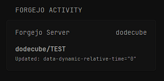

## Screenshots
#### Normal


```yaml
  - type: custom-api
    title: Forgejo Activity
    title-url: http://${FORGEJO_URL}
    cache: 5m
    url: http://${FORGEJO_URL}/api/v1/repos/search?limit=5
    query:
        limit: "10"
    headers:
        Authorization: "token ${FORGEJO_TOKEN}"
    template: |
      <style>
      .header { display: flex; justify-content: space-between; margin-bottom: 12px; }
      .repo { font-weight: bold; margin-top: 8px; color: var(--color-accent); }
      .meta { font-size: 0.8em; color: var(--color-text-secondary); display: flex; justify-content: space-between; }
      .error { color: var(--color-negative); text-align: center; }
      </style>

      {{ if ne .Response.StatusCode 200 }}
      <div class="error">
          Error: {{ .Response.StatusCode }} - {{ .Response.Status }}
      </div>
      {{ else }}
      {{ $data := .JSON }}
      {{ $repos := $data.Array "data" }}

      <div class="header">
          <div>Forgejo Server</div>
          {{ if gt (len $repos) 0 }}
          <div>{{ (index $repos 0).String "owner.login" }}</div>  <!-- Fixed path -->
          {{ end }}
      </div>

      {{ if eq (len $repos) 0 }}
          <div class="error">No repositories found</div>
      {{ else }}
          {{ range $repo := $repos }}
          <div class="repo">{{ $repo.String "full_name" }}</div>
          <div class="meta">Updated: {{ $repo.String "updated_at" | parseTime "iso8601" | toRelativeTime }}</div>  <!-- Fixed time format -->
          {{ end }}
      {{ end }}
      {{ end }}
```

## Environment variables

- `FORGEJO_URL` - url of the forgejo instance
- `FORGEJO_TOKEN` - access token to your user of forgejo
