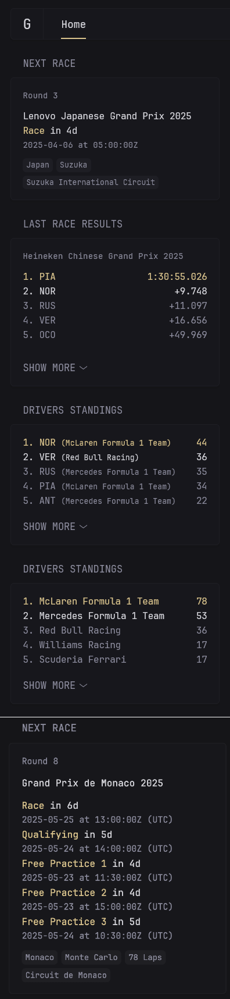

## Preview


## Config

Choose one or more of the following widgets.

```yaml
- type: custom-api
  title: Next Race
  cache: 2h
  url: https://f1api.dev/api/current/next
  template: |
    <div class="flex flex-column gap-10">
      {{ $session := index (.JSON.Array "race") 0 }}
      <p class="size-h5">
        Round {{ .JSON.String "round" }}
      </p>

      <div class="margin-block-4">
        <p class="color-highlight">{{ $session.String "raceName" }}</p>
        <p class="color-primary">
          <span>Race</span>
          {{ $datetime := concat ($session.String "schedule.race.date") "T" ($session.String "schedule.race.time") }}
          <span
            class="color-highlight"
            title="{{ $session.String "schedule.race.date" }}"
            {{ parseRelativeTime "rfc3339" $datetime }}
          ></span>
        </p>
        <p class="size-h5">{{ $session.String "schedule.race.date" }} at {{ $session.String "schedule.race.time" }}</p>
      </div>

      <ul class="size-h5 attachments">
        <li>{{ $session.String "circuit.country" }}</li>
        <li>{{ $session.String "circuit.city" }}</li>
        <li>{{ $session.String "circuit.circuitName" }}</li>
      </ul>
    </div>

- type: custom-api
  title: Last Race Results
  cache: 1d
  url: https://f1api.dev/api/current/last/race
  template: |
    <div class="flex flex-column gap-10">
      <p class="size-h5">{{ .JSON.String "races.raceName" }}</p>
      <ul class="list collapsible-container" data-collapse-after="5">
        {{ range $i, $v := .JSON.Array "races.results" }}
        <li class="flex items-center {{ if eq $i 0 }}color-primary{{ else if eq $i 1 }}color-highlight{{ end }}">
          <span class="grow min-width-0">{{ .String "position" }}. {{ .String "driver.shortName" }}</span>
          <span class="shrink-0 text-right">{{ .String "time" }}</span>
        </li>
        {{ end }}
      </ul>
    </div>

- type: custom-api
  title: Drivers Standings
  cache: 1d
  url: https://f1api.dev/api/current/drivers-championship
  template: |
    <ul class="list collapsible-container" data-collapse-after="5">
      {{ range $i, $v := .JSON.Array "drivers_championship" }}
      <li class="flex items-center {{ if eq $i 0 }}color-primary{{ else if eq $i 1 }}color-highlight{{ end }}">
        <div class="grow min-width-0">
          <span>{{ .String "position" }}. {{ .String "driver.shortName" }}</span>
          <span class="size-h6">({{ .String "team.teamName" }})</span>
        </div>
        <span class="shrink-0 text-right">{{ .String "points" }}</span>
      </li>
      {{ end }}
    </ul>

- type: custom-api
  title: Constructors Standings
  cache: 1d
  url: https://f1api.dev/api/current/constructors-championship
  template: |
    <ul class="list collapsible-container" data-collapse-after="5">
      {{ range $i, $v := .JSON.Array "constructors_championship" }}
      <li class="flex items-center {{ if eq $i 0 }}color-primary{{ else if eq $i 1 }}color-highlight{{ end }}">
        <span class="grow min-width-0">{{ .String "position" }}. {{ .String "team.teamName" }}</span>
        <span class="shrink-0 text-right">{{ .String "points" }}</span>
      </li>
      {{ end }}
    </ul>

- type: custom-api
  title: Next Race Detailed
  #cache: 5m
  url: https://f1api.dev/api/current/next
  template: |
    <div class="flex flex-column gap-10">
      {{ $session := index (.JSON.Array "race") 0 }}
      <p class="size-h5">
        Round {{ .JSON.String "round" }}
      </p>

      <div class="margin-block-4">
        <p class="color-primary">{{ $session.String "raceName" }}</p>

        <div class="margin-block-10"></div>

        <!-- Race -->
        <p class="color-primary">
          <span>Race</span>
          {{ $raceDate := $session.String "schedule.race.date" }}
          {{ $raceTime := $session.String "schedule.race.time" }}
          {{ $raceDateTime := concat $raceDate "T" $raceTime }}
          {{ $parsedRaceTime := parseTime "rfc3339" $raceDateTime }}
          {{ $now := now }}
          {{ if $parsedRaceTime.Before $now }}
            <span class="color-highlight">Completed</span>
          {{ else }}
            <span class="color-highlight" {{ $raceDateTime | parseRelativeTime "rfc3339" }}></span>
          {{ end }}
        </p>
        <p class="size-h5">Starting {{ $raceDate }} at {{ $raceTime }} (UTC)</p>
        
        <!-- Qualifying -->
        <p class="color-primary">
          <span>Qualifying</span>
          {{ $qualyDate := $session.String "schedule.qualy.date" }}
          {{ $qualyTime := $session.String "schedule.qualy.time" }}
          {{ $qualyDateTime := concat $qualyDate "T" $qualyTime }}
          {{ $parsedQualyTime := parseTime "rfc3339" $qualyDateTime }}
          {{ $now := now }}
          {{ if $parsedQualyTime.Before $now }}
            <span class="color-highlight">Completed</span>
          {{ else }}
            <span class="color-highlight" {{ $qualyDateTime | parseRelativeTime "rfc3339" }}></span>
          {{ end }}
        </p>
        <p class="size-h5">Starting {{ $qualyDate }} at {{ $qualyTime }} (UTC)</p>
        
        <!-- Free Practice 1 -->
        <p class="color-primary">
          <span>Free Practice 1</span>
          {{ $fp1Date := $session.String "schedule.fp1.date" }}
          {{ $fp1Time := $session.String "schedule.fp1.time" }}
          {{ $fp1DateTime := concat $fp1Date "T" $fp1Time }}
          {{ $parsedFP1Time := parseTime "rfc3339" $fp1DateTime }}
          {{ $now := now }}
          {{ if $parsedFP1Time.Before $now }}
            <span class="color-highlight">Completed</span>
          {{ else }}
            <span class="color-highlight" {{ $fp1DateTime | parseRelativeTime "rfc3339" }}></span>
          {{ end }}
        </p>
        <p class="size-h5">Starting {{ $fp1Date }} at {{ $fp1Time }} (UTC)</p>
        
        <!-- Free Practice 2 -->
        <p class="color-primary">
          <span>Free Practice 2</span>
          {{ $fp2Date := $session.String "schedule.fp2.date" }}
          {{ $fp2Time := $session.String "schedule.fp2.time" }}
          {{ $fp2DateTime := concat $fp2Date "T" $fp2Time }}
          {{ $parsedFP2Time := parseTime "rfc3339" $fp2DateTime }}
          {{ $now := now }}
          {{ if $parsedFP2Time.Before $now }}
            <span class="color-highlight">Completed</span>
          {{ else }}
            <span class="color-highlight" {{ $fp2DateTime | parseRelativeTime "rfc3339" }}></span>
          {{ end }}
        </p>
        <p class="size-h5">Starting {{ $fp2Date }} at {{ $fp2Time }} (UTC)</p>
        
        <!-- Free Practice 3 -->
        <p class="color-primary">
          <span>Free Practice 3</span>
          {{ $fp3Date := $session.String "schedule.fp3.date" }}
          {{ $fp3Time := $session.String "schedule.fp3.time" }}
          {{ $fp3DateTime := concat $fp3Date "T" $fp3Time }}
          {{ $parsedFP3Time := parseTime "rfc3339" $fp3DateTime }}
          {{ $now := now }}
          {{ if $parsedFP3Time.Before $now }}
            <span class="color-highlight">Completed</span>
          {{ else }}
            <span class="color-highlight" {{ $fp3DateTime | parseRelativeTime "rfc3339" }}></span>
          {{ end }}
        </p>
        <p class="size-h5">Starting {{ $fp3Date }} at {{ $fp3Time }} (UTC)</p>
        
        <!-- Sprint Qualifying - only if date is not null -->
        {{ if and (ne ($session.String "schedule.sprintQualy.date") "null") (ne ($session.String "schedule.sprintQualy.date") "") }}
        <p class="color-primary">
          <span>Sprint Qualifying</span>
          {{ $sprintQualyDate := $session.String "schedule.sprintQualy.date" }}
          {{ $sprintQualyTime := $session.String "schedule.sprintQualy.time" }}
          {{ $sprintQualyDateTime := concat $sprintQualyDate "T" $sprintQualyTime }}
          {{ $parsedSprintQualyTime := parseTime "rfc3339" $sprintQualyDateTime }}
          {{ $now := now }}
          {{ if $parsedSprintQualyTime.Before $now }}
            <span class="color-highlight">Completed</span>
          {{ else }}
            <span class="color-highlight" {{ $sprintQualyDateTime | parseRelativeTime "rfc3339" }}></span>
          {{ end }}
        </p>
        <p class="size-h5">Starting {{ $sprintQualyDate }} at {{ $sprintQualyTime }} (UTC)</p>
        {{ end }}
        
        <!-- Sprint Race - only if date is not null -->
        {{ if and (ne ($session.String "schedule.sprintRace.date") "null") (ne ($session.String "schedule.sprintRace.date") "") }}
        <p class="color-primary">
          <span>Sprint Race</span>
          {{ $sprintRaceDate := $session.String "schedule.sprintRace.date" }}
          {{ $sprintRaceTime := $session.String "schedule.sprintRace.time" }}
          {{ $sprintRaceDateTime := concat $sprintRaceDate "T" $sprintRaceTime }}
          {{ $parsedSprintRaceTime := parseTime "rfc3339" $sprintRaceDateTime }}
          {{ $now := now }}
          {{ if $parsedSprintRaceTime.Before $now }}
            <span class="color-highlight">Completed</span>
          {{ else }}
            <span class="color-highlight" {{ $sprintRaceDateTime | parseRelativeTime "rfc3339" }}></span>
          {{ end }}
        </p>
        <p class="size-h5">Starting {{ $sprintRaceDate }} at {{ $sprintRaceTime }} (UTC)</p>
        {{ end }}
      </div>

      <ul class="size-h5 attachments">
        <li>{{ $session.String "circuit.country" }}</li>
        <li>{{ $session.String "circuit.city" }}</li>
        <li>{{ $session.String "laps" }} Laps</li>
        <li>{{ $session.String "circuit.circuitName" }}</li>                
      </ul>
    </div>

```
