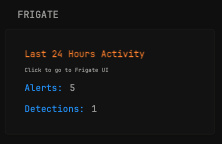

## Getting alerts and detections from the last 24 hours from your Frigate service

This widget displays the total number of alerts and detections recorded by your Frigate instance during the last 24 hours.

Click on the widget to navigate directly to your Frigate web UI.

### Required environment variable:
- `FRIGATE_URL` = Your Frigate server URL (without http/https prefix)

### Installation

Add the following configuration to your `home.yml` file:

```yaml
- type: custom-api
          title: Frigate
          url: https://${FRIGATE_URL}/api/review/summary
          allow-insecure: true
          skip-tls-verify: true
          cache: 30s
          template: |
            <div style="padding: 1rem;">
              <ul style="list-style: none; padding: 0; margin: 0; gap: 10px;">
                <li>
                  <div style="padding-bottom: 1rem;">
                    <a style="color: var(--color-primary); font-weight: bold; text-decoration: none;" href="https://${FRIGATE_URL}" target="_blank" rel="noreferrer" title="Frigate Dashboard">Last 24 Hours Activity</a>
                    <p style="margin: 5px 0 0 0; font-size: 0.8rem; color: var(--color-text-muted);">Click to go to Frigate UI</p>
                  </div>
                  <ul style="list-style: none; padding: 0; margin: 0; gap: 10px;">
                    <li style="display: flex; gap: 1rem; margin-bottom: 8px;">
                      <span style="color: var(--color-negative); font-weight: 500;">Alerts:</span>
                      <span style="color: var(--color-text-base);">{{ .JSON.Int "last24Hours.total_alert" }}</span>
                    </li>
                    <li style="display: flex; gap: 1rem;">
                      <span style="color: var(--color-negative); font-weight: 500;">Detections:</span>
                      <span style="color: var(--color-text-base);">{{ .JSON.Int "last24Hours.total_detection" }}</span>
                    </li>
                  </ul>
                </li>
              </ul>
            </div>
```

> [!WARNING]  
> If you're using self-signed TLS certificates with Glance, make sure to include these lines in your `docker-compose.yml`:
```yaml
    volumes:
      - ./config:/app/config
      - ./assets:/app/assets
      - /var/run/docker.sock:/var/run/docker.sock
      - /your/path/to/rootCA.pem:/usr/local/share/ca-certificates/rootCA.crt:ro
    environment:
      - SSL_CERT_FILE=/your/path/to/rootCA.crt
    env_file: .env
```
