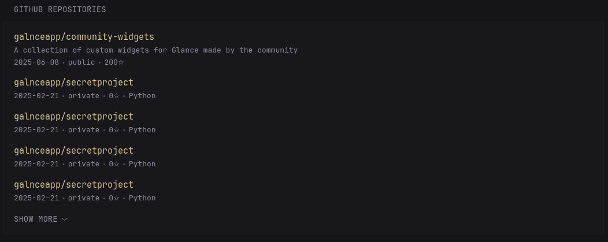

```yaml
- type: custom-api
  title: GitHub Repositories
  url: https://api.github.com/user/repos
  cache: 30m
  parameters:
    affiliation: owner
    sort: updated
    visibility: all
  headers:
    Authorization: Bearer ${Github_Personal_Access_Token}
    Accept: application/vnd.github.v3+json
    User-Agent: Glance-Dashboard
  template: |
    <div class="github-repos">
      <ul class="list list-gap-14 collapsible-container" data-collapse-after="5">
        {{ range .JSON.Array "" }}
          <li>
            <a class="size-h3 color-primary" href="{{ .String "html_url" }}">{{ .String "full_name" }}</a>
            <h3><a href="" target="_blank"></a></h3>
            <p>{{ .String "description" }}</p>
            <ul class="list-horizontal-text device-info">
              <li data-popover-type="html"><div data-popover-html="">Last Update</div>{{ formatTime "DateOnly" ( parseTime "RFC3339" (.String "updated_at") ) }}</li>
              <li data-popover-type="html"><div data-popover-html="">Visibility</div>{{ .String "visibility" }}</li>
              <li data-popover-type="html"><div data-popover-html="">Stars</div>{{ .Int "stargazers_count" }}✩</li>
              {{ if .String "language" }}
              <li data-popover-type="html"><div data-popover-html="">Language</div>{{ .String "language" }}</li>
              {{ end }}     
            </ul>
          </li>
        {{ end }}
      </ul>
    </div>
```

## Environment variables

- `Github_Personal_Access_Token`: Your GitHub Personal Access Token, you can create a token from Github settings. Navigate to *GitHub Settings > Developer settings > Personal access tokens > Tokens (classic)*, and create a new token with *repo* scope selected.
