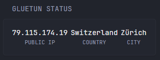
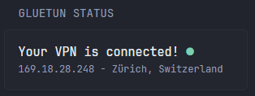
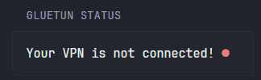

## Version 1
#### Normal

#### Not connected


```yaml
- type: custom-api
  title: Gluetun status
  cache: 1m
  url: http://${GLUETUN_URL}/v1/publicip/ip
  headers:
    X-API-Key: ${GLUETUN_API_KEY}
  template: |
    {{ if eq .Response.StatusCode 200 }}
      {{ $ip := (.JSON.String "public_ip") }}
      {{ $city := (.JSON.String "city") }}
      {{ $country := (.JSON.String "country") }}
      {{ if eq $ip "" }}
        {{ $ip = "-" }}
        {{ $city = "-" }}
        {{ $country = "-" }}
      {{ end }}
      <div class="flex justify-between text-center">
        <div>
            <div class="color-highlight size-h4">{{ $ip }}</div>
            <div class="size-h6">PUBLIC IP</div>
        </div>
        <div>
            <div class="color-highlight size-h4">{{ $country }}</div>
            <div class="size-h6">COUNTRY</div>
        </div>
        <div>
            <div class="color-highlight size-h4">{{ $city }}</div>
            <div class="size-h6">CITY</div>
        </div>
      </div>
    {{ else }}
      <div style="text-align: center; color: var(--color-negative);">
        Error: {{ .Response.StatusCode }} - {{ .Response.Status }}
      </div>
    {{ end }}
```
## Version 2
#### Normal

#### Not connected

```yaml
- type: custom-api
  title: Gluetun status
  cache: 1m
  url: http://${GLUETUN_URL}/v1/publicip/ip
  headers:
    X-API-Key: ${GLUETUN_API_KEY}
  template: |
    {{ if eq .Response.StatusCode 200 }}
      {{ $ip := (.JSON.String "public_ip") }}
      {{ $city := (.JSON.String "city") }}
      {{ $country := (.JSON.String "country") }}
      {{ if eq $ip "" }}
        <div>
          <div>
            <div>
              <div class="color-highlight size-h3">
                Your VPN is not connected!
                <span class="color-negative">●</span> 
              </div>
            </dv>
          </div>
        </div>
      {{ else }}
        <div>
          <div>
            <div>
              <div class="color-highlight size-h3">
                Your VPN is connected!
                <span class="color-positive">●</span> 
              </div>
            </div>
            <div class="size-h5">{{ $ip }} - {{ $city }}, {{ $country }}</div>
          </div>
        </div>
      {{ end }}
    {{ else }}
      <div style="text-align: center; color: var(--color-negative);">
        Error: {{ .Response.StatusCode }} - {{ .Response.Status }}
      </div>
    {{ end }}
```

## Notes
The Gluetun API `/v1/publicip/ip` returns more attributes than the ones used in the widget. You can change the attributes in the widget as you like.
Example response:
```json
{"public_ip":"79.115.174.19","region":"Zurich","country":"Switzerland","city":"Zürich","location":"47.3667,8.5500","organization":"AS209103 Proton AG","postal_code":"8000","timezone":"Europe/Zurich"}
```
## Environment variables
- `GLUETUN_URL` - Your Gluetun URL
- `GLUETUN_API_KEY` - The API key configured in the `config.toml` file in Gluetun. See https://github.com/qdm12/gluetun-wiki/blob/main/setup/advanced/control-server.md#authentication for more details.
