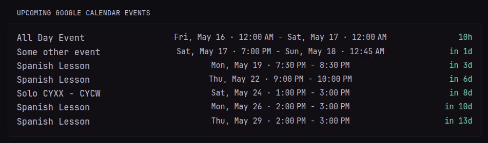

```yaml
- type: custom-api
  title: Upcoming Google Calendar Events
  cache: 15m
  template: |
    {{
      $token := newRequest "https://oauth2.googleapis.com/token"
        | withHeader "Content-Type" "application/x-www-form-urlencoded"
        | withStringBody "client_id=${GOOGLE_CLIENT_ID}&client_secret=${GOOGLE_CLIENT_SECRET}&refresh_token=${GOOGLE_REFRESH_TOKEN}&grant_type=refresh_token"
        | getResponse
    }}

    {{ if ne $token.Response.StatusCode 200 }}
      <p>Failed to get token: {{ $token.Response.Status }}</p>
    {{ else }}
      {{ $accessToken := $token.JSON.String "access_token" }}
      {{ $nowtime := now | formatTime "rfc3339" }}
      {{ $future := offsetNow "720h" | formatTime "rfc3339" }}
      {{
        $events := newRequest "https://www.googleapis.com/calendar/v3/calendars/primary/events"
          | withParameter "timeMin" $nowtime
          | withParameter "timeMax" $future
          | withParameter "singleEvents" "true"
          | withParameter "orderBy" "startTime"
          | withHeader "Authorization" (print "Bearer " $accessToken)
          | getResponse
      }}

      {{ if ne $events.Response.StatusCode 200 }}
        <p>Failed to fetch events: {{ $events.Response.Status }}</p>
      {{ else }}
        <div>
          {{ range $events.JSON.Array "items" }}
          {{ $start := .String "start.dateTime" }}
          {{ $end := .String "end.dateTime" }}
          {{ $isAllDay := eq $start "" }}
          {{ if $isAllDay }}
            {{ $start = print (.String "start.date") | parseLocalTime "DateOnly" }}
            {{ $end = print (.String "end.date") | parseLocalTime "DateOnly" }}
          {{ else }}
            {{ $start = $start | parseTime "rfc3339" }}
            {{ $end = $end | parseTime "rfc3339" }}            
          {{ end }}
          {{ $startDateOnly := $start | formatTime "DateOnly" }}
          {{ $endDateOnly := $end | formatTime "DateOnly" }}
          {{ $isStartAndEndDateSame := eq $startDateOnly $endDateOnly }}

          <div style="display: flex; flex-wrap: wrap; justify-content: space-between; align-items: flex-start;">
            <a href="https://calendar.google.com/calendar/u/0" target="_blank" class="size-h1" style="text-align: left; width: 215px;">
              {{ .String "summary" }}
            </a>
            <a href="https://calendar.google.com/calendar/u/0" target="_blank" class="size-h3" style="text-align: left;">
              {{ $start | formatTime "Mon, Jan 2 · 3:04 PM" }} 
              {{ if $isStartAndEndDateSame }}
                  - {{ $end | formatTime "3:04 PM" }}
                {{ else }}
                  - {{ $end | formatTime "Mon, Jan 2 · 3:04 PM" }}
              {{ end }}
            </a>
            <div class="color-primary size-h3" style="text-align: right; width: 75px;" {{ $start | toRelativeTime }}>
            </div>
          </div>
        {{ end }}
        </div>
      {{ end }}
    {{ end }}
```

## Info
This will show a list of both one-off and upcoming events from Google Calendar.   
It first calls Google's Oauth servers to get a JWT bearer token and then uses this token to get the events from Google's Calendar API. 

## ENV Variables

You will need to obtain the following values to get the calendar working.
- GOOGLE_CLIENT_ID
- GOOGLE_CLIENT_SECRET
- GOOGLE_REFRESH_TOKEN

1. Prepare Google API Credentials
    1. Go to [Google Cloud Console](https://console.cloud.google.com/).
    2. Create a new project (or reuse one).
    3. Enable Google Calendar API.
    4. Create OAuth 2.0 Credentials:  
    App type = Web application  
    Add redirect URI: http://localhost:8075 [This does not really matter]  
    **You get**:  
    - **CLIENT_ID**  
    - **CLIENT_SECRET**  
    Save these.
2. Get the Authentication Code (Manual one-time step)
    1. You need to get an auth code. Replace with your ClientId & Paste the following into your browser:  
    ```
    https://accounts.google.com/o/oauth2/v2/auth?client_id=YOUR_CLIENT_ID&redirect_uri=http://localhost:8075&response_type=code&scope=https://www.googleapis.com/auth/calendar.readonly&access_type=offline&prompt=consent
    ```
    2. Login with your Google Account.
    3. It will redirect you to http://localhost:8075?code=XYZ
    4. Copy the XYZ part. This is **YOUR_AUTHORIZATION_CODE**
    
3. Exchange Authentication Code for Refresh Token 
    1. Run the following request:
    ```
    curl -X POST https://oauth2.googleapis.com/token \
      -H "Content-Type: application/x-www-form-urlencoded" \
      -d "client_id=YOUR_CLIENT_ID" \
      -d "client_secret=YOUR_CLIENT_SECRET" \
      -d "code=YOUR_AUTHORIZATION_CODE" \
      -d "grant_type=authorization_code" \
      -d "redirect_uri=http://localhost:8075"
    ```
    2. This is your **GOOGLE_REFRESH_TOKEN**
    3. Store these values in your .env for Glance