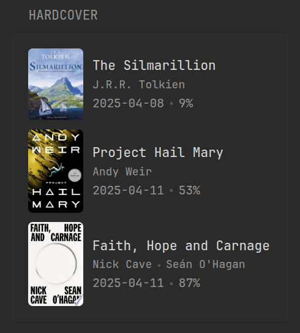

## Preview



## Configuration

```yaml
- type: custom-api
  title: Hardcover
  cache: 3h
  url: https://api.hardcover.app/v1/graphql
  headers:
    content-type: application/json
    authorization: ${HARDCOVER_API_KEY}
  body:
    query: |
      query MyQuery {
        me {
          user_books(where: {status_id: {_eq: 2}}, order_by: {first_read_date: desc}) {
            id
            user_book_reads(
              limit: 1,
              order_by: {started_at: desc_nulls_last}
            ) {
              id
              started_at
              progress
              edition {
                image {
                  url
                }
                cached_contributors
              }
            }
            book {
              title
              slug
            }
          }
        }
      }
  template: |
    <ul class="list list-gap-10 collapsible-container" data-collapse-after="5">
      {{ range .JSON.Array "data.me.0.user_books" }}
        <li class="flex items-center gap-10">
          <div style="border-radius: 5px; max-height: 10rem; max-width: 6rem; overflow: hidden;">
            
          </div>
          <div class="flex-1">
            <a class="size-h4 color-highlight" href="https://hardcover.app/books/{{ .String "book.slug" }}">{{ .String "book.title" }}</a>
            <ul class="list-horizontal-text size-h5">
              {{ range .Array "user_book_reads.0.edition.cached_contributors" }}
                {{ if not (.String "contribution") }}
                  <li>{{ .String "author.name" }}</li>
                {{ end }}
              {{ end }}
            </ul>
            <ul class="list-horizontal-text" >
              <li>{{ .String "user_book_reads.0.started_at" }}</li>
              <li>{{ .Int "user_book_reads.0.progress" }}%</li>
            </ul>
          </div>
        </li>
      {{ end }}
    </ul>
```

## Environment Variables

- `HARDCOVER_API_KEY` - Hardcover API authorization token, which you can obtain from [here](https://hardcover.app/account/api). Information will be fetched for the user associated with the token.
