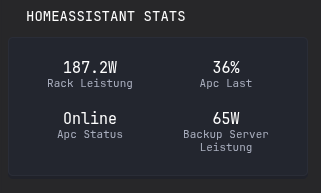

```yaml
- type: custom-api
  title: Homeassistant Stats
  cache: 10m
  url: ${HASS_URL}/api/states
  headers:
    Authorization: "Bearer ${HASS_API_KEY}"
    Content-Type: "application/json"
  template: |
    {{ if eq .Response.StatusCode 200 }}
      <div style="display: grid; grid-template-columns: repeat(2, 1fr); gap: 8px;">
        {{ range .JSON.Array "" }}
          {{ $id := .String "entity_id" }}
          {{ $state := .String "state" }}
          {{ if and (or 
                        (eq $id "sensor.example1") 
                        (eq $id "sensor.example2")
                    )
                    (ne $state "unavailable")
                    (ne $state "unknown")
          }}
            <div class="background-faint radius-8" style="padding: 6px 10px; text-align: center;">
              <div class="color-highlight size-h3" style="line-height: 1.2;">
                {{ $state }}{{ .String "attributes.unit_of_measurement" }}
              </div>
              <div class="size-h6 color-subdue" style="line-height: 1.2;">
                {{ .String "attributes.friendly_name" }}
              </div>
            </div>
          {{ end }}
        {{ end }}
      </div>
    {{ else }}
      <div style="text-align: center;" class="color-negative size-h4">
        Error: {{ .Response.StatusCode }} – {{ .Response.Status }}
      </div>
    {{ end }}

```

## Config

You need to edit the lines below `{{ if and (or` These are your sensors  that will be displayed.

I recommend a minimum of Two. 

You can add as many as you like by copying the line.

## Environment variables

- `HASS_URL` - the URL of the Homeassitant server (for example: https://homeassistant.example.org)
- `HASS_API_KEY` - the API key of the server which can be found in `Account settings (Bottom Left, Click on your Username.) -> Security -> Long Lived Token`
