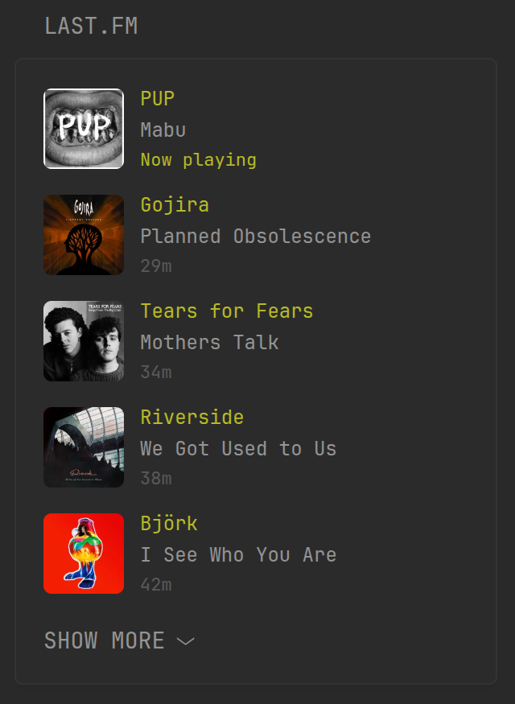

## Preview



## Configuration

```yaml
- type: custom-api
  title: Last.fm
  cache: 60s
  url: http://ws.audioscrobbler.com/2.0/
  parameters:
    method: user.getRecentTracks
    user: ${LASTFM_USERNAME}
    api_key: ${LASTFM_API_KEY}
    format: json
    limit: 10
  template: |
    <ul class="list list-gap-10 collapsible-container" data-collapse-after="5">
      {{ range .JSON.Array "recenttracks.track" }}
        <li class="flex items-center gap-10">
          
          <div class="flex-1">
            <p class="color-positive size-h5">{{ .String "artist.#text" }}</p>
            <p class="size-h5">{{ .String "name" }}</p>
            <p class="size-h6">
              {{ if .String "@attr.nowplaying" }}
                <span class="color-positive">Now playing</span>
              {{ else }}
                <span class="color-subdue" {{ .String "date.#text" | parseRelativeTime "02 Jan 2006, 15:04" }}></span>
              {{ end }}
            </p>
          </div>
        </li>
      {{ end }}
    </ul>
```

## Environment Variables

- `LASTFM_USERNAME` - Last.FM username of the user you want to get the recent tracks for.
- `LASTFM_API_KEY` - Last.FM API key, which you can obtain from [here](https://www.last.fm/api/accounts). The API requires (free) registration, [see the documentation](https://www.last.fm/api) for details.
