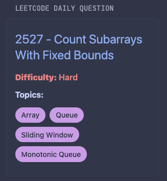

# Leetcode daily questions preview
Simple custom-api widget to display leetcode today question

## Preview



## Configuration
```yaml
- type: custom-api
  title: LeetCode Daily Question
  cache: 6h
  url: https://leetcode.com/graphql
  method: POST
  headers:
    Accept: application/json
  body-type: json
  body:
    query: |
      query questionOfToday {
        activeDailyCodingChallengeQuestion {
          link
          question {
            questionId
            title
            difficulty
            topicTags {
              name
              slug
            }
          }
        }
      }
    operationName: questionOfToday
  template: |
    <div class="leetcode-card">
      <style>
        .leetcode-card {
          max-width: 600px;
          margin: 8px auto;
          font-family: -apple-system, BlinkMacSystemFont, 'Segoe UI', Roboto, sans-serif;
          transition: transform 0.2s ease, box-shadow 0.2s ease;
        }
        .leetcode-card h1 {
          font-size: 24px;
          margin: 0 0 16px;
          line-height: 1.3;
        }
        .leetcode-card h1 a {
          color: #8CAAEE;
          text-decoration: none;
          transition: color 0.2s ease;
        }
        .leetcode-card h1 a:hover {
          color: #BAC8FF;
          text-decoration: underline;
        }
        .leetcode-card p {
          margin: 8px 0;
          color: #C6D0F5;
          font-size: 16px;
        }
        .leetcode-card .difficulty {
          font-weight: 600;
          color: #A5ADCE;
        }
        .leetcode-card .difficulty.Easy {
          color: #A6D189;
        }
        .leetcode-card .difficulty.Medium {
          color: #E5C890;
        }
        .leetcode-card .difficulty.Hard {
          color: #E78284;
        }
        .leetcode-card .topics {
          display: flex;
          flex-wrap: wrap;
          gap: 8px;
          margin: 12px 0;
        }
        .leetcode-card .topic-tag {
          background: #CA9EE6;
          color: #303446;
          padding: 4px 12px;
          border-radius: 16px;
          font-size: 14px;
          font-weight: 500;
          transition: transform 0.2s ease;
        }
        .leetcode-card .topic-tag:hover {
          transform: scale(1.05);
        }
        .leetcode-card .premium {
          color: #E78284;
          font-weight: 600;
          margin-top: 12px;
        }
        @media (max-width: 600px) {
          .leetcode-card {
            padding: 16px;
            margin: 8px;
          }
          .leetcode-card h1 {
            font-size: 20px;
          }
          .leetcode-card p {
            font-size: 14px;
          }
          .leetcode-card .topic-tag {
            font-size: 12px;
            padding: 3px 10px;
          }
        }
      </style>
      <h1>
        <a href="https://leetcode.com{{ .JSON.String "data.activeDailyCodingChallengeQuestion.link" }}" target="_blank">
          {{ .JSON.String "data.activeDailyCodingChallengeQuestion.question.questionId" }} - {{ .JSON.String "data.activeDailyCodingChallengeQuestion.question.title" }}
        </a>
      </h1>
      <p class="difficulty {{ .JSON.String "data.activeDailyCodingChallengeQuestion.question.difficulty" }}"><strong>Difficulty:</strong> {{ .JSON.String "data.activeDailyCodingChallengeQuestion.question.difficulty" }}</p>
      <p><strong>Topics:</strong></p>
      <div class="topics">
        {{ if .JSON.Exists "data.activeDailyCodingChallengeQuestion.question.topicTags" }}
          {{ range .JSON.Array "data.activeDailyCodingChallengeQuestion.question.topicTags" }}
            <span class="topic-tag">{{ .String "name" }}</span>
          {{ end }}
        {{ else }}
          <span class="topic-tag">None</span>
        {{ end }}
      </div>
      {{ if .JSON.Bool "data.activeDailyCodingChallengeQuestion.question.paidOnly" }}
        <p class="premium">This is a Premium question</p>
      {{ end }}
    </div>
```
