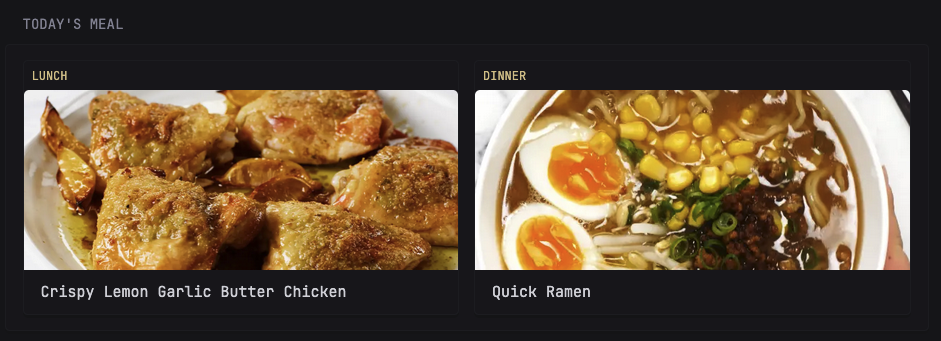

```yaml
- type: custom-api
  title: Today's Meal
  cache: 1m
  url: http://${MEALIE_URL}/api/households/mealplans/today
  headers:
    Authorization: Bearer ${MEALIE_API_TOKEN}
  template: |
    <div class="flex gap-15 justify-between">
      {{ range .JSON.Array "" }}
        <div class="card widget-content-frame flex-1" style="min-width: 0; max-width: calc(50% - 7.5px);">
          <div class="absolute" style="top: 10px; left: 10px; background-color: var(--color-widget-background); padding: 4px 8px; border-radius: var(--border-radius); z-index: 1;">
            <span class="size-h5 uppercase color-primary">{{.String "entryType"}}</span>
          </div>
          <div class="relative" style="height: 180px; overflow: hidden; border-radius: var(--border-radius) var(--border-radius) 0 0;">
            
          </div>
          <div class="padding-block-5 padding-inline-widget">
            <h3 class="size-h3 color-highlight margin-block-5 text-truncate">{{.String "recipe.name"}}</h3>
          </div>
        </div>
      {{ else }}
        <p class="text-center color-subdue padding-block-5 flex-1">No meals planned for today</p>
      {{ end }}
    </div>
```

## Environment variables

- `MEALIE_URL` - the URL of the Mealie server
- `MEALIE_API_TOKEN` - the API key of the server which can be found by following the instructions [here](https://docs.mealie.io/documentation/getting-started/api-usage/)