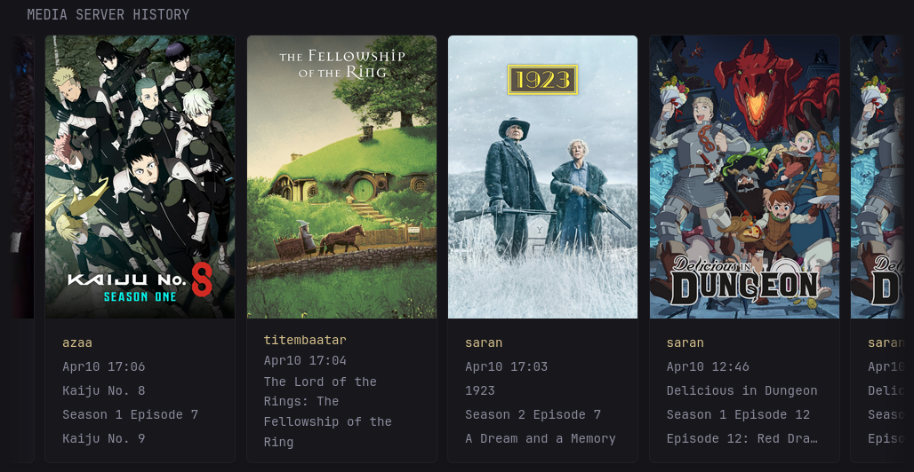
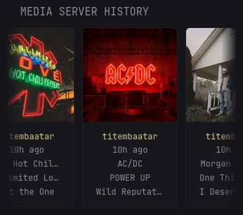
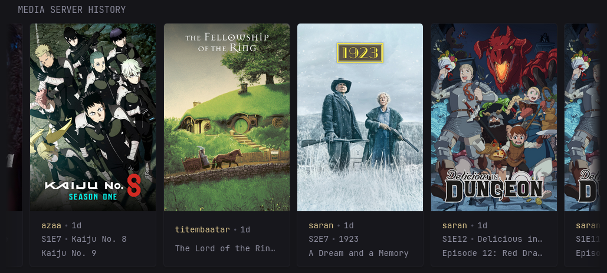

* [Introduction](#introduction)
* [Preview](#preview)
* [Environment Variables](#environment-variables)
* [Secrets](#secrets)
* [Options](#options)
* [Widget YAML](#widget-yaml)
* [🍻 Cheers](#cheers)

## Introduction
This is a widget for various media servers to display played items history.

> [!NOTE]
>
> The widget has been updated to `glance v0.8.0`.
> Ensure you update to at least this version.

Tested with `Plex`, `Tautulli`, `Jellyfin`, and `Emby`.
If you encounter any issues, please open an issue, tag me, and I’ll investigate further.

The appearance is consistent across all media servers.  
Customisation can be applied using the `options:` field. See [Options](#options) for more details.

## Preview
### Full-Size Column


### Small-Size Column


### Compact Mode


## Environment Variables

> [!IMPORTANT]
>
> For URLs, you **MUST** include `http://` or `https://`.
> Do **NOT** include a trailing `/` at the end of URLs.

### Plex
* `PLEX_URL` - the Plex URL, can be `http://<ip_address>:<port>` or `https://<domain>`
* `PLEX_TOKEN` - the Plex token, follow [this guide](https://support.plex.tv/articles/204059436-finding-an-authentication-token-x-plex-token/) if you don't know how to get it

### Tautulli
* `TAUTULLI_URL` - the Tautulli URL, can be `http://<ip_address>:<port>` or `https://<domain>`
* `TAUTULLI_KEY` - the Tautulli API key, can be found in `Settings` -> `Web Interface `-> `API key`

### Jellyfin
* `JELLYFIN_URL` - the Jellyfin URL, can be `http://<ip_address>:<port>` or `https://<domain>`
* `JELLYFIN_KEY` - the Jellyfin API key, use or create one in `Administration` -> `Dashboard` -> `API Keys`

### Emby
* `EMBY_URL` - The Emby URL, e.g., `http://<ip_address>:<port>` or `https://<domain>`
* `EMBY_KEY` - The Emby API key, available in `⚙️ icon in top-right` -> `Advanced` -> `API Keys`

## Secrets
Since `v0.8.0`, you can use Docker secrets instead of environment variables. See [v0.8.0 Release Notes](https://github.com/glanceapp/glance/releases/tag/v0.8.0#g-rh-5) for more information.  
If you do, replace `${YOUR_API_KEY}` with `${secret:your-api-key-secret}`.

## Options
Since `v0.8.0`, you can use the `options:` field to customise the widget.  
See [v0.8.0 Release Notes](https://github.com/glanceapp/glance/releases/tag/v0.8.0#g-rh-15) for more information.

> [!CAUTION]
>
> Enabling thumbnails **will** expose your token/API keys in the HTML.
> Do **not** enable this in production or on internet-exposed services.

> [!IMPORTANT]
>
> The Jellyfin/Emby API only retrieves playback history for a specific user.
> You must set the `user-name` option to your Jellyfin/Emby username.

Default options are:
```yaml
options:
  # Required options
  media-server: "plex"      # Your media server; "plex", "tautulli", "jellyfin", "emby"
  base-url: ${PLEX_URL}     # Your environment-variables for the URL
  api-key: ${PLEX_TOKEN}    # Your environment-variables for the API key/token. Can a secret as well `${secret:plex-token}`
  # Required for Jellyfin/Emby (See `Important` note above)
  user-name: "yourUserName" # Your Jellyfin/Emby user name.

  # Optionals options
  history-length: "10"               # number of items to fetch; must be between ""
  media-types: "movie,episode,track" # see options below
  small-column: false                # `true` if using the widget in a small column
  compact: true                      # `false` for a more spread-out layout
  show-thumbnail: false              # `true` to show thumbnails
  thumbnail-aspect-ratio: "default"  # see options below
  show-user: true                    # `false` to hide user name
  time-absolute: false               # `true` to use absolute time
  time-format: "Jan 02 15:04"        # The absolute time format
```

* `media-types`:

| Display | Plex | Tautulli | Jellyfin/Emby |
|:-------:|:----:|:--------:|:------------:|
| Shows | Not available | episode | Episode |
| Movies | Not available | movie | Movie |
| Music | Not available | track | Audio |

All media types included by default
e.g., for only Shows and Movies in Jellyfin, use `"Episode,Movie"`.

* `thumbnail-aspect-ratio`:
    * `default`: original aspect ratio
    * `square`: aspect ratio of `1`
    * `portrait`: aspect ratio of `3/4`
    * `landscape`: aspect ratio of `4/3`

## Widget YAML
```yaml
- type: custom-api
  title: Media Server History
  frameless: true
  cache: 5m
  options:
    media-server: "plex"
    base-url: ${PLEX_URL}
    api-key: ${PLEX_TOKEN}
    # user-name: "yourUserName" # for Jellyfin/Emby
    history-length: "10"
    small-column: false
    compact: true
    show-thumbnail: false
    thumbnail-aspect-ratio: "default"
    show-user: true
    time-absolute: false
    time-format: "Jan 02 15:04"
  template: |
    {{ $mediaServer := .Options.StringOr "media-server" "" }}
    {{ $baseURL := .Options.StringOr "base-url" "" }}
    {{ $apiKey := .Options.StringOr "api-key" "" }}
    {{ $userName := .Options.StringOr "user-name" "" }}

    {{ define "errorMsg" }}
      <div class="widget-error-header">
        <div class="color-negative size-h3">ERROR</div>
        <svg class="widget-error-icon" xmlns="http://www.w3.org/2000/svg" fill="none" viewBox="0 0 24 24" stroke-width="1.5">
          <path stroke-linecap="round" stroke-linejoin="round" d="M12 9v3.75m-9.303 3.376c-.866 1.5.217 3.374 1.948 3.374h14.71c1.73 0 2.813-1.874 1.948-3.374L13.949 3.378c-.866-1.5-3.032-1.5-3.898 0L2.697 16.126ZM12 15.75h.007v.008H12v-.008Z"></path>
        </svg>
      </div>
      <p class="break-all">{{ . }}</p>
    {{ end }}

    {{ if or
      (eq $mediaServer "")
      (eq $baseURL "")
      (eq $apiKey "")
      (and (eq $mediaServer "jellyfin") (eq $userName ""))
    }}
      {{ template "errorMsg" "Some required options are not set" }}
    {{ else }}

    {{ $historyLength := .Options.StringOr "history-length" "10" }}
    {{ $mediaTypes := .Options.StringOr "media-types" "" }}
    {{ if eq $mediaServer "tautulli" }}
      {{ $mediaTypes = .Options.StringOr "media-types" "movie,episode,track" }}
    {{ else if or (eq $mediaServer "jellyfin") (eq $mediaServer "emby") }}
      {{ $mediaTypes = .Options.StringOr "media-types" "Movie,Episode,Audio" }}
    {{ end }}
    {{ $isSmallColumn := .Options.BoolOr "small-column" false }}
    {{ $isCompact := .Options.BoolOr "compact" true }}
    {{ $showThumbnail := .Options.BoolOr "show-thumbnail" false }}
    {{ $thumbAspectRatio := .Options.StringOr "thumbnail-aspect-ratio" "" }}
    {{ $showUser := .Options.BoolOr "show-user" true }}
    {{ $timeAbsolute := .Options.BoolOr "time-absolute" false }}
    {{ $timeFormat := .Options.StringOr "time-format" "Jan 02 15:04" }}

    {{ $userID := "" }}
    {{ $historyRequestURL := "" }}
    {{ $usersRequestURL := "" }}
    {{ $historyCall := "" }}
    {{ $usersCall := "" }}
    {{ $history := "" }}
    {{ $users := "" }}

    {{ if eq $mediaServer "plex" }}
      {{ $historyRequestURL = concat $baseURL "/status/sessions/history/all" }}
      {{ $historyCall = newRequest $historyRequestURL
        | withParameter "limit" $historyLength
        | withParameter "sort" "viewedAt:desc"
        | withHeader "Accept" "application/json"
        | withHeader "X-Plex-Token" $apiKey
        | getResponse }}

      {{ if $historyCall.JSON.Exists "MediaContainer" }}
        {{ $history = $historyCall.JSON.Array "MediaContainer.Metadata" }}
      {{ else }}
        {{ template "errorMsg" (concat "Could not fetch " $mediaServer " API.") }}
      {{ end }}

      {{ $usersRequestURL = concat $baseURL "/accounts" }}
      {{ $usersCall = newRequest $usersRequestURL
        | withHeader "Accept" "application/json"
        | withHeader "X-Plex-Token" $apiKey
        | getResponse }}
      {{ $users = $usersCall.JSON.Array "MediaContainer.Account" }}

    {{ else if eq $mediaServer "tautulli" }}
      {{ $historyRequestURL = concat $baseURL "/api/v2" }}
      {{ $historyCall = newRequest $historyRequestURL
        | withParameter "apikey" $apiKey
        | withParameter "cmd" "get_history"
        | withParameter "length" $historyLength
        | withParameter "media_type" $mediaTypes
        | withHeader "Accept" "application/json"
        | getResponse }}

      {{ if eq $historyCall.Response.StatusCode 200 }}
        {{ $history = $historyCall.JSON.Array "response.data.data" }}
      {{ else }}
        {{ template "errorMsg" (concat "Could not fetch " $mediaServer " API.") }}
      {{ end }}

    {{ else if or (eq $mediaServer "jellyfin") (eq $mediaServer "emby") }}
      {{ $usersRequestURL = concat $baseURL "/Users" }}

      {{ $usersCall = newRequest $usersRequestURL
        | withParameter "api_key" $apiKey
        | withHeader "Accept" "application/json"
        | getResponse }}

      {{ $usersList := $usersCall.JSON.Array "" }}
      {{ range $i, $user := $usersList }}
        {{ if eq ($user.String "Name") $userName }}
          {{ $userID = $user.String "Id" }}
          {{ break }}
        {{ end }}
      {{ end }}
      {{ if eq $userID "" }}
        {{ template "errorMsg" (concat "User '" $userName "' not found.") }}
      {{ end }}

      {{ $historyRequestURL = concat $baseURL "/Users/" $userID "/Items" }}
      {{ $historyCall = newRequest $historyRequestURL
        | withParameter "api_key" $apiKey
        | withParameter "Limit" $historyLength
        | withParameter "IncludeItemTypes" $mediaTypes
        | withParameter "Recursive" "true"
        | withParameter "isPlayed" "true"
        | withParameter "sortBy" "DatePlayed"
        | withParameter "sortOrder" "Descending"
        | withParameter "Fields" "UserDataLastPlayedDate"
        | withHeader "Accept" "application/json"
        | getResponse }}

      {{ $history = $historyCall.JSON.Array "Items" }}
    {{ end }}

    {{ if and ($history) (eq (len $history) 0) }}
      <p>Nothing is playing. Start watching something!</p>
    {{ else }}
      <div class="carousel-container show-right-cutoff">
        <div class="cards-horizontal carousel-items-container">
          {{ range $n, $item := $history }}
            {{ $mediaType := "" }}
            {{ $isMovie := false }}
            {{ $isShows := false }}
            {{ $isMusic := false }}
            {{ $title := "" }}
            {{ $showTitle := "" }}
            {{ $showSeason := "" }}
            {{ $showEpisode := "" }}
            {{ $artist := "" }}
            {{ $albumTitle := "" }}
            {{ $thumbURL := "" }}
            {{ $playedAt := "" }}

            {{ if eq $mediaServer "plex" }}
              {{ $userID = $item.Int "accountID" }}
              {{ range $n, $u := $users }}
                {{ if eq $userID ($u.Int "id") }}
                  {{ $userName = $u.String "name" }}
                  {{ break }}
                {{ end }}
              {{ end }}

              {{ $mediaType = $item.String "type" }}
              {{ $isMovie = eq $mediaType "movie" }}
              {{ $isShows = eq $mediaType "episode" }}
              {{ $isMusic = eq $mediaType "track" }}

              {{ $title = $item.String "title" }}
              {{ if $isShows }}
                {{ $showTitle = $item.String "grandparentTitle" }}
                {{ $showSeason = $item.String "parentIndex" }}
                {{ $showEpisode = $item.String "index" }}
              {{ else if $isMusic }}
                {{ $artist = $item.String "grandparentTitle" }}
                {{ $albumTitle = $item.String "parentTitle" }}
              {{ end }}

              {{ $thumbID := $item.String "thumb" }}
              {{ if or $isShows $isMusic}}
                {{ $thumbID = $item.String "parentThumb" }}
              {{ end }}
              {{ $thumbURL = concat $baseURL $thumbID "?X-Plex-Token=" $apiKey }}

              {{ $time := $item.String "viewedAt" }}
              {{ if $timeAbsolute }}
                {{ $playedAt = $time | parseLocalTime "unix" | formatTime $timeFormat }}
              {{ else }}
                {{ $playedAt = $time | parseRelativeTime "unix" }}
              {{ end }}

            {{ else if eq $mediaServer "tautulli" }}
              {{ $userName = $item.String "user" }}
              {{ $mediaType = $item.String "media_type" }}
              {{ $isMovie = eq $mediaType "movie" }}
              {{ $isShows = eq $mediaType "episode" }}
              {{ $isMusic = eq $mediaType "track" }}

              {{ $title = $item.String "title" }}
              {{ if $isShows }}
                {{ $showTitle = $item.String "grandparent_title" }}
                {{ $showSeason = $item.String "parent_media_index" }}
                {{ $showEpisode = $item.String "media_index" }}
              {{ else if $isMusic }}
                {{ $artist = $item.String "grandparent_title" }}
                {{ $albumTitle = $item.String "parent_title" }}
              {{ end }}

              {{ $thumbID := $item.String "thumb" }}
              {{ $thumbURL = concat $baseURL "/api/v2?apikey=" $apiKey "&cmd=pms_image_proxy&img=" $thumbID }}

              {{ $time := $item.String "date" }}
              {{ if $timeAbsolute }}
                {{ $playedAt = $time | parseLocalTime "unix" | formatTime $timeFormat }}
              {{ else }}
                {{ $playedAt = $time | parseRelativeTime "unix" }}
              {{ end }}

            {{ else if or (eq $mediaServer "jellyfin") (eq $mediaServer "emby") }}
              {{ $mediaType = $item.String "Type" }}
              {{ $isMovie = eq $mediaType "Movie" }}
              {{ $isShows = eq $mediaType "Episode" }}
              {{ $isMusic = eq $mediaType "Audio" }}

              {{ $title = $item.String "Name" }}
              {{ if $isShows }}
                {{ $showTitle = $item.String "SeriesName" }}
                {{ $showSeason = $item.String "ParentIndexNumber" }}
                {{ $showEpisode = $item.String "IndexNumber" }}
              {{ else if $isMusic }}
                {{ $artist = $item.String "AlbumArtist" }}
                {{ $albumTitle = $item.String "Album" }}
              {{ end }}

              {{ $thumbID := $item.String "Id" }}
              {{ if $isShows }}
                {{ $thumbID  = $item.String "SeasonId" }}
              {{ end }}
              {{ $thumbURL = concat $baseURL "/Items/" $thumbID "/Images/Primary?api_key=" $apiKey }}

              {{ $time := $item.String "UserData.LastPlayedDate" }}
              {{ if $timeAbsolute }}
                {{ $playedAt = $time | parseLocalTime "rfc3339" | formatTime $timeFormat }}
              {{ else }}
                {{ $playedAt = $time | parseRelativeTime "rfc3339" }}
              {{ end }}
            {{ end }}

            {{ $showInfoFormat := concat "Season " $showSeason " Episode " $showEpisode}}
            {{ if $isCompact }}
              {{ $showInfoFormat = concat "S" $showSeason "E" $showEpisode}}
            {{ end }}

            <div class="card widget-content-frame">
              {{ if $showThumbnail }}
                
              {{ end }}

              <div class="grow padding-inline-widget margin-top-10 margin-bottom-10">
                <ul class="flex flex-column justify-evenly margin-bottom-3 {{if $isSmallColumn}}size-h6{{end}}" style="height: 100%;">
                  {{ if $isCompact }}
                    <ul class="list-horizontal-text flex-nowrap">
                      {{ if $showUser }}
                        <li class="color-primary text-truncate">{{ $userName }}</li>
                      {{ end }}

                      {{ if $timeAbsolute }}
                        <li class="text-truncate">{{ $playedAt }}</li>
                      {{ else }}
                        <li class="shrink-0">
                          <span {{ $playedAt }}></span>
                          {{ if not $showUser }}
                            <span> ago</span>
                          {{ end }}
                        </li>
                      {{ end }}
                    </ul>

                    {{ if $isShows }}
                      <ul class="list-horizontal-text flex-nowrap">
                        <li class="text-truncate">{{ $showInfoFormat }}</li>
                        <li class="text-truncate">{{ $showTitle }}</li>
                      </ul>
                    {{ else if $isMusic }}
                      <ul class="list-horizontal-text flex-nowrap">
                        <li class="text-truncate">{{ $artist }}</li>
                        <li class="text-truncate">{{ $albumTitle }}</li>
                      </ul>
                    {{ end }}

                    <li class="text-truncate">{{ $title }}</li>
                  {{ else }}
                    {{ if $showUser }}
                      <li class="color-primary text-truncate">{{ $userName }}</li>
                    {{ end }}

                    {{ if $timeAbsolute }}
                      <li class="text-truncate">{{ $playedAt }}</li>
                    {{ else }}
                      <li class="text-truncate">
                        <span {{ $playedAt }}></span>
                        <span> ago</span>
                      </li>
                    {{ end }}

                    {{ if $isShows }}
                      <li class="text-truncate">{{ $showTitle }}</li>
                      <li class="text-truncate">{{ $showInfoFormat }}</li>
                    {{ else if $isMusic }}
                      <li class="text-truncate">{{ $artist }}</li>
                      <li class="text-truncate">{{ $albumTitle }}</li>
                    {{ end }}

                    <li class="text-truncate">{{ $title }}</li>
                  {{ end }}
                </ul>
              </div>
            </div>
          {{ end }}
        </div>
      </div>
    {{ end }}
    {{ end }}
```

## 🍻 Cheers
* [svilenmarkov](https://github.com/svilenmarkov) for glance, helping, and providing these amazing tools
* [erkston](https://github.com/erkston) for his help on discord (and his great ideas that I did not copy at all)
* [ralphocdol](https://github.com/ralphocdol) for his ideas definitly not used here

