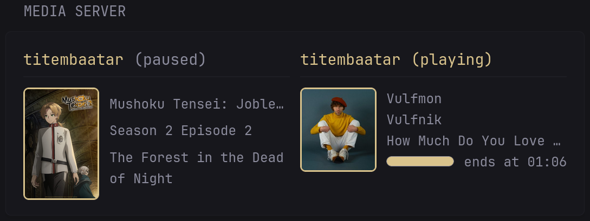
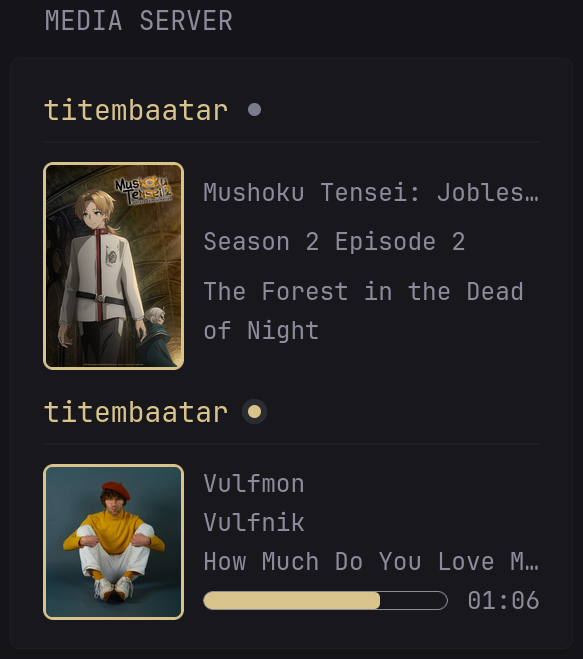
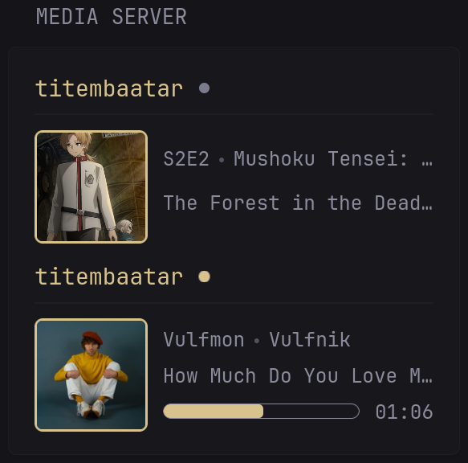

* [Presentation](#presentation)
* [Preview](#preview)
    * [Full Size Column](#grid-layout-for-full-size-column)
    * [Small Size Column](#vertical-layout-for-small-size-column)
    * [Compact Mode](#compact-mode)
* [Environment Variables](#environment-variables)
* [User Variables](#user-variables)
* [Widget YAML](#widget-yaml)
    * [Plex YAML](#plex-yaml)
    * [Tautulli YAML](#tautulli-yaml)
    * [Jellyfin YAML](#jellyfin-yaml)

## Presentation

This is a collection of widget for different Media Servers.

Right now I tested `Plex`, `Tautulli` and `Jellyfin`. For `Emby` the API is (from what I glanced)
exactly the same as `Jellyfin`, I think you can use the [Jellyfin Widget](#jellyfin-yaml) with
`Emby` URL and API key. If there is issue, please open an issue and I'll take a closer look.

Appearance is the same for all Media Servers. There is some [User Variables](#user-variables)
you can use to display/hide some elements. Please take a look !

## Preview

### Grid Layout For Full Size Column



### Vertical Layout For Small Size Column



### Compact Mode



## Environment Variables

### Plex

* `PLEX_URL` - the Plex URL, can be `http://<ip_adress>:<port>` or `https://<domain>`
* `PLEX_TOKEN` - the Plex token, follow [this guide](https://support.plex.tv/articles/204059436-finding-an-authentication-token-x-plex-token/) if you don't know how to get it

### Tautulli

* `TAUTULLI_URL` - the Tautulli URL, can be `http://<ip_adress>:<port>` or `https://<domain>`
* `TAUTULLI_KEY` - the Tautulli API key, can be found in `Settings` -> `Web Interface `-> `API key`

### Jellyfin

* `JELLYFIN_URL` - the Jellyfin URL, can be `http://<ip_adress>:<port>` or `https://<domain>`
* `JELLYFIN_KEY` - the Jellyfin API key, use or create one in `Administration` -> `Dashboard` -> `API Keys`

> [!IMPORTANT]
>
> For URLS, you **NEED** to add `http://` or `https://`
> Do **NOT** leave a trailing `/` at the end of your URLs

## User Variables

You can modify some variables inside the `template`. They are inside the block `{{/* USER VARIABLES ... */}}`

* `isSmallColumn` - set to true if using the widget in a small column
* `isCompact` - set to true to use compact mode
* `playState` - set to "text" to display the playing state in plain text, "indicator" for a status badge or "none" to hide the play state
* `showThumbnail` - set to true to show thumbnails
* `showPaused` - set to true to display paused items
* `showProgressBar` - set to true to display the "Progress Bar"
* `showProgressInfo` - set to true to display "Progress Info". Depends on `showProgressBar`

> [!CAUTION]
>
> Displaying the thumbnail **WILL** expose your Token/Api Keys in the HTML.
> Do **NOT** set to true if you are using glance in production or exposing the service to internet.

> [!NOTE]
>
> The "Progress Bar" is just for fluff
> It uses CSS animation and time calculations
> It is **NOT** dynamic, nor will it refresh the widget automatically when it reaches 100%

## Widget YAML

### Plex YAML

```yaml
- type: custom-api
  title: plex
  cache: 1m
  url: ${PLEX_URL}/status/sessions
  headers:
    Accept: application/json
    X-Plex-Token: ${PLEX_TOKEN}
  template: |
    {{/* USER VARIABLES BEGIN */}}

    {{/* Set to true if using the widget in a small column */}}
    {{ $isSmallColumn := false }}

    {{/* Set to true to use compact mode */}}
    {{ $isCompact := false }}

    {{/* Set to "text" to display the playing state in plain text */}}
    {{/* Set to "indicator" to display a status badge instead of text */}}
    {{/* Set to "" to hide the play state */}}
    {{ $playState := "text" }}

    {{/* Set to true to show thumbnails */}}
    {{ $showThumbnail := false }}

    {{/* Set to true to display paused items */}}
    {{ $showPaused := false }}

    {{/* Set to false to hide "Progress Bar" */}}
    {{ $showProgressBar := false }}

    {{/* Set to false to hide "Progress Info". Depends on $showProgressBar */}}
    {{ $showProgressInfo := true }}

    {{/* USER VARIABLES END */}}

    {{ if eq .Response.StatusCode 200 }}
      {{ $sessions := .JSON.Array "MediaContainer.Metadata" }}

      {{ if eq (len $sessions) 0 }}
        <p>nothing is playing right now.</p>
      {{ else }}
        {{ if $isSmallColumn }}
          <div class="flex flex-column gap-10">
        {{ else }}
          <div class="gap-10" style="display: grid; grid-template-columns: repeat(2, 1fr);">
        {{ end }}

          {{ range $i, $session := $sessions }}
            {{/* WIDGET VARIABLES BEGIN */}}

            {{ $mediaType := $session.String "type" }}
            {{ $isPlaying := eq ($session.String "Player.state") "playing" }}
            {{ $state := $session.String "Player.state" }}

            {{ $isMovie := eq $mediaType "movie" }}
            {{ $isShows := eq $mediaType "episode" }}
            {{ $isMusic := eq $mediaType "track" }}

            {{ $user := $session.String "User.title"}}
            {{ $movieTitle := $session.String "title" }}
            {{ $showTitle := $session.String "grandparentTitle" }}
            {{ $showSeason := $session.String "parentIndex" }}
            {{ $showEpisode := $session.String "index" }}
            {{ $episodeTitle := $session.String "title" }}
            {{ $artist := $session.String "grandparentTitle" }}
            {{ $albumTitle := $session.String "parentTitle" }}
            {{ $songTitle := $session.String "title" }}
            {{ $default := $session.String "title" }}

            {{ $thumbPath := $session.String "thumb" }}
            {{ if or $isShows $isMusic }}
              {{ $thumbPath = $session.String "parentThumb" }}
            {{ end }}
            {{ $thumbURL := concat "${PLEX_URL}" $thumbPath "?X-Plex-Token=${PLEX_TOKEN}" }}

            {{ $duration := $session.Float "duration" }}
            {{ $offset := $session.Float "viewOffset" }}
            {{ $progress := mul 100 (div $offset $duration) | toInt }}
            {{ $remainingSeconds := div (sub $duration $offset) 1000 | toInt }}
            {{ $remainingSecondsString := printf "%ds" $remainingSeconds }}
            {{ $endTime := offsetNow $remainingSecondsString }}
            {{ $endHour := printf "%02d" $endTime.Hour }}
            {{ $endMinute := printf "%02d" $endTime.Minute }}


            {{/* WIDGET VARIABLES END */}}

            {{/* WIDGET TEMPLATE BEGIN */}}

            {{ if or $isPlaying $showPaused }}
              <div class="card gap-5">
                <div class="flex items-center gap-10 size-h3">
                  <span class="color-primary">{{ $user }}</span>

                  {{ if eq $playState "text" }}
                    <span {{ if $isPlaying }}class="color-primary"{{ end }}>
                      ({{ $state }})
                    </span>
                  {{ else if eq $playState "indicator" }}
                    <style>
                      @keyframes pulse {
                        0% { box-shadow: 0 0 0 0 var(--color-text-base); }
                        40% { box-shadow: 0 0 0 4px transparent; }
                        100% { box-shadow: 0 0 0 4px transparent; }
                      }
                    </style>
                    <div
                      style="
                        {{ if $isPlaying }}
                          animation: pulse 5s infinite;
                          background: var(--color-primary);
                        {{ else }}
                          background: var(--color-text-base-muted);
                        {{ end }}
                        height: .7rem;
                        width: .7rem;
                        border-radius: 100%;
                      "
                    ></div>
                  {{ else }}
                  {{ end }}
                </div>

                <hr class="margin-bottom-5" />

                <div class="flex items-center gap-10" style="align-items: stretch;">
                  {{ if eq $showThumbnail true }}
                    
                  {{ end }}

                  <ul
                    class="flex flex-column grow justify-evenly"
                    style="width: 0;"
                  >
                    {{ if $isMovie }}
                      <li>{{ $movieTitle }}</li>
                    {{ else if $isShows }}
                      {{ if $isCompact }}
                        <ul class="list-horizontal-text flex-nowrap">
                          <li class="text-truncate shrink-0">{{ concat "S" $showSeason "E" $showEpisode }}</li>
                          <li class="text-truncate">{{ $showTitle }}</li>
                        </ul>
                        <li class="text-truncate">{{ $episodeTitle }}</li>
                      {{ else }}
                        <li class="text-truncate">{{ $showTitle }}</li>
                        <li class="text-truncate">{{ concat "Season " $showSeason " Episode " $showEpisode }}</li>
                        <li>{{ $episodeTitle }}</li>
                      {{ end }}
                    {{ else if $isMusic }}
                      {{ if $isCompact }}
                        <ul class="list-horizontal-text flex-nowrap">
                          <li class="text-truncate shrink-0">{{ $artist }}</li>
                          <li class="text-truncate">{{ $albumTitle }}</li>
                        </ul>
                      {{ else }}
                        <li class="text-truncate">{{ $artist }}</li>
                        <li class="text-truncate">{{ $albumTitle }}</li>
                      {{ end }}
                      <li class="text-truncate">{{ $songTitle }}</li>
                    {{ else }}
                      <li>{{ $default }}</li>
                    {{ end }}

                    <li>
                      {{ if and $isPlaying $showProgressBar }}
                        <div class="flex gap-10 items-center">
                          <div
                            class="grow"
                            style="height: 1rem;
                              max-width: 32rem;
                              border: 1px solid var(--color-text-base);
                              border-radius: var(--border-radius);
                              overflow: hidden;"
                          >
                            <style>
                              @keyframes progress-animation {
                                to { width: 100%; }
                              }
                            </style>
                            <div
                              style="height: 100%;
                                width: {{ $progress }}%;
                                background: var(--color-primary);
                                border-radius: 3px;
                                transition: width 1s linear;
                                animation: progress-animation {{ $remainingSeconds }}s linear forwards;"
                              data-progress="{{ $progress }}"
                              data-remaining="{{ $remainingSeconds }}">
                            </div>
                          </div>

                          {{ if $showProgressInfo }}
                            <p>{{ if and ( not $isCompact ) ( not $isSmallColumn ) }}ends at {{ end }}{{ $endHour -}}:{{- $endMinute }}</p>
                          {{ end }}
                        </div>
                      {{ end }}
                    </li>
                  </ul>
                </div>
              </div>
            {{ end }}

            {{/* WIDGET TEMPLATE END */}}

          {{ end }}
        </div>
      {{ end }}
    {{ else }}
      <p>Failed to fetch Plex sessions</p>
    {{ end }}
```

### Tautulli YAML

```yaml
- type: custom-api
  title: tautulli
  cache: 1m
  allow-insecure: true
  url: ${TAUTULLI_URL}/api/v2
  parameters:
    apikey: ${TAUTULLI_KEY}
    cmd: get_activity
  template: |
    {{/* USER VARIABLES BEGIN */}}

    {{/* Set to true if using the widget in a small column */}}
    {{ $isSmallColumn := false }}

    {{/* Set to true to use compact mode */}}
    {{ $isCompact := false }}

    {{/* Set to "text" to display the playing state in plain text */}}
    {{/* Set to "indicator" to display a status badge instead of text */}}
    {{/* Set to "" to hide the play state */}}
    {{ $playState := "text" }}

    {{/* Set to true to show thumbnails */}}
    {{ $showThumbnail := false }}

    {{/* Set to true to display paused items */}}
    {{ $showPaused := false }}

    {{/* Set to false to hide "Progress Bar" */}}
    {{ $showProgressBar := false }}

    {{/* Set to false to hide "Progress Info". Depends on $showProgressBar */}}
    {{ $showProgressInfo := true }}

    {{/* USER VARIABLES END */}}

    {{ if eq .Response.StatusCode 200 }}
      {{ $sessions := .JSON.Array "response.data.sessions" }}

      {{ if eq (len $sessions) 0 }}
        <p>nothing is playing right now.</p>
      {{ else }}
        {{ if $isSmallColumn }}
          <div class="flex flex-column gap-10">
        {{ else }}
          <div class="gap-10" style="display: grid; grid-template-columns: repeat(2, 1fr);">
        {{ end }}

          {{ range $i, $session := $sessions }}
            {{/* WIDGET VARIABLES BEGIN */}}

            {{ $mediaType := $session.String "media_type" }}
            {{ $isPlaying := eq ($session.String "state") "playing" }}
            {{ $state := $session.String "state" }}

            {{ $isMovie := eq $mediaType "movie" }}
            {{ $isShows := eq $mediaType "episode" }}
            {{ $isMusic := eq $mediaType "track" }}

            {{ $user := $session.String "user"}}
            {{ $movieTitle := $session.String "title" }}
            {{ $showTitle := $session.String "grandparent_title" }}
            {{ $showSeason := $session.String "parent_media_index" }}
            {{ $showEpisode := $session.String "media_index" }}
            {{ $episodeTitle := $session.String "title" }}
            {{ $artist := $session.String "grandparent_title" }}
            {{ $albumTitle := $session.String "parent_title" }}
            {{ $songTitle := $session.String "title" }}
            {{ $default := $session.String "title" }}

            {{ $thumbPath := $session.String "thumb" }}
            {{ if or $isShows $isMusic }}
              {{ $thumbPath = $session.String "parent_thumb" }}
            {{ end }}
            {{ $thumbURL := concat "${TAUTULLI_URL}/api/v2?apikey=${TAUTULLI_KEY}&cmd=pms_image_proxy&img=" $thumbPath }}

            {{ $duration := $session.Float "duration" }}
            {{ $offset := $session.Float "view_offset" }}
            {{ $progress := $session.Int "progress_percent" }}
            {{ $remainingSeconds := div (sub $duration $offset) 1000 | toInt }}
            {{ $remainingSecondsString := printf "%ds" $remainingSeconds }}
            {{ $endTime := offsetNow $remainingSecondsString }}
            {{ $endHour := printf "%02d" $endTime.Hour }}
            {{ $endMinute := printf "%02d" $endTime.Minute }}

            {{/* WIDGET VARIABLES END */}}

            {{/* WIDGET TEMPLATE BEGIN */}}

            {{ if or $isPlaying $showPaused }}
              <div class="card gap-5">
                <div class="flex items-center gap-10 size-h3">
                  <span class="color-primary">{{ $user }}</span>

                  {{ if eq $playState "text" }}
                    <span {{ if $isPlaying }}class="color-primary"{{ end }}>
                      ({{ $state }})
                    </span>
                  {{ else if eq $playState "indicator" }}
                    <style>
                      @keyframes pulse {
                        0% { box-shadow: 0 0 0 0 var(--color-text-base); }
                        40% { box-shadow: 0 0 0 4px transparent; }
                        100% { box-shadow: 0 0 0 4px transparent; }
                      }
                    </style>
                    <div
                      style="
                        {{ if $isPlaying }}
                          animation: pulse 5s infinite;
                          background: var(--color-primary);
                        {{ else }}
                          background: var(--color-text-base-muted);
                        {{ end }}
                        height: .7rem;
                        width: .7rem;
                        border-radius: 100%;
                      "
                    ></div>
                  {{ else }}
                  {{ end }}
                </div>

                <hr class="margin-bottom-5" />

                <div class="flex items-center gap-10" style="align-items: stretch;">
                  {{ if eq $showThumbnail true }}
                    
                  {{ end }}

                  <ul
                    class="flex flex-column grow justify-evenly"
                    style="width: 0;"
                  >
                    {{ if $isMovie }}
                      <li>{{ $movieTitle }}</li>
                    {{ else if $isShows }}
                      {{ if $isCompact }}
                        <ul class="list-horizontal-text flex-nowrap">
                          <li class="text-truncate shrink-0">{{ concat "S" $showSeason "E" $showEpisode }}</li>
                          <li class="text-truncate">{{ $showTitle }}</li>
                        </ul>
                        <li class="text-truncate">{{ $episodeTitle }}</li>
                      {{ else }}
                        <li class="text-truncate">{{ $showTitle }}</li>
                        <li class="text-truncate">{{ concat "Season " $showSeason " Episode " $showEpisode }}</li>
                        <li>{{ $episodeTitle }}</li>
                      {{ end }}
                    {{ else if $isMusic }}
                      {{ if $isCompact }}
                        <ul class="list-horizontal-text flex-nowrap">
                          <li class="text-truncate shrink-0">{{ $artist }}</li>
                          <li class="text-truncate">{{ $albumTitle }}</li>
                        </ul>
                      {{ else }}
                        <li class="text-truncate">{{ $artist }}</li>
                        <li class="text-truncate">{{ $albumTitle }}</li>
                      {{ end }}
                      <li class="text-truncate">{{ $songTitle }}</li>
                    {{ else }}
                      <li>{{ $default }}</li>
                    {{ end }}

                    <li>
                      {{ if and $isPlaying $showProgressBar }}
                        <div class="flex gap-10 items-center">
                          <div
                            class="grow"
                            style="height: 1rem;
                              max-width: 32rem;
                              border: 1px solid var(--color-text-base);
                              border-radius: var(--border-radius);
                              overflow: hidden;"
                          >
                            <style>
                              @keyframes progress-animation {
                                to { width: 100%; }
                              }
                            </style>
                            <div
                              style="height: 100%;
                                width: {{ $progress }}%;
                                background: var(--color-primary);
                                border-radius: 3px;
                                transition: width 1s linear;
                                animation: progress-animation {{ $remainingSeconds }}s linear forwards;"
                              data-progress="{{ $progress }}"
                              data-remaining="{{ $remainingSeconds }}">
                            </div>
                          </div>

                          {{ if $showProgressInfo }}
                            <p>{{ if and ( not $isCompact ) ( not $isSmallColumn ) }}ends at {{ end }}{{ $endHour -}}:{{- $endMinute }}</p>
                          {{ end }}
                        </div>
                      {{ end }}
                    </li>
                  </ul>
                </div>
              </div>
            {{ end }}

            {{/* WIDGET TEMPLATE END */}}

          {{ end }}
        </div>
      {{ end }}
    {{ else }}
      <p>Failed to fetch Tautulli sessions</p>
    {{ end }}
```

### Jellyfin YAML

```yaml
- type: custom-api
  title: jellyfin
  cache: 1m
  url: ${JELLYFIN_URL}/Sessions
  parameters:
    api_key: ${JELLYFIN_KEY}
    activeWithinSeconds: 30
  template: |
    {{/* USER VARIABLES BEGIN */}}

    {{/* Set to true if using the widget in a small column */}}
    {{ $isSmallColumn := false }}

    {{/* Set to true to use compact mode */}}
    {{ $isCompact := false }}

    {{/* Set to "text" to display the playing state in plain text */}}
    {{/* Set to "indicator" to display a status badge instead of text */}}
    {{/* Set to "" to hide the play state */}}
    {{ $playState := "text" }}

    {{/* Set to true to show thumbnails */}}
    {{ $showThumbnail := false }}

    {{/* Set to true to display paused items */}}
    {{ $showPaused := false }}

    {{/* Set to false to hide "Progress Bar" */}}
    {{ $showProgressBar := false }}

    {{/* Set to false to hide "Progress Info". Depends on $showProgressBar */}}
    {{ $showProgressInfo := true }}

    {{/* USER VARIABLES END */}}

    {{ if eq .Response.StatusCode 200 }}
      {{ $sessions := .JSON.Array "" }}

      {{ if eq (len $sessions) 0 }}
        <p>nothing is playing right now.</p>
      {{ else }}
        {{ if $isSmallColumn }}
          <div class="flex flex-column gap-10">
        {{ else }}
          <div class="gap-10" style="display: grid; grid-template-columns: repeat(2, 1fr);">
        {{ end }}

          {{ range $i, $session := $sessions }}
            {{/* WIDGET VARIABLES BEGIN */}}

            {{ $mediaType := $session.String "NowPlayingItem.Type" }}
            {{ $isPaused := $session.Bool "PlayState.IsPaused" }}
            {{ $isPlaying := not $isPaused }}
            {{ $state := "playing" }}
            {{ if $isPaused }}
              {{ $state = "paused" }}
            {{ end }}

            {{ $isMovie := eq $mediaType "Movie" }}
            {{ $isShows := eq $mediaType "Episode" }}
            {{ $isMusic := eq $mediaType "Audio" }}

            {{ $user := $session.String "UserName"}}
            {{ $movieTitle := $session.String "NowPlayingItem.Name" }}
            {{ $showTitle := $session.String "NowPlayingItem.SeriesName" }}
            {{ $showSeason := $session.String "NowPlayingItem.ParentIndexNumber" }}
            {{ $showEpisode := $session.String "NowPlayingItem.IndexNumber" }}
            {{ $episodeTitle := $session.String "NowPlayingItem.Name" }}
            {{ $artist := $session.String "NowPlayingItem.AlbumArtist" }}
            {{ $albumTitle := $session.String "NowPlayingItem.Album" }}
            {{ $songTitle := $session.String "NowPlayingItem.Name" }}
            {{ $default := $session.String "NowPlayingItem.Name" }}

            {{ $thumbID := $session.String "NowPlayingItem.Id" }}
            {{ if $isShows }}
              {{ $thumbID = $session.String "NowPlayingItem.ParentId" }}
            {{ end }}
            {{ $thumbURL := concat "${JELLYFIN_URL}/Items/" $thumbID "/Images/Primary?api_key=${JELLYFIN_KEY}" }}

            {{ $duration := $session.Float "NowPlayingItem.RunTimeTicks" }}
            {{ $offset := $session.Float "PlayState.PositionTicks" }}
            {{ $progress := mul 100 ( div $offset $duration ) | toInt }}
            {{ $remainingSeconds := div (sub $duration $offset) 10000000 | toInt }}
            {{ $remainingSecondsString := printf "%ds" $remainingSeconds }}
            {{ $endTime := offsetNow $remainingSecondsString }}
            {{ $endHour := printf "%02d" $endTime.Hour }}
            {{ $endMinute := printf "%02d" $endTime.Minute }}

            {{/* WIDGET VARIABLES END */}}

            {{/* WIDGET TEMPLATE BEGIN */}}

            {{ if or $isPlaying $showPaused }}
              <div class="card gap-5">
                <div class="flex items-center gap-10 size-h3">
                  <span class="color-primary">{{ $user }}</span>

                  {{ if eq $playState "text" }}
                    <span {{ if $isPlaying }}class="color-primary"{{ end }}>
                      ({{ $state }})
                    </span>
                  {{ else if eq $playState "indicator" }}
                    <style>
                      @keyframes pulse {
                        0% { box-shadow: 0 0 0 0 var(--color-text-base); }
                        40% { box-shadow: 0 0 0 4px transparent; }
                        100% { box-shadow: 0 0 0 4px transparent; }
                      }
                    </style>
                    <div
                      style="
                        {{ if $isPlaying }}
                          animation: pulse 5s infinite;
                          background: var(--color-primary);
                        {{ else }}
                          background: var(--color-text-base-muted);
                        {{ end }}
                        height: .7rem;
                        width: .7rem;
                        border-radius: 100%;
                      "
                    ></div>
                  {{ else }}
                  {{ end }}
                </div>

                <hr class="margin-bottom-5" />

                <div class="flex items-center gap-10" style="align-items: stretch;">
                  {{ if eq $showThumbnail true }}
                    
                  {{ end }}

                  <ul
                    class="flex flex-column grow justify-evenly"
                    style="width: 0;"
                  >
                    {{ if $isMovie }}
                      <li>{{ $movieTitle }}</li>
                    {{ else if $isShows }}
                      {{ if $isCompact }}
                        <ul class="list-horizontal-text flex-nowrap">
                          <li class="text-truncate shrink-0">{{ concat "S" $showSeason "E" $showEpisode }}</li>
                          <li class="text-truncate">{{ $showTitle }}</li>
                        </ul>
                        <li class="text-truncate">{{ $episodeTitle }}</li>
                      {{ else }}
                        <li class="text-truncate">{{ $showTitle }}</li>
                        <li class="text-truncate">{{ concat "Season " $showSeason " Episode " $showEpisode }}</li>
                        <li>{{ $episodeTitle }}</li>
                      {{ end }}
                    {{ else if $isMusic }}
                      {{ if $isCompact }}
                        <ul class="list-horizontal-text flex-nowrap">
                          <li class="text-truncate shrink-0">{{ $artist }}</li>
                          <li class="text-truncate">{{ $albumTitle }}</li>
                        </ul>
                      {{ else }}
                        <li class="text-truncate">{{ $artist }}</li>
                        <li class="text-truncate">{{ $albumTitle }}</li>
                      {{ end }}
                      <li class="text-truncate">{{ $songTitle }}</li>
                    {{ else }}
                      <li>{{ $default }}</li>
                    {{ end }}

                    <li>
                      {{ if and $isPlaying $showProgressBar }}
                        <div class="flex gap-10 items-center">
                          <div
                            class="grow"
                            style="height: 1rem;
                              max-width: 32rem;
                              border: 1px solid var(--color-text-base);
                              border-radius: var(--border-radius);
                              overflow: hidden;"
                          >
                            <style>
                              @keyframes progress-animation {
                                to { width: 100%; }
                              }
                            </style>
                            <div
                              style="height: 100%;
                                width: {{ $progress }}%;
                                background: var(--color-primary);
                                border-radius: 3px;
                                transition: width 1s linear;
                                animation: progress-animation {{ $remainingSeconds }}s linear forwards;"
                              data-progress="{{ $progress }}"
                              data-remaining="{{ $remainingSeconds }}">
                            </div>
                          </div>

                          {{ if $showProgressInfo }}
                            <p>{{ if and ( not $isCompact ) ( not $isSmallColumn ) }}ends at {{ end }}{{ $endHour -}}:{{- $endMinute }}</p>
                          {{ end }}
                        </div>
                      {{ end }}
                    </li>
                  </ul>
                </div>
              </div>
            {{ end }}

            {{/* WIDGET TEMPLATE END */}}

          {{ end }}
        </div>
      {{ end }}
    {{ else }}
      <p>Failed to fetch Jellyfin sessions</p>
    {{ end }}
```
