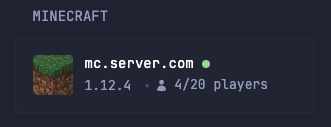

```yaml
- type: custom-api
  title: Minecraft
  url: https://api.mcstatus.io/v2/status/java/${MC_SERVER_URL}
  allow-potentially-dangerous-html: true
  cache: 1s
  template: |
    <div style="display:flex; align-items:center; gap:12px;">
      <div style="width:40px; height:40px; flex-shrink:0;  border-radius:4px; display:flex; justify-content:center; align-items:center; overflow:hidden;">
        {{ if .JSON.Bool "online" }}
          
        {{ else }}
          <svg xmlns="http://www.w3.org/2000/svg" viewBox="0 0 20 20" fill="currentColor" style="width:32px; height:32px; opacity:0.5;">
            <path fill-rule="evenodd" d="M1 5.25A2.25 2.25 0 0 1 3.25 3h13.5A2.25 2.25 0 0 1 19 5.25v9.5A2.25 2.25 0 0 1 16.75 17H3.25A2.25 2.25 0 0 1 1 14.75v-9.5Zm1.5 5.81v3.69c0 .414.336.75.75.75h13.5a.75.75 0 0 0 .75-.75v-2.69l-2.22-2.219a.75.75 0 0 0-1.06 0l-1.91 1.909.47.47a.75.75 0 1 1-1.06 1.06L6.53 8.091a.75.75 0 0 0-1.06 0l-2.97 2.97ZM12 7a1 1 0 1 1-2 0 1 1 0 0 1 2 0Z" clip-rule="evenodd" />
          </svg>
        {{ end }}
      </div>

      <div style="flex-grow:1; min-width:0;">
        <a class="size-h4 block text-truncate color-highlight">
          {{ .JSON.String "host" }}
          {{ if .JSON.Bool "online" }}
          <span
            style="width: 8px; height: 8px; border-radius: 50%; background-color: var(--color-positive); display: inline-block; vertical-align: middle;"
            data-popover-type="text"
            data-popover-text="Online"
          ></span>
          {{ else }}
          <span
            style="width: 8px; height: 8px; border-radius: 50%; background-color: var(--color-negative); display: inline-block; vertical-align: middle;"
            data-popover-type="text"
            data-popover-text="Offline"
          ></span>
          {{ end }}
        </a>

        <ul class="list-horizontal-text">
          <li>
            {{ if .JSON.Bool "online" }}
            <span>{{ .JSON.String "version.name_clean" }}</span>
            {{ else }}
            <span>Offline</span>
            {{ end }}
          </li>
          {{ if .JSON.Bool "online" }}
          <li>
            <p style="display:inline-flex;align-items:center;">
              <svg xmlns="http://www.w3.org/2000/svg" viewBox="0 0 24 24" fill="currentColor" class="size-6" style="height:1em;vertical-align:middle;margin-right:0.5em;">
                <path fill-rule="evenodd" d="M7.5 6a4.5 4.5 0 1 1 9 0 4.5 4.5 0 0 1-9 0ZM3.751 20.105a8.25 8.25 0 0 1 16.498 0 .75.75 0 0 1-.437.695A18.683 18.683 0 0 1 12 22.5c-2.786 0-5.433-.608-7.812-1.7a.75.75 0 0 1-.437-.695Z" clip-rule="evenodd" />
              </svg>
              {{ .JSON.Int "players.online" | formatNumber }}/{{ .JSON.Int "players.max" | formatNumber }} players
            </p>
          </li>
          {{ else }}
          <li>
            <p style="display:inline-flex;align-items:center;">
              <svg xmlns="http://www.w3.org/2000/svg" viewBox="0 0 24 24" fill="currentColor" class="size-6" style="height:1em;vertical-align:middle;margin-right:0.5em;opacity:0.5;">
                <path fill-rule="evenodd" d="M7.5 6a4.5 4.5 0 1 1 9 0 4.5 4.5 0 0 1-9 0ZM3.751 20.105a8.25 8.25 0 0 1 16.498 0 .75.75 0 0 1-.437.695A18.683 18.683 0 0 1 12 22.5c-2.786 0-5.433-.608-7.812-1.7a.75.75 0 0 1-.437-.695Z" clip-rule="evenodd" />
              </svg>
              0 players
            </p>
          </li>
          {{ end }}
        </ul>
      </div>
    </div>
```

## Environment variables

- `MC_SERVER_URL` - the URL/IP of the minecraft server (what you would enter in the game to join). Must be publicly accessible IP.
