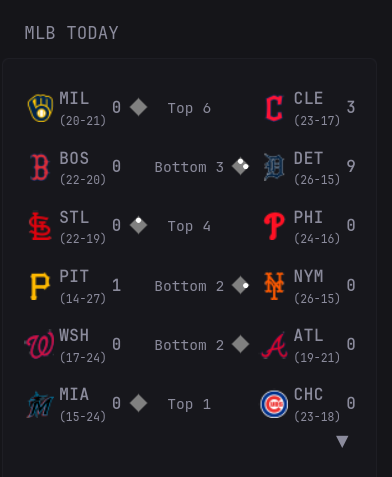

## Preview




## Configuration

```yaml
          - type: custom-api
            title: MLB Today
            url: "https://statsapi.mlb.com/api/v1/schedule/games/?sportId=1&hydrate=linescore(runners),team"
            cache: 15s
            template: |
              {{ $dates := .JSON.Array "dates" }}
              {{ if eq (len $dates) 0 }}
                <div style="padding:8px;text-align:center;">No games scheduled today.</div>
              {{ else }}
                {{ $games := (index $dates 0).Array "games" }}
                {{ $wid := printf "mlb-%d" now.UnixNano }}
                <div id="{{ $wid }}" style="position:relative;padding-bottom:{{ if gt (len $games) 6 }}25px{{ else }}0px{{ end }};">
                  <input type="checkbox" id="{{ $wid }}-cb" style="display:none"/>
                  <ul class="visible" style="list-style:none;padding:0;margin:0;">
                    {{ $count := 0 }}
                    {{ range $i, $g := $games }}
                      {{ $abs := $g.String "status.abstractGameState" }}
                      {{ if and (lt $count 6) (eq $abs "Live") }}
                        {{ template "row" $g }}
                        {{ $count = add $count 1 }}
                      {{ end }}
                    {{ end }}

                    {{ range $i, $g := $games }}
                      {{ $abs := $g.String "status.abstractGameState" }}
                      {{ if and (lt $count 6) (eq $abs "Preview") }}
                        {{ template "row" $g }}
                        {{ $count = add $count 1 }}
                      {{ end }}
                    {{ end }}

                    {{ range $i, $g := $games }}
                      {{ $abs := $g.String "status.abstractGameState" }}
                      {{ if and (lt $count 6) (ne $abs "Live") (ne $abs "Preview") }}
                        {{ template "row" $g }}
                        {{ $count = add $count 1 }}
                      {{ end }}
                    {{ end }}
                  </ul>

                  <ul class="all" style="list-style:none;padding:0;margin:0;display:none">
                    {{ range $i, $g := $games }}
                      {{ if eq ($g.String "status.abstractGameState") "Live" }}
                        {{ template "row" $g }}
                      {{ end }}
                    {{ end }}

                    {{ range $i, $g := $games }}
                      {{ if eq ($g.String "status.abstractGameState") "Preview" }}
                        {{ template "row" $g }}
                      {{ end }}
                    {{ end }}

                    {{ range $i, $g := $games }}
                      {{ $abs := $g.String "status.abstractGameState" }}
                      {{ if and (ne $abs "Live") (ne $abs "Preview") }}
                        {{ template "row" $g }}
                      {{ end }}
                    {{ end }}
                  </ul>

                  {{ if gt (len $games) 6 }}
                    <label for="{{ $wid }}-cb" style="position:absolute;bottom:0px;right:0;cursor:pointer;color:var(--glance-accent-color);font-size:16px;padding:5px;">
                      <span style="display:inline-block;transition:transform .2s">▼</span>
                    </label>
                  {{ end }}

                  <style>
                    #{{ $wid }}-cb:not(:checked) ~ .all  { display:none!important }
                    #{{ $wid }}-cb:checked   ~ .visible { display:none!important }
                    #{{ $wid }}-cb:checked   ~ .all     { display:block!important }
                    #{{ $wid }}-cb:checked   ~ label span { transform:rotate(180deg)!important }
                  </style>
                </div>
              {{ end }}

              {{ define "row" }}
                {{/* --- AWAY SIDE --- */}}
                {{ $awayAbr  := .String "teams.away.abbreviation" }}
                {{ $awayCode := .String "teams.away.team.fileCode" }}
                {{ $awayRecW := .Int    "teams.away.leagueRecord.wins" }}
                {{ $awayRecL := .Int    "teams.away.leagueRecord.losses" }}
                {{ $awaySc   := .Int    "teams.away.score" }}
                {{ $awayId   := .Int    "teams.away.team.id" }}

                {{/* --- HOME SIDE --- */}}
                {{ $homeAbr  := .String "teams.home.abbreviation" }}
                {{ $homeCode := .String "teams.home.team.fileCode" }}
                {{ $homeRecW := .Int    "teams.home.leagueRecord.wins" }}
                {{ $homeRecL := .Int    "teams.home.leagueRecord.losses" }}
                {{ $homeSc   := .Int    "teams.home.score" }}
                {{ $homeId   := .Int    "teams.home.team.id" }}

                {{/* status & linescore */}}
                {{ $abs       := .String "status.abstractGameState" }}
                {{ $detailed  := .String "status.detailedState" }}
                {{ $live      := eq $abs "Live" }}
                {{ $inningSt  := .String "linescore.inningState" }}
                {{ $inningN   := .Int    "linescore.currentInning" }}

                {{/* offense & base occupancy */}}
                {{ $r1        := .Exists "linescore.offense.first" }}
                {{ $r2        := .Exists "linescore.offense.second" }}
                {{ $r3        := .Exists "linescore.offense.third" }}
                {{ $offTeamId := .Int    "linescore.offense.team.id" }}

                <li style="display:flex;align-items:center;gap:12px;padding:6px 0;border-bottom:1px solid var(--glance-divider);white-space:nowrap;"
                    {{ if ne $abs "Preview" }}
                      title="{{ $awayAbr }} Box:{{ range $i, $inning := (.Array "linescore.innings") }}
                        {{ if lt $i 9 }}  Inning {{ add $i 1 }}: {{ $inning.Int "away.runs" }}{{ else }}  Inning {{ add $i 1 }}: {{ $inning.Int "away.runs" }}{{ end }}
                      {{ end }} {{ $homeAbr }} Box:{{ range $i, $inning := (.Array "linescore.innings") }}
                        {{ if lt $i 9 }}  Inning {{ add $i 1 }}: {{ $inning.Int "home.runs" }}{{ else }}  Inning {{ add $i 1 }}: {{ $inning.Int "home.runs" }}{{ end }}
                      {{ end }}"
                    {{ end }}>
                  <span style="display:flex;align-items:center;width:80px;">
                    
                    <span style="display:flex;flex-direction:column;margin-right:4px;">
                      <span style="font-weight:bold;">{{ $awayAbr }}</span>
                      <span style="font-size:0.7em;color:var(--glance-muted-text)">
                        ({{ printf "%d-%d" $awayRecW $awayRecL }})
                      </span>
                    </span>

                    {{ if ne $abs "Preview" }}
                      <span style="margin-left:auto;font-size:0.95em;font-weight:700;">{{ $awaySc }}</span>
                    {{ end }}

                    {{ if and $live (eq $offTeamId $awayId) }}
                      <svg width="20" height="20" viewBox="0 0 24 24" style="margin-left:4px;flex-shrink:0;">
                        <rect x="6" y="6" width="12" height="12" fill="#808080" transform="rotate(45 12 12)"/>
                        {{ if $r1 }}<circle cx="17" cy="12" r="2.5" fill="white"/>{{ end }}
                        {{ if $r2 }}<circle cx="12" cy="7" r="2.5" fill="white"/>{{ end }}
                        {{ if $r3 }}<circle cx="7" cy="12" r="2.5" fill="white"/>{{ end }}
                      </svg>
                    {{ end }}
                  </span>

                  <span style="text-align:center;width:90px;display:inline-block;font-size:0.9em;">
                    {{ if eq $abs "Preview" }}
                      {{ $gameTime := (.String "gameDate" | parseTime "2006-01-02T15:04:05Z").In now.Location }}
                      <span style="color:var(--glance-muted-text)">{{ printf "%02d:%02d" $gameTime.Hour $gameTime.Minute }}</span>
                    {{ else if $live }}
                      {{ printf "%s %d" $inningSt $inningN }}
                    {{ else }}
                      {{ if or (eq $detailed "Game Over") (eq $detailed "Final") }}
                        <span style="font-size:1.1em;font-weight:500;">Final</span>
                        {{ if and (.Exists "seriesGameNumber") (.Exists "seriesDescription") }}
                          {{ $seriesDesc := .String "seriesDescription" }}
                          {{ if not (or (eq $seriesDesc "Regular Season") (eq $seriesDesc "Regular Season 1") (eq $seriesDesc "Regular Season 2") (eq $seriesDesc "Regular Season 3") (eq $seriesDesc "Regular Season 4")) }}
                            <div style="font-size:0.7em;color:var(--glance-accent-color);margin-top:2px;">
                              {{ $seriesDesc }} {{ .String "seriesGameNumber" }}
                            </div>
                          {{ end }}
                        {{ end }}
                      {{ else }}
                        {{ $detailed }}
                      {{ end }}
                    {{ end }}
                  </span>

                  <span style="display:flex;align-items:center;width:80px;position:relative;">
                    {{ if and $live (eq $offTeamId $homeId) }}
                      <svg width="20" height="20" viewBox="0 0 24 24" style="position:absolute;left:-24px;margin-right:0;flex-shrink:0;">
                        <rect x="6" y="6" width="12" height="12" fill="#808080" transform="rotate(45 12 12)"/>
                        {{ if $r1 }}<circle cx="17" cy="12" r="2.5" fill="white"/>{{ end }}
                        {{ if $r2 }}<circle cx="12" cy="7" r="2.5" fill="white"/>{{ end }}
                        {{ if $r3 }}<circle cx="7" cy="12" r="2.5" fill="white"/>{{ end }}
                      </svg>
                    {{ end }}

                    
                    <span style="display:flex;flex-direction:column;margin-right:4px;">
                      <span style="font-weight:bold;">{{ $homeAbr }}</span>
                      <span style="font-size:0.7em;color:var(--glance-muted-text)">
                        ({{ printf "%d-%d" $homeRecW $homeRecL }})
                      </span>
                    </span>

                    {{ if ne $abs "Preview" }}
                      <span style="margin-left:auto;font-size:0.95em;font-weight:700;">{{ $homeSc }}</span>
                    {{ end }}
                  </span>
                </li>
              {{ end }}


          - type: custom-api
            title: NHL Today
            cache: 5s
            url: https://api-web.nhle.com/v1/score/now
            template: |
              {{ $myTeam := "ALL" }}
              {{ $games := .JSON.Array "games" }}
              {{ define "gameItem" }}
                {{ $toolTipEnabled := true }}
                {{ $awayTeamColor := "" }}
                {{ $homeTeamColor := "" }}
                {{ $situationDescriptionHome := "" }}
                {{ $situationDescriptionAway := "" }}
                {{ $situationStrength := "" }}
                {{ $homeTeam := .String "homeTeam.abbrev" }}
                {{ $awayTeam := .String "awayTeam.abbrev" }}
                {{ $homeTeamScores := "" }}
                {{ $awayTeamScores := "" }}
                {{ range $index, $desc := .Array "goals" }}
                    {{ $teamAbbrev := .String "teamAbbrev" }}
                    {{ $playerName := .String "name.default" }}
                    {{ $timeScored := .String "timeInPeriod" }}
                    {{ $periodScored := .Int "period" }}
                    {{ if eq $awayTeam $teamAbbrev }}
                        {{ $awayTeamScores = (printf "%s %s %s(%d)" $awayTeamScores $playerName $timeScored $periodScored) }}
                    {{ else if eq $homeTeam $teamAbbrev }}
                        {{ $homeTeamScores = (printf "%s %s %s(%d)" $homeTeamScores $playerName $timeScored $periodScored) }}
                    {{ end }}
                {{ end }}
                {{ $gameState := .String "gameState" }}
                {{ $currentLabel := "" }}
                {{ if or (eq $gameState "OFF") (eq $gameState "FINAL") }}
                    {{ $lastPeriodType := .String "gameOutcome.lastPeriodType" }}
                    {{ $currentLabel = "Final" }}
                    {{ if or (eq $lastPeriodType "OT") (eq $lastPeriodType "SO") }}
                        {{ $currentLabel = (printf "%s %s" $currentLabel $lastPeriodType) }}
                    {{ end }}
                {{ end }}
                {{ if or (eq $gameState "FUT") (eq $gameState "PRE") }}
                    {{ $gameTime := (.String "startTimeUTC" | parseTime "rfc3339").In now.Location }}
                    {{ $currentLabel = (printf "%02d:%02d" $gameTime.Hour $gameTime.Minute) }}
                {{ end }}
                {{ if or (eq $gameState "LIVE") (eq $gameState "CRIT") }}
                    {{ $period := .Int "period" }}
                    {{ $periodString := .String "period" }}
                    {{ $timeRemaining := .String "clock.timeRemaining" }}
                    {{ $intermission := .Int "clock.inIntermission" }}
                    {{ $periodType := .String "periodDescriptor.periodType" }}
                    {{ if eq $period 1 }}
                    {{ $addonValue := "st" }}
                    {{ if eq $intermission 1 }}
                        {{ $addonValue = printf "%s Int" $addonValue }}
                    {{ end }}
                    {{ $currentLabel = (printf "%s%s %s" $periodString $addonValue $timeRemaining) }}
                    {{ else if eq $period 2 }}
                        {{ $addonValue := "nd" }}
                        {{ if eq $intermission 1 }}
                            {{ $addonValue = printf "%s Int" $addonValue }}
                        {{ end }}
                    {{ $currentLabel = (printf "%s%s %s" $periodString $addonValue $timeRemaining) }}
                    {{ else if eq $period 3 }}
                        {{ $addonValue := "rd" }}
                        {{ if eq $intermission 1 }}
                            {{ $addonValue = printf "%s Int" $addonValue }}
                        {{ end }}
                    {{ $currentLabel = (printf "%s%s %s" $periodString $addonValue $timeRemaining) }}
                    {{ else }}
                    {{ $currentLabel = $periodType }} 
                        {{ if not (eq $periodType "SO") }}
                            {{ $currentLabel = (printf "%s %s" $periodType $timeRemaining) }}
                        {{ end }}
                    {{ end }}
                {{ end }}
                {{ if .Exists "situation" }}
                    {{ if .Exists "situation.awayTeam.situationDescriptions" }}
                        {{ $awayTeamColor = "color-negative" }}
                        {{ range $index, $desc := .Array "situation.awayTeam.situationDescriptions" }}
                              {{ $situationDescriptionAway = (printf "%s %s" $situationDescriptionAway $desc.Value) }}
                        {{ end }} 
                    {{ end }}
                    {{ if .Exists "situation.homeTeam.situationDescriptions" }}
                        {{ $homeTeamColor = "color-positive" }}
                        {{ range $index, $desc := .Array "situation.homeTeam.situationDescriptions" }}
                            {{ $situationDescriptionHome = (printf "%s %s" $situationDescriptionHome $desc.Value) }}
                        {{ end }}
                    {{ end }}
                  {{ $situationStrength = concat "(" (.String "situation.awayTeam.strength") "v" (.String "situation.homeTeam.strength") ")" }}
                {{ end }}
                <table>
                    <tr>
                        <td>
                            <a target="_blank" class="size-h3 color-highlight block text-truncate" href="https://www.nhl.com{{ .String "gameCenterLink" }}/">
                              <span class= {{ $awayTeamColor }} > {{ .String "awayTeam.name.default" }} </span> vs <span class= {{ $homeTeamColor }} > {{ .String "homeTeam.name.default" }} </span>
                            </a>
                        </td>
                    </tr>
                    <tr>
                        <td>
                            <span class= {{ $awayTeamColor }} > {{ $situationDescriptionAway }} </span> <span class= {{ $homeTeamColor }} > {{ $situationDescriptionHome }} </span> <span> {{ .String "situation.timeRemaining" }} {{ $situationStrength }}</span>
                        </td>
                    </tr>
                </table>
                <table>
                    <tr>
                        <td data-popover-type="html">
                            {{ if and (not (eq $awayTeamScores "")) (eq $toolTipEnabled true) }}
                                <div data-popover-html>
                                  {{ $awayTeamScores }}
                                </div>
                            {{ end }}
                          
                        </td>
                        <td data-popover-type="html">
                            {{ if and (not (eq $awayTeamScores "")) (eq $toolTipEnabled true) }}
                              <div data-popover-html>
                                {{ $awayTeamScores }}
                              </div>
                            {{ end }}
                          <p style="font-size:25px"> {{ .String "awayTeam.score" }} </p>
                        </td>
                        <td>
                            <p style="font-size:25px">-</p>
                        </td>
                        <td data-popover-type="html">
                          {{ if and (not (eq $homeTeamScores "")) (eq $toolTipEnabled true) }}
                            <div data-popover-html>
                              {{ $homeTeamScores }}
                            </div>
                          {{ end }}
                          <p style="font-size:25px"> {{ .String "homeTeam.score" }} </p>
                        </td>
                        <td data-popover-type="html">
                          {{ if and (not (eq $homeTeamScores "")) (eq $toolTipEnabled true) }}
                            <div data-popover-html>
                              {{ $homeTeamScores }}
                            </div>
                          {{ end }}
                          
                        </td>
                        <td>
                            {{ $currentLabel }}
                        </td>
                    </tr>
                </table>
              {{ end }}

              <ul class="list list-gap-10 collapsible-container" data-collapse-after="10">
              {{ range $game := $games }}
                  {{ if and (or (eq ($game.String "homeTeam.abbrev") $myTeam) (eq ($game.String "awayTeam.abbrev") $myTeam) (eq "ALL" $myTeam)) }}
                  {{ $state := $game.String "gameState" }}
                      {{ if not (or (eq $state "FINAL") (eq $state "OFF")) }}
                          {{ template "gameItem" $game }}
                      {{ end }}
                  {{ end }}
              {{ end }}
              {{ range $game := $games }}
                  {{ if and (or (eq ($game.String "homeTeam.abbrev") $myTeam) (eq ($game.String "awayTeam.abbrev") $myTeam) (eq "ALL" $myTeam)) }}
                  {{ $state := $game.String "gameState" }}
                      {{ if or (eq $state "FINAL") (eq $state "OFF") }}
                          {{ template "gameItem" $game }}
                      {{ end }}
                  {{ end }}
              {{ end }}
              </ul>
     ```
