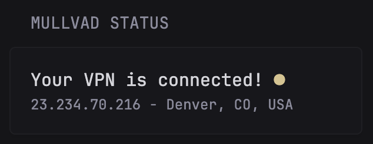

```yaml
- type: custom-api
  title: Mullvad Status
  cache: 1m
  url: https://am.i.mullvad.net/json
  template: |
    <div>
      <div>
        <div>
          {{ $connected := (.JSON.Bool "mullvad_exit_ip") }}
          {{ $ip := (.JSON.String "ip") }}
          {{ $city := (.JSON.String "city") }}
          {{ $country := (.JSON.String "country") }}
          {{ if $connected }}
            <div class="color-highlight size-h3">
              Your VPN is connected!
              <span class="color-positive">●</span> 
            </div>
          {{ else }}
            <div class="color-highlight size-h3">
              Your VPN is not connected!
              <span class="color-negative">●</span> 
            </div>
          {{ end }}
        </div>
        <div class="size-h5">{{ $ip }} - {{ $city }}, {{ $country }}</div>
      </div>
    </div>
```

## Notes

Can be abstracted to other VPN providers by substituting the url for the applicable endpoints