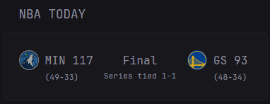
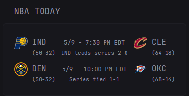

## Preview





## Configuration

```yaml
- type: custom-api
title: NBA Today
url: "https://site.api.espn.com/apis/site/v2/sports/basketball/nba/scoreboard"
cache: 15s
template: |
  {{ $events := .JSON.Array "events" }}
  {{ if eq (len $events) 0 }}
    <div>No games scheduled today.</div>
  {{ else }}
    {{ $wid := printf "nba-%d" now.UnixNano }}
    <div id="{{ $wid }}" style="position:relative;padding-bottom:{{ if gt (len $events) 6 }}25px{{ else }}0px{{ end }};">
      <input type="checkbox" id="{{ $wid }}-cb" style="display:none"/>
      <ul class="visible" style="list-style:none;padding:0;margin:0;">
        {{ $count := 0 }}
      
        {{ range $i, $g := $events }}
          {{ if and (lt $count 6) (eq ($g.String "competitions.0.status.type.name") "STATUS_IN_PROGRESS") }}
            {{ template "nba-game" $g }}
            {{ $count = add $count 1 }}
          {{ end }}
        {{ end }}
      
        {{ range $i, $g := $events }}
          {{ if and (lt $count 6) (eq ($g.String "competitions.0.status.type.name") "STATUS_SCHEDULED") }}
            {{ template "nba-game" $g }}
            {{ $count = add $count 1 }}
          {{ end }}
        {{ end }}
      
        {{ range $i, $g := $events }}
          {{ if and (lt $count 6) (not (or (eq ($g.String "competitions.0.status.type.name") "STATUS_IN_PROGRESS") (eq ($g.String "competitions.0.status.type.name") "STATUS_SCHEDULED"))) }}
            {{ template "nba-game" $g }}
            {{ $count = add $count 1 }}
          {{ end }}
        {{ end }}
      </ul>
    
      <ul class="all" style="list-style:none;padding:0;margin:0;display:none">
        {{ range $i, $g := $events }}
          {{ if eq ($g.String "competitions.0.status.type.name") "STATUS_IN_PROGRESS" }}
            {{ template "nba-game" $g }}
          {{ end }}
        {{ end }}
      
        {{ range $i, $g := $events }}
          {{ if eq ($g.String "competitions.0.status.type.name") "STATUS_SCHEDULED" }}
            {{ template "nba-game" $g }}
          {{ end }}
        {{ end }}
      
        {{ range $i, $g := $events }}
          {{ if not (or (eq ($g.String "competitions.0.status.type.name") "STATUS_IN_PROGRESS") (eq ($g.String "competitions.0.status.type.name") "STATUS_SCHEDULED")) }}
            {{ template "nba-game" $g }}
          {{ end }}
        {{ end }}
      </ul>
    
      {{ if gt (len $events) 6 }}
        <label for="{{ $wid }}-cb" style="position:absolute;bottom:0px;right:0;cursor:pointer;color:var(--glance-accent-color);font-size:16px;padding:5px;">
          <span style="display:inline-block;transition:transform .2s">▼</span>
        </label>
      {{ end }}
      <style>
        #{{ $wid }}-cb:not(:checked) ~ .all { display:none!important }
        #{{ $wid }}-cb:checked ~ .visible { display:none!important }
        #{{ $wid }}-cb:checked ~ .all { display:block!important }
        #{{ $wid }}-cb:checked ~ label span { transform:rotate(180deg)!important }
      </style>
    </div>
  {{ end }}

  {{ define "nba-game" }}
    {{ $state := .String "competitions.0.status.type.name" }}
    {{ $away := index (.Array "competitions.0.competitors") 0 }}
    {{ $home := index (.Array "competitions.0.competitors") 1 }}
    {{ $awayRec := (index ($away.Array "records") 0).String "summary" }}
    {{ $homeRec := (index ($home.Array "records") 0).String "summary" }}
    <li style="display:flex;align-items:center;white-space:nowrap;gap:12px;padding:6px 0;border-bottom:1px solid var(--glance-divider);cursor:default" {{ if ne $state "STATUS_SCHEDULED" }}title="{{ $away.String "team.abbreviation" }} Box:{{ range $j,$ls := $away.Array "linescores" }}{{ if eq $j 0 }} Q1: {{ else if eq $j 1 }} Q2: {{ else if eq $j 2 }} Q3: {{ else if eq $j 3 }} Q4: {{ else }} OT: {{ end }}{{ $ls.String "value" }}{{ end }}&#10;{{ $home.String "team.abbreviation" }} Box:{{ range $j,$ls := $home.Array "linescores" }}{{ if eq $j 0 }} Q1: {{ else if eq $j 1 }} Q2: {{ else if eq $j 2 }} Q3: {{ else if eq $j 3 }} Q4: {{ else }} OT: {{ end }}{{ $ls.String "value" }}{{ end }}"{{ end }}>
      <span style="display:flex;align-items:center;width:90px;">
        
        <span style="display:flex;flex-direction:column;margin-right:0;">
          <span style="font-weight:bold;">{{ $away.String "team.abbreviation" }}</span>
          <span style="font-size:0.7em;color:var(--glance-muted-text)">({{ $awayRec }})</span>
        </span>
        {{ if ne $state "STATUS_SCHEDULED" }}<span style="margin-left:0;font-size:1.1em;font-weight:500;">{{ $away.String "score" }}</span>{{ end }}
      </span>
      <span style="display:flex;flex-direction:column;align-items:center;min-width:90px;margin:0 8px;">
        <span>
          {{ if eq $state "STATUS_IN_PROGRESS" }}
            {{ $period := .String "competitions.0.status.period" }}
            <span style="font-size:0.85em;font-weight:500;">{{ if eq $period "1" }}1st{{ else if eq $period "2" }}2nd{{ else if eq $period "3" }}3rd{{ else if eq $period "4" }}4th{{ else }}OT{{ end }} {{ .String "competitions.0.status.displayClock" }}</span>
          {{ else if eq $state "STATUS_SCHEDULED" }}
            <span style="font-size:0.85em;">{{ .String "competitions.0.status.type.shortDetail" }}</span>
          {{ else }}
            <span style="font-size:0.85em;font-weight:500;">{{ .String "competitions.0.status.type.shortDetail" }}</span>
          {{ end }}
        </span>

        {{ if .Exists "competitions.0.series" }}
          <span style="font-size:0.7em;color:var(--glance-accent-color);margin-top:5px;">{{ .String "competitions.0.series.summary" }}</span>
        {{ end }}
      </span>
      <span style="display:flex;align-items:center;width:90px;">
        
        <span style="display:flex;flex-direction:column;margin-right:0;">
          <span style="font-weight:bold;">{{ $home.String "team.abbreviation" }}</span>
          <span style="font-size:0.7em;color:var(--glance-muted-text)">({{ $homeRec }})</span>
        </span>
        {{ if ne $state "STATUS_SCHEDULED" }}<span style="margin-left:0;font-size:1.1em;font-weight:500;">{{ $home.String "score" }}</span>{{ end }}
      </span>
    </li>
  {{ end }}
```
