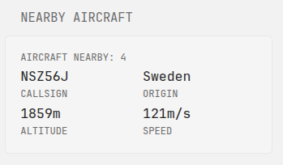

```yaml
- type: custom-api
  title: Nearby Aircraft
  cache: 1m
  url: https://opensky-network.org/api/states/all?lamin=${MY_LAT_MIN}&lomin=${MY_LON_MIN}&lamax=${MY_LAT_MAX}&lomax=${MY_LON_MAX}
  template: |
    <div class="opensky-aircraft-stats">
      {{ $states := .JSON.Array "states" }}
      {{ $statesCount := len $states }}
      
      <div class="margin-block-2">
        <div class="size-h6">AIRCRAFT NEARBY: {{ $statesCount }} </div>
      </div>
      
      {{ if gt $statesCount 0 }}
        {{ $plane := index $states 0 }}
        {{ $callsign := $plane.Get "1" | printf "%s" }}
        {{ $icao24 := $plane.Get "0" | printf "%s" }}
        {{ $origin := $plane.Get "2" | printf "%s" }}
        {{ $onGround := $plane.Get "8" }}
        
        <div class="margin-block-2">
          <!-- Using grid layout with fixed column widths -->
          <div style="display: grid; grid-template-columns: 1fr 1fr; gap: 10px;">
            <div>
              <div class="color-highlight size-h3">{{ if ne $callsign "" }}{{ $callsign }}{{ else }}{{ $icao24 }}{{ end }}</div>
              <div class="size-h6">CALLSIGN</div>
            </div>
            <div>
              <div class="color-highlight size-h3 text-truncate" style="max-width: 100%;">{{ if ne $origin "" }}{{ $origin }}{{ else }}-{{ end }}</div>
              <div class="size-h6">ORIGIN</div>
            </div>
          </div>
        </div>
        
        <div class="margin-block-2">
          <!-- Matching grid layout for the second row -->
          <div style="display: grid; grid-template-columns: 1fr 1fr; gap: 10px;">
            <div>
              {{ $altitude := $plane.Get "7" }}
              <div class="color-highlight size-h3">{{ if and (not $onGround.Bool) $altitude.Exists }}{{ $altitude.Float | printf "%.0f" }}m{{ else }}-{{ end }}</div>
              <div class="size-h6">ALTITUDE</div>
            </div>
            <div>
              {{ $speed := $plane.Get "9" }}
              <div class="color-highlight size-h3">{{ if and (not $onGround.Bool) $speed.Exists }}{{ $speed.Float | printf "%.0f" }}m/s{{ else }}-{{ end }}</div>
              <div class="size-h6">SPEED</div>
            </div>
          </div>
        </div>
      {{ end }}
    </div>
```

## Environment variables

- `MY_LAT_MIN` - Minimum latitude (southern boundary)
- `MY_LAT_MAX` - Maximum latitude (northern boundary)
- `MY_LON_MIN` - Minimum longitude (western boundary)
- `MY_LON_MAX` - Maximum longitude (eastern boundary)
