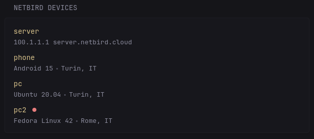

```yaml
- type: custom-api
  title: Netbird Devices
  title-url: https://app.netbird.io/peers
  url: https://api.netbird.io/api/peers
  headers:
    Accept: application/json
    Authorization: Token ${Netbird_API_KEY}
  cache: 10m
  template: |
    {{ $enableOnlineIndicator := false }}

    <style>
      .device-info-container {
        position: relative;
        overflow: hidden;
        height: 1.5em;
      }

      .device-info {
        display: flex;
        transition: transform 0.2s ease, opacity 0.2s ease;
      }

      .device-ip {
        position: absolute;
        top: 0;
        left: 0;
        transform: translateY(-100%);
        opacity: 0;
        transition: transform 0.2s ease, opacity 0.2s ease;
      }

      .device-info-container:hover .device-info {
        transform: translateY(100%);
        opacity: 0;
      }

      .device-info-container:hover .device-ip {
        transform: translateY(0);
        opacity: 1;
      }

      .offline-indicator,
      .online-indicator {
        width: 8px;
        height: 8px;
        border-radius: 50%;
        display: inline-block;
        margin-left: 4px;
        vertical-align: middle;
      }

      .online-indicator {
        background-color: var(--color-positive);
      }

      .offline-indicator {
        background-color: var(--color-negative);
      }

      .device-name-container {
        display: flex;
        align-items: center;
        gap: 8px;
      }

      .indicators-container {
        display: flex;
        align-items: center;
        gap: 4px;
      }
    </style>

    <ul class="list list-gap-10 collapsible-container" data-collapse-after="4">
      {{ range .JSON.Array "" }}
      <li>
        <div class="flex items-center gap-10">
          <div class="device-name-container grow">
            <span class="size-h4 block text-truncate color-primary">
              {{ .String "hostname" }}
            </span>
            <div class="indicators-container">
              {{ if .Bool "connected" }}
                {{ if $enableOnlineIndicator }}
                <span class="online-indicator" data-popover-type="text" data-popover-text="Online"></span>
                {{ end }}
              {{ else }}
                {{ $lastSeen := .String "last_seen" | parseTime "rfc3339" }}
                <span class="offline-indicator" data-popover-type="text" data-popover-text="Offline - Last seen {{ $lastSeen.Format "Jan 2 3:04pm" }}"></span>
              {{ end }}
            </div>
          </div>
        </div>
        <div class="device-info-container">
          <ul class="list-horizontal-text device-info">
            <li>{{ .String "os" }}</li>
            <li>{{ .String "city_name" }}, {{ .String "country_code"}}</li>
          </ul>
          <div class="device-ip">
            {{ .String "ip" }}
            {{ .String "dns_label"}}
          </div>
        </div>
      </li>
      {{ end }}
    </ul>
```

## Environment variables

- `NETBIRD_API_KEY`: Your Netbird API key, you can create one in the [NetBird dashboard](https://app.netbird.io/users) under User settings. 
- `TZ`: For correct times, the widget uses the container's timezone. If not already supplied, you can use this variable to provide your timezone.

## Disclaimer

Some parts of this widget's code are inspired by the [Tailscale Devices widget](widgets/tailscale-devices-by-not-first/README.md) created by @not-first.
