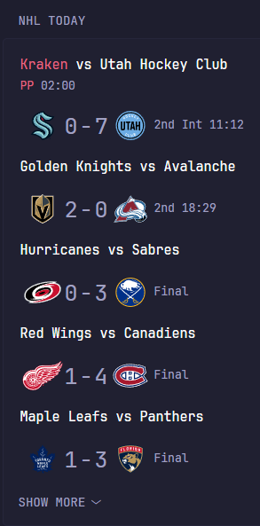
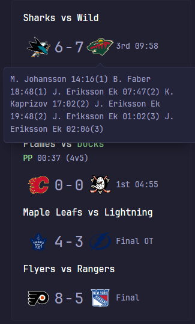

## Screenshots

| Daily Schedule | Ongoing Games | Goal Scorers Tooltips |
| -------------- | ------------- | ----------- |
|  |  |  |


```yaml
- type: custom-api
  title: NHL Today
  cache: 5s
  url: https://api-web.nhle.com/v1/score/now 
  template: |
    {{ $myTeam := "ALL" }}
    
    <style>
    .tooltip {
        position: relative;
        display: inline-block;
    }
    .tooltip .tooltiptext {
        visibility: hidden;
        width: 120px;
        background-color: black;
        color: #fff;
        text-align: center;
        border-radius: 6px;
        padding: 5px 0;

        /* Position the tooltip */
        position: absolute;
        z-index: 1;
    }
    .tooltip:hover .tooltiptext {
        visibility: visible;
    }
    </style>

    {{ $games := .JSON.Array "games" }}
    {{ define "gameItem" }}
      {{ $toolTipEnabled := true }}
      {{ $awayTeamColor := "" }}
      {{ $homeTeamColor := "" }}
      {{ $situationDescriptionHome := "" }}
      {{ $situationDescriptionAway := "" }}
      {{ $homeTeam := .String "homeTeam.abbrev" }}
      {{ $awayTeam := .String "awayTeam.abbrev" }}
      {{ $homeTeamScores := "" }}
      {{ $awayTeamScores := "" }}
      {{ range $index, $desc := .Array "goals" }}
          {{ $teamAbbrev := .String "teamAbbrev" }}
          {{ $playerName := .String "name.default" }}
          {{ $timeScored := .String "timeInPeriod" }}
          {{ $periodScored := .Int "period" }}
          {{ if eq $awayTeam $teamAbbrev }}
              {{ $awayTeamScores = (printf "%s %s %s(%d)" $awayTeamScores $playerName $timeScored $periodScored) }}
          {{ else if eq $homeTeam $teamAbbrev }}
              {{ $homeTeamScores = (printf "%s %s %s(%d)" $homeTeamScores $playerName $timeScored $periodScored) }}
          {{ end }}
      {{ end }}
      {{ $gameState := .String "gameState" }}
      {{ $currentLabel := "" }}
      {{ if or (eq $gameState "OFF") (eq $gameState "FINAL") }}
          {{ $lastPeriodType := .String "gameOutcome.lastPeriodType" }}
          {{ $currentLabel = "Final" }}
          {{ if or (eq $lastPeriodType "OT") (eq $lastPeriodType "SO") }}
              {{ $currentLabel = (printf "%s %s" $currentLabel $lastPeriodType) }}
          {{ end }}
      {{ end }}
      {{ if or (eq $gameState "FUT") (eq $gameState "PRE") }}
          {{ $gameTime := (.String "startTimeUTC" | parseTime "rfc3339").In now.Location }}
          {{ $currentLabel = (printf "%02d:%02d" $gameTime.Hour $gameTime.Minute) }}
      {{ end }}
      {{ if or (eq $gameState "LIVE") (eq $gameState "CRIT") }}
          {{ $period := .Int "period" }}
          {{ $periodString := .String "period" }}
          {{ $timeRemaining := .String "clock.timeRemaining" }}
          {{ $intermission := .Int "clock.inIntermission" }}
          {{ $periodType := .String "periodDescriptor.periodType" }}
          {{ if eq $period 1 }}
          {{ $addonValue := "st" }}
          {{ if eq $intermission 1 }}
              {{ $addonValue = printf "%s Int" $addonValue }}
          {{ end }}
          {{ $currentLabel = (printf "%s%s %s" $periodString $addonValue $timeRemaining) }}
          {{ else if eq $period 2 }}
              {{ $addonValue := "nd" }}
              {{ if eq $intermission 1 }}
                  {{ $addonValue = printf "%s Int" $addonValue }}
              {{ end }}
          {{ $currentLabel = (printf "%s%s %s" $periodString $addonValue $timeRemaining) }}
          {{ else if eq $period 3 }}
              {{ $addonValue := "rd" }}
              {{ if eq $intermission 1 }}
                  {{ $addonValue = printf "%s Int" $addonValue }}
              {{ end }}
          {{ $currentLabel = (printf "%s%s %s" $periodString $addonValue $timeRemaining) }}
          {{ else }}
          {{ $currentLabel = $periodType }} 
              {{ if not (eq $periodType "SO") }}
                  {{ $currentLabel = (printf "%s %s" $periodType $timeRemaining) }}
              {{ end }}
          {{ end }}
      {{ end }}
      {{ if .Exists "situation" }}
          {{ if .Exists "situation.awayTeam.situationDescriptions" }}
              {{ $awayTeamColor = "color-negative" }}
              {{ range $index, $desc := .Array "situation.awayTeam.situationDescriptions" }}
                    {{ $situationDescriptionAway = (printf "%s %s" $situationDescriptionAway $desc.Value) }}
              {{ end }} 
          {{ end }}
          {{ if .Exists "situation.homeTeam.situationDescriptions" }}
              {{ $homeTeamColor = "color-positive" }}
              {{ range $index, $desc := .Array "situation.homeTeam.situationDescriptions" }}
                  {{ $situationDescriptionHome = (printf "%s %s" $situationDescriptionHome $desc.Value) }}
              {{ end }}
          {{ end }}
      {{ end }}
      <table>
          <tr>
              <td>
                  <a target="_blank" class="size-h3 color-highlight block text-truncate" href="https://www.nhl.com{{ .String "gameCenterLink" }}/">
                    <span class= {{ $awayTeamColor }} > {{ .String "awayTeam.name.default" }} </span> vs <span class= {{ $homeTeamColor }} > {{ .String "homeTeam.name.default" }} </span>
                  </a>
              </td>
          </tr>
          <tr>
              <td>
                  <span class= {{ $awayTeamColor }} > {{ $situationDescriptionAway }} </span> <span class= {{ $homeTeamColor }} > {{ $situationDescriptionHome }} </span> <span> {{ .String "situation.timeRemaining" }} </span>
              </td>
          </tr>
      </table>
      <table>
          <tr>
              <td class="tooltip">
                  
                  {{ if and (not (eq $awayTeamScores "")) (eq $toolTipEnabled true) }}
                      <span class="tooltiptext"> {{ $awayTeamScores }} </span>
                  {{ end }}
              </td>
              <td class="tooltip">
                <div>
                <p style="font-size:25px"> {{ .String "awayTeam.score" }} </p>
                {{ if and (not (eq $awayTeamScores "")) (eq $toolTipEnabled true) }}
                    <span class="tooltiptext"> {{ $awayTeamScores }} </span>
                {{ end }}
                </div>
              </td>
              <td>
                  <p style="font-size:25px">-</p>
              </td>
              <td class="tooltip">
                <div>
                <p style="font-size:25px"> {{ .String "homeTeam.score" }} </p>
                {{ if and (not (eq $homeTeamScores "")) (eq $toolTipEnabled true) }}
                    <span class="tooltiptext"> {{ $homeTeamScores }} </span>
                {{ end }}
                </div>
              </td>
              <td class="tooltip">
                  
                  {{ if and (not (eq $homeTeamScores "")) (eq $toolTipEnabled true) }}
                  <span class="tooltiptext"> {{ $homeTeamScores }} </span>
                  {{ end }}
              </td>
              <td>
                  {{ $currentLabel }}
              </td>
          </tr>
      </table>
    {{ end }}

    <ul class="list list-gap-10 collapsible-container" data-collapse-after="10">
    {{ range $game := $games }}
        {{ if and (or (eq ($game.String "homeTeam.abbrev") $myTeam) (eq ($game.String "awayTeam.abbrev") $myTeam) (eq "ALL" $myTeam)) }}
        {{ $state := $game.String "gameState" }}
            {{ if not (or (eq $state "FINAL") (eq $state "OFF")) }}
                {{ template "gameItem" $game }}
            {{ end }}
        {{ end }}
    {{ end }}
    {{ range $game := $games }}
        {{ if and (or (eq ($game.String "homeTeam.abbrev") $myTeam) (eq ($game.String "awayTeam.abbrev") $myTeam) (eq "ALL" $myTeam)) }}
        {{ $state := $game.String "gameState" }}
            {{ if or (eq $state "FINAL") (eq $state "OFF") }}
                {{ template "gameItem" $game }}
            {{ end }}
        {{ end }}
    {{ end }}
    </ul>
```

## Settings
- If you only want to show result for a single team, set the value of `$myTeam` to your team name official abreviation as shown here: https://en.wikipedia.org/wiki/Wikipedia:WikiProject_Ice_Hockey/NHL_team_abbreviations
- If you want to disable the tooltip, set the value of `$toolTipEnabled` to false