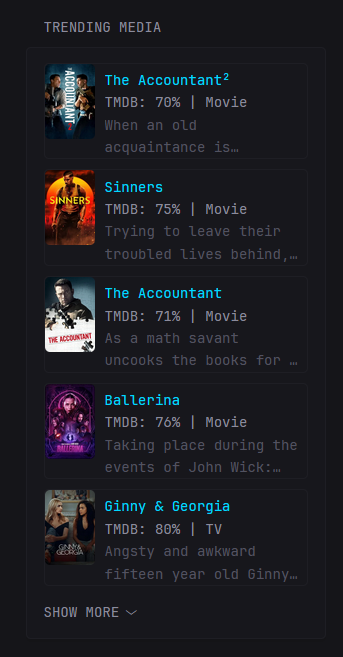

```yaml
- type: custom-api
  title: Trending Media
  title-url: ${OVERSEERR_URL}/discover/trending    # trending, movies, or tv
  url: ${OVERSEERR_URL}/api/v1/discover/trending   # trending, movies, or tv
  cache: 15m
  headers:
    accept: "application/json"
    x-api-key: ${OVERSEERR_API_KEY}
  parameters:
    language: "en" # this can be changed to other languages if desired
    page: "1"
  options:
    show-media-type: true # set to false to hide the "| TV" or "| Movie" suffix
    show-media-desc: true # set to false to hide the media's summary
  template: |
    {{ $showMediaType := .Options.BoolOr "show-media-type" true }}
    {{ $showMediaDesc := .Options.BoolOr "show-media-desc" true }}

    {{ if eq .Response.StatusCode 200 }}
      {{ $items := .JSON.Array "results" }}
      {{ if gt (len $items) 0 }}
        <ul class="list list-gap-10 collapsible-container" data-collapse-after="5">
        {{ range $items }}
          <li class="flex items-start gap-10 thumbnail-container thumbnail-parent">
            {{ $mediaType := .String "mediaType" }}
            {{ $mediaTitle := "" }}
            {{ $mediaTypeUpper := "" }}
            {{ if eq $mediaType "movie" }} {{ $mediaTitle = .String "title" }} {{ $mediaTypeUpper = "Movie" }}{{ else }}{{ $mediaTitle = .String "name" }} {{ $mediaTypeUpper = "TV" }}{{ end }}
            {{ $overseerrUrl := concat "${OVERSEERR_URL}" "/" $mediaType "/" ( .String "id" ) }}
            {{ $tmdbUrl := concat "https://www.themoviedb.org" "/" $mediaType "/" ( .String "id" ) }}
            <a href={{ $overseerrUrl }} target="_blank">
            
            </a>
            <div class="flex-1" style="padding-right: 5px;">
              <p class="color-positive size-h4 text-truncate-2-lines margin-top-5" title={{ $mediaTitle }}><a href={{ $overseerrUrl }} target="_blank">{{ $mediaTitle }}</p>
              <p class="size-h4" title="TMDB Rating"><a href={{ $tmdbUrl }} target="_blank">TMDB: {{ mul (.Float "voteAverage") 10 | toInt }}% {{ if $showMediaType }}| {{ $mediaTypeUpper }}{{ end }}</a></p>
              {{ if $showMediaDesc }}<p class="color-subdue size-h4 text-truncate-2-lines" title={{ .String "overview" }}>{{ .String "overview" }}</p>{{ end }}
            </div>
          </li>
        {{ end }}
        </ul>
      {{ else }}
        <details style="margin-top:0.5rem">
          <summary> Raw JSON:</summary>
          <pre stye="font-size:10px">
      {{ (printf "%+v" .JSON) }}
          </pre>
        </details>
      {{ end }}
    {{ end }}
```

## Environment variables

- `OVERSEERR_URL` - the URL of the Overseerr instance, please include `http://` or `https://` (preferred: `https://`)
- `OVERSEERR_API_KEY` - the API key of the server which can be found in `Overseerr settings -> General -> API key`

## Additional notes

- You can replace `trending` with `movies` or `tv` in the `title-url:` and `url:` keys if you want movies or tv shows *only*
- The thumbnail and title are linked to the respective media item in your Overseerr instance
- The TMDB rating links to TMDB's page for the media item
- The title and overview sometimes cut off, you can hover your mouse over them to see the full title or overview
