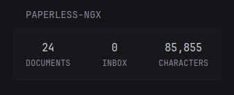

```yaml
- type: custom-api
  title: Paperless-NGX
  title-url: https://${PAPERLESS_URL}
  url: https://${PAPERLESS_URL}/api/statistics/
  headers:
    Authorization: Token ${PAPERLESS_KEY}
    Accept: application/json
  cache: 5m
  template: |
    <div class="flex justify-between text-center">
        <div>
            <div class="color-highlight size-h3">{{ .JSON.Int "documents_total" | formatNumber }}</div>
            <div class="size-h5 uppercase">Documents</div>
        </div>
        <div>
            <div class="color-highlight size-h3">{{ .JSON.Int "documents_inbox" | formatNumber }}</div>
            <div class="size-h5 uppercase">Inbox</div>
        </div>
        <div>
            <div class="color-highlight size-h3">{{ .JSON.Int "character_count" | formatNumber }}</div>
            <div class="size-h5 uppercase">Characters</div>
        </div>
    </div>
```

## Environment variables

#### `PAPERLESS_URL`
the URL of your Paperless instance

#### `PAPERLESS_KEY`
> You can create (or re-create) an API token by opening the "My Profile" link in the user dropdown found in the web UI and clicking the circular arrow button.

See official docs: https://docs.paperless-ngx.com/api/