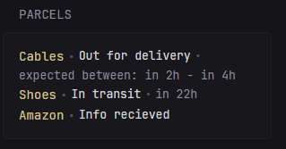

# Parcel

Get status of parcels being tracked by the parcel app (parcelapp.net)

Requires API and paid version of the parcel app $5/year

the API is rate-limited to 20 per hour so the cache could be adjusted if wanted.



```yaml
- type: custom-api
  title: Parcels
  cache: 15m
  url: >-
    https://api.parcel.app/external/deliveries/?filter_mode=active
  headers:
    api-key: ${PARCEL_API_KEY}
    Accept: application/json
  template: |
        <ul class="list list-gap-10 collapsible-container" data-collapse-after="5">
        {{ if .JSON.Bool "success" }}
          {{ if gt (len (.JSON.Array "deliveries")) 0 }}
            {{ range .JSON.Array "deliveries" }}
              <li>
                <ul class="list-horizontal-text">
                  {{ if and (.Exists "extra_information") (ne (.String "extra_information") "") }}
                    <a href="https://parcelapp.net/webtrack.php?platform=web&code={{ .String "tracking_number" }}@{{ .String "extra_information" }}&type={{ .String "carrier_code" }}&lang=en" target="_blank" class="size-h4 color-positive block text-truncate">{{ .String "description" }}</a>
                  {{ else }}
                    <a href="https://parcelapp.net/webtrack.php?platform=web&code={{ .String "tracking_number" }}&type={{ .String "carrier_code" }}&lang=en" target="_blank" class="size-h4 color-positive block text-truncate">{{ .String "description" }}</a>
                  {{ end }}
                  {{ if eq (.Int "status_code") 0 }}
                    <li class="color-positive">Delivered!</li>
                  {{ else if eq (.Int "status_code") 1 }}
                    <li class="color-negative">Frozen delivery</li>
                  {{ else if eq (.Int "status_code") 2 }}
                    <li class="color-highlight">In transit</li>
                    <li {{ .String "timestamp_expected" | parseTime "unix" | toRelativeTime }}></li>
                  {{ else if eq (.Int "status_code") 3 }}
                    <li class="color-highlight">At Pick-up point</li>
                  {{ else if eq (.Int "status_code") 4 }}
                    <li class="color-highlight">Out for delivery</li>
                    <li> expected between:
                      <span {{ .String "timestamp_expected" | parseTime "unix" | toRelativeTime }}></span> - 
                      <span {{ .String "timestamp_expected_end" | parseTime "unix" | toRelativeTime }}></span>
                    </li>
                  {{ else if eq (.Int "status_code") 5 }}
                    <li class="color-negative">Not found</li>
                  {{ else if eq (.Int "status_code") 6 }}
                    <li class="color-negative">Failed delivery attempt.</li>
                  {{ else if eq (.Int "status_code") 7 }}
                    <li class="color-negative">Delivery execption!</li>
                  {{ else if eq (.Int "status_code") 8 }}
                    <li class="color-highlight">Info recieved</li>
                  {{ else }}
                    <li class="color-primary">Unknown</li>
                  {{ end }}
                </ul>
              </li>
            {{ end }}
          {{ else }}
            <div>No active parcels</div>
          {{ end }}
        {{ else }}
          <div>Error: {{ .JSON.String "error_message" }}</div>
        {{ end }}
        </ul>
```

## Environment variables
- `PARCEL_API_KEY` - The Parcel API key. Set a email/password in the app,  go to web.parcelapp.net and generate a API key
