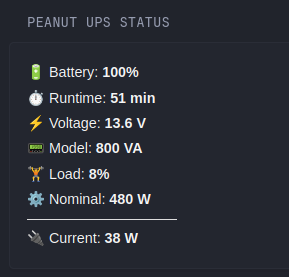

# PEANUT UPS STATS
- The widget returns statistics on from PeaNut to Monitor UPS



```yaml
- type: custom-api
        title: PeaNUT UPS Status
        cache: 10m
        options:
          device: ${PEANUT_DEVICE}
        subrequests:
          charge:
            url: http://${PEANUT_URL}/api/v1/devices/${PEANUT_DEVICE}/var/battery.charge
            headers:
              Authorization: "Basic ${PEANUT_AUTH}"
              Accept: application/json
          runtime:
            url: http://${PEANUT_URL}/api/v1/devices/${PEANUT_DEVICE}/var/battery.runtime
            headers:
              Authorization: "Basic ${PEANUT_AUTH}"
              Accept: application/json
          voltage:
            url: http://${PEANUT_URL}/api/v1/devices/${PEANUT_DEVICE}/var/battery.voltage
            headers:
              Authorization: "Basic ${PEANUT_AUTH}"
              Accept: application/json
          model:
            url: http://${PEANUT_URL}/api/v1/devices/${PEANUT_DEVICE}/var/device.model
            headers:
              Authorization: "Basic ${PEANUT_AUTH}"
              Accept: application/json
          load:
            url: http://${PEANUT_URL}/api/v1/devices/${PEANUT_DEVICE}/var/ups.load
            headers:
              Authorization: "Basic ${PEANUT_AUTH}"
              Accept: application/json
          nominal:
            url: http://${PEANUT_URL}/api/v1/devices/${PEANUT_DEVICE}/var/ups.realpower.nominal
            headers:
              Authorization: "Basic ${PEANUT_AUTH}"
              Accept: application/json
        template: |
          {{ $c:=.Subrequest "charge" }}{{ $rt:=.Subrequest "runtime" }}{{ $v:=.Subrequest "voltage" }}{{ $m:=.Subrequest "model" }}{{ $l:=.Subrequest "load" }}{{ $n:=.Subrequest "nominal" }}
          {{ $charge:=$c.JSON.Int "" }}{{ $runtime:=$rt.JSON.Int "" }}{{ $voltage:=$v.JSON.Float "" }}{{ $model:=$m.JSON.Int "" }}{{ $load:=$l.JSON.Int "" }}{{ $nominal:=$n.JSON.Int "" }}
          {{ $current:=div (mul $load $nominal) 100 }}
          <div style="font-family:Arial,sans-serif;color:#f5f5f5;line-height:1.5;max-width:300px;">
            <p style="margin:4px 0;font-size:1.1em;">🔋 Battery: <strong>{{ printf "%d%%" $charge }}</strong></p>
            <p style="margin:4px 0;font-size:1.1em;">⏱️ Runtime: <strong>{{ printf "%d min" (div $runtime 60) }}</strong></p>
            <p style="margin:4px 0;font-size:1.1em;">⚡ Voltage: <strong>{{ printf "%.1f V" $voltage }}</strong></p>
            <p style="margin:4px 0;font-size:1.1em;">📟 Model: <strong>{{ printf "%d VA" $model }}</strong></p>
            <p style="margin:4px 0;font-size:1.1em;">🏋️ Load: <strong>{{ printf "%d%%" $load }}</strong></p>
            <p style="margin:4px 0;font-size:1.1em;">⚙️ Nominal: <strong>{{ printf "%d W" $nominal }}</strong></p>
            <hr style="border:none;border-top:1px solid #ddd;margin:8px 0;max-width:150px">
            <p style="margin:4px 0;font-size:1.1em;">🔌 Current: <strong>{{ printf "%d W" $current }}</strong></p>
          </div>
```
## Environment variables
- `PEANUT_DEVICE` - Device name
- `PEANUT_URL` - PeaNut URL
- `PEANUT_AUTH` - Bearer Token (For API calls, you'll need to include an Authorization header with the Base64 encoded credentials in the format username:password. The header should be formatted as: Authorization: Basic <encoded credentials> )
