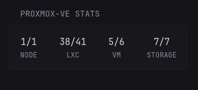

```yaml
- type: custom-api
  title: Proxmox-VE Stats
  cache: 1m
  url: https://${PROXMOXVE_URL}/api2/json/cluster/resources
  allow-insecure: true
  headers:
    Accept: application/json
    Authorization: PVEAPIToken=${PROXMOXVE_KEY}
  template: |
    <div class="flex flex-column gap-5">
      <div class="flex justify-between text-center">
        <div>
          {{ $nodes_online := len (.JSON.Array "data.#(type==\"node\")#|#(status==\"online\")#") }}
          {{ $nodes_total := len (.JSON.Array "data.#(type==\"node\")#") }}
          <div class="color-highlight size-h3">{{ $nodes_online }}/{{ $nodes_total }}</div>
          <div class="size-h5 uppercase">Node</div>
        </div>
        <div>
          {{ $lxc_running := len (.JSON.Array "data.#(type==\"lxc\")#|#(status==\"running\")#|#(template==0)#") }}
          {{ $lxc_total := len (.JSON.Array "data.#(type==\"lxc\")#|#(template==0)#") }}
          <div class="color-highlight size-h3">{{ $lxc_running }}/{{ $lxc_total }}</div>
          <div class="size-h5 uppercase">LXC</div>
        </div>
        <div>
          {{ $qemu_running := len (.JSON.Array "data.#(type==\"qemu\")#|#(status==\"running\")#|#(template==0)#") }}
          {{ $qemu_total := len (.JSON.Array "data.#(type==\"qemu\")#|#(template==0)#") }}
          <div class="color-highlight size-h3">{{ $qemu_running }}/{{ $qemu_total }}</div>
          <div class="size-h5 uppercase">VM</div>
        </div>
        <div>
            {{ $storage_available := len (.JSON.Array "data.#(type==\"storage\")#|#(status==\"available\")#") }}
            {{ $storage_total := len (.JSON.Array "data.#(type==\"storage\")#") }}
            <div class="color-highlight size-h3">{{ $storage_available }}/{{ $storage_total }}</div>
            <div class="size-h5 uppercase">Storage</div>
        </div>
      </div>
    </div>
```

## Environment variables

#### `PROXMOXVE_URL`
the URL of the Proxmox VE server

#### `PROXMOXVE_KEY`
You need to generate an API token for it, follow the steps below if you don't have one

1. Navigate to the Proxmox portal, click on Datacenter
2. Expand Permissions, click on Groups
3. Click the Create button
4. Name the group something informative, like api-ro-users
5. Click on the Permissions "folder"
6. Click Add -> Group Permission
    - Path: /
    - Group: group from bullet 4 above
    - Role: PVEAuditor
    - Propagate: Checked
7. Expand Permissions, click on Users
8. Click the Add button
    - User name: something informative like `api`
    - Realm: Linux PAM standard authentication
    - Group: group from bullet 4 above
9. Expand Permissions, click on API Tokens
10. Click the Add button
    - User: user from bullet 8 above
    - Token ID: something informative like the application or purpose like  for general use `shared` or for specific `glance` - **_better avoid using dashes_**
    - Privilege Separation: Checked
11. Go back to the "Permissions" menu
12. Click Add -> API Token Permission
    - Path: /
    - API Token: select the Token ID created in Step 10
    - Role: PVE Auditor
    - Propagate: Checked

Your key should look like `<username>@pam!<tokenID>=<secret>`, eg:
```
api@pam!shared=some-random-secret-value-here
```

source: [gethomepage's documentation](https://github.com/gethomepage/homepage/blob/main/docs/widgets/services/proxmox.md)
