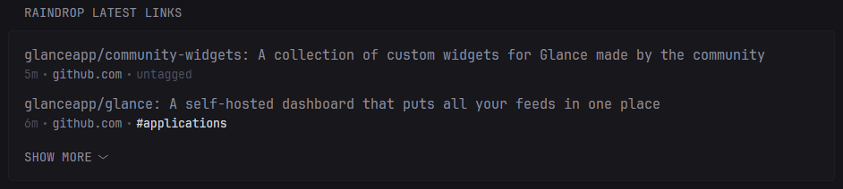
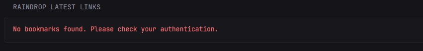

# 🌧 Raindrop.io Widget for Glance

Hey there, fellow bookmark hoarder! 👋

This widget connects your Glance dashboard to Raindrop.io, because let's face it - we all have too many bookmarks and need a better way to manage them. It's like having your own personal librarian, but for links.

- **Latest Links Widget**: Shows your most recent bookmarks with a clean, collapsible interface

   


```yaml
- type: custom-api
    title: RAINDROP LATEST LINKS
    cache: 1h
    url: https://api.raindrop.io/rest/v1/raindrops/1?perpage=10
    headers:
    Authorization: Bearer ${RAINDROP_TOKEN}
    template: |
    {{ if .JSON.Bool "result" }}
        <ul class="list list-gap-10 collapsible-container" data-collapse-after="2">
        {{ range .JSON.Array "items" }}
            <li class="list-item">
                <div class="flex items-center gap-10 list-with-seperator">
                <a href="{{ .String "link" }}" target="_blank" class="size-h3 color-primary-if-not-visited text-truncate-2">{{ .String "title" }}</a>
                </div>
                <div class="flex justify-between text-sm">
                <ul class="list-horizontal-text">
                <li class="color-subdue" {{ .String "created" | parseTime "rfc3339" | toRelativeTime }}></li>
                
                <li>{{ .String "domain" }}</li>
                    {{ if .Array "tags" }}
                <li class="color-highlight">#{{ (index (.Array "tags") 0).String "" | trimPrefix "{" | trimSuffix "}" }}</li>
                    {{ else }}
                    <li class="color-subdue">untagged</li>
                    {{ end }}
                </ul>
                </div>
            </li>
        {{ end }}
        </ul>
    {{ else }}
        <div class="color-negative padding-10">
        No bookmarks found. Please check your authentication.
        </div>
    {{ end }}
```

   With no results.. 




- **Dahboard**: Because we know you've been religiously tagging everything (right? ...right?)

```yaml
- type: custom-api
  title: RAINDROP DASHBOARD
  cache: 1d
  url: https://api.raindrop.io/rest/v1/filters/0
  headers:
    Authorization: Bearer ${RAINDROP_TOKEN}
  template: |
    {{ $view_type := "cards" }} {{/* Options: "cards" or "list" */}}
    {{ $show_tags := true }}  {{/* Note: .Parameters.show_tags not working in template, using hardcoded value */}}
    {{ $show_conten_types := false }}
    {{ if eq $view_type "cards" }}
      <div class="grid grid-cols-2 gap-4">
        <!-- Stats Cards -->
        <div class="card">
          <div class="card-body">
            <h4 class="size-h4">Important</h4>
            <p class="size-h2 color-primary">{{ .JSON.Int "important.count" }}</p>
          </div>
        </div>
        <div class="card">
          <div class="card-body">
            <h4 class="size-h4">Broken Links</h4>
            <p class="size-h2 color-negative">{{ .JSON.Int "broken.count" }}</p>
          </div>
        </div>
        <div class="card">
          <div class="card-body">
            <h4 class="size-h4">Duplicates</h4>
            <p class="size-h2 color-warning">{{ .JSON.Int "duplicates.count" }}</p>
          </div>
        </div>
        <div class="card">
          <div class="card-body">
            <h4 class="color-subdue size-h4">Untagged</h4>
            <p class="size-h2">{{ .JSON.Int "notag.count" }}</p>
          </div>
        </div>
      </div>
    {{ else }}
      <div class="margin-top-10">
        <h4 class="size-h4 margin-bottom-5">Dashboard Stats</h4>
        <ul class="list list-gap-3">
          <li class="list-item">
            <div class="flex justify-between items-center">
              <span class="color-primary">Important</span>
              <span class="text-sm color-muted">{{ .JSON.Int "important.count" }} items</span>
            </div>
          </li>
          <li class="list-item">
            <div class="flex justify-between items-center">
              <span class="color-negative">Broken Links</span>
              <span class="text-sm color-muted">{{ .JSON.Int "broken.count" }} items</span>
            </div>
          </li>
          <li class="list-item">
            <div class="flex justify-between items-center">
              <span class="color-warning">Duplicates</span>
              <span class="text-sm color-muted">{{ .JSON.Int "duplicates.count" }} items</span>
            </div>
          </li>
          <li class="list-item">
            <div class="flex justify-between items-center">
              <h4 class="color-subdue size-h4">Untagged</h4>
              <span class="text-sm color-muted">{{ .JSON.Int "notag.count" }} items</span>
            </div>
          </li>
        </ul>
      </div>
    {{ end }}

    {{ if $show_tags }}
    <hr class="margin-block-15">
    <!-- Tags Distribution -->
    <div class="margin-top-10">
      <h4 class="size-h4 margin-bottom-5">Top Tags</h4>
      <ul class="list list-gap-3">
        {{ $tags := .JSON.Array "tags" }}
        {{ range $tags }}
          {{ $tagName := .String "_id" }}
          {{ $tagCount := .Int "count" }}
          <li class="list-item">
            <div class="flex justify-between items-center">
              <span class="color-highlight">#{{ $tagName }}</span>
              <div class="flex items-center gap-2">
                <span class="text-sm color-muted">{{ $tagCount }} items</span>
                <a href="?tag={{ $tagName }}" class="text-sm">View</a>
              </div>
            </div>
          </li>
        {{ end }}
      </ul>
    </div>
    {{ end}}

    <!-- Content Types -->
    {{ if $show_conten_types }}
    <hr class="margin-block-15">
    <div class="margin-top-10">
      <h4 class="size-h4 margin-bottom-5">Content Types</h4>
      <ul class="list list-gap-3">
        {{ range .JSON.Array "types" }}
          <li class="list-item">
            <div class="flex justify-between items-center">
              <span>{{ .String "_id" }}</span>
              <span class="text-sm color-muted">{{ .Int "count" }} items</span>
            </div>
          </li>
        {{ end }}
      </ul>
    </div>
    {{ end }}

```


## Configuration


### The Token Dance 🎭

Here's the deal: You'll need a token from Raindrop.io. The good news? It's free! The bad news? Test tokens expire in 14 days. But hey, if you're smart enough to use Raindrop.io for bookmark management, you're smart enough to figure out a solution. 😉

Let's get this party started! 🚀

1. Get a personal access token:
   - Go to https://app.raindrop.io/settings/integrations
   - Click on "Create new token"
   - Give it a name (e.g., "GlanceApp Widget")
   - Generate a Test Token
     **Note:** Test tokens are only valid for 14 days. Currently, OAuth flow is not possible when running in Docker, so you'll need to manually refresh your test token every 14 days. I'm sure, when this widget is helpfull for you, you will find a way ;-) 
   - Test Token is usedf for `RAINDROP_TOKEN`

2. Add the token to your GlanceApp configuration as an environment variable:
   - `RAINDROP_TOKEN` (use the personal access token you created)

## Debug Authorization

```yaml
- type: custom-api
    title: Raindrop Auth Test
    cache: 1h
    url: https://api.raindrop.io/rest/v1/user
    headers:
    Authorization: Bearer ${RAINDROP_TOKEN}
    template: |
    <div class="debug-info">
        {{ if .JSON.Bool "result" }}
        <div class="alert alert-success">
            <h4>Authorization Successful!</h4>
            <p>Connected to Raindrop.io as:</p>
            <ul>
            <li>Name: {{ .JSON.String "fullName" }}</li>
            <li>Email: {{ .JSON.String "email" }}</li>
            <li>ID: {{ .JSON.String "_id" }}</li>
            </ul>
        </div>
        {{ else }}
        <div class="alert alert-danger">
            <h4>Authorization Failed</h4>
            <p>Please check your access token and try again.</p>
            <details>
            <summary>Show API Response</summary>
            <pre>{{ .JSON  }}</pre>
            </details>
            <p>To fix:</p>
            <ol>
            <li>Verify your access token is valid</li>
            <li>Check if the token has the correct permissions</li>
            <li>Try the API directly (is not working with docker, try wget):
                <pre>curl -H "Authorization: Bearer YOUR_TOKEN" "https://api.raindrop.io/rest/v1/user"</pre>
            </li>
            </ol>
        </div>
        {{ end }}
    </div>
```
