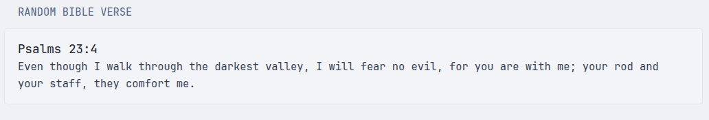

```yaml
- type: custom-api
  title: Random Bible Verse
  cache: 3h
  url: https://bible-api.com/data/web/random
  template: |
    <p class="size-h2 color-highlight">{{ .JSON.String "random_verse.book" }} {{ .JSON.String "random_verse.chapter" }}:{{ .JSON.String "random_verse.verse" }}</p>
    <p class="size-h4 color-paragraph">{{ .JSON.String "random_verse.text" }}</p>
```

## Options

You can see all available endpoints [here](https://bible-api.com/).
