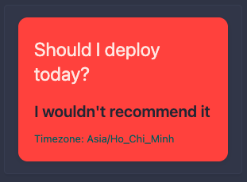

# Should I Deploy Today?
A lighthearted yet professional widget to help you decide if today is the day to ship your code. Perfect for pairing with your CI/CD, Git, or monitoring dashboards. Because sometimes, you need a second opinion—preferably from a widget with a sense of humor.

## Preview



## Configuration

**Note:** Don’t forget to set your correct time zone in the URL for accurate advice!

```yaml
- type: custom-api
  hide-header: true
  title: Should I deploy today
  # cache: 1h
  url: https://shouldideploy.today/api?tz=Asia%2FHo_Chi_Minh
  method: GET
  template: |
    <div class="deploy-card {{ if .JSON.Bool "shouldideploy" }}deploy-yes{{ else }}deploy-no{{ end }}">
      <style>
        .deploy-card {
          width: 100%;
          max-width: unset;
          margin: 0;
          font-family: -apple-system, BlinkMacSystemFont, 'Segoe UI', Roboto, sans-serif;
          transition: transform 0.2s ease, box-shadow 0.2s ease;
          border-radius: 12px;
          box-shadow: 0 2px 8px rgba(0,0,0,0.08);
          padding: 24px 20px 18px 20px;
          text-align: left;
        }
        .deploy-card.deploy-yes {
          background: #9FC87E;
        }
        .deploy-card.deploy-no {
          background: #FF3F33;
        }
        .deploy-card h1 {
          font-size: 24px;
          margin: 0 0 16px;
          line-height: 1.3;
          color: #FFE6E1;
        }
        .deploy-message {
          font-size: 20px;
          font-weight: 600;
          margin: 12px 0 8px 0;
          color: #232634;
        }
        .deploy-date {
          font-size: 14px;
          color: #232634;
          margin-bottom: 4px;
        }
        .deploy-tz {
          font-size: 13px;
          color: #075B5E;
        }
        @media (max-width: 600px) {
          .deploy-card {
            padding: 16px;
          }
          .deploy-card h1 {
            font-size: 20px;
          }
          .deploy-message {
            font-size: 16px;
          }
        }
      </style>
      <h1>Should I deploy today?</h1>
      <div class="deploy-message">{{ .JSON.String "message" }}</div>
      <div class="deploy-tz">Timezone: {{ .JSON.String "timezone" }}</div>
    </div>
```
