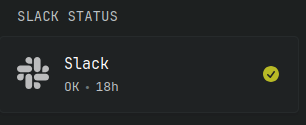

# Slack Status




Custom-api widget to display slack status, simliar to [slack-status.com](https://slack-status.com/)

```yaml
 - type: custom-api
   title: Slack Status
   cache: 1m
   url: https://slack-status.com/api/v2.0.0/current
   template: |
    <div class="flex items-center gap-15">
      <svg class="monitor-site-icon flat-icon" alt="Slack Logo" role="img" viewBox="0 0 24 24" xmlns="http://www.w3.org/2000/svg"><path d="M5.042 15.165a2.528 2.528 0 0 1-2.52 2.523A2.528 2.528 0 0 1 0 15.165a2.527 2.527 0 0 1 2.522-2.52h2.52v2.52zM6.313 15.165a2.527 2.527 0 0 1 2.521-2.52 2.527 2.527 0 0 1 2.521 2.52v6.313A2.528 2.528 0 0 1 8.834 24a2.528 2.528 0 0 1-2.521-2.522v-6.313zM8.834 5.042a2.528 2.528 0 0 1-2.521-2.52A2.528 2.528 0 0 1 8.834 0a2.528 2.528 0 0 1 2.521 2.522v2.52H8.834zM8.834 6.313a2.528 2.528 0 0 1 2.521 2.521 2.528 2.528 0 0 1-2.521 2.521H2.522A2.528 2.528 0 0 1 0 8.834a2.528 2.528 0 0 1 2.522-2.521h6.312zM18.956 8.834a2.528 2.528 0 0 1 2.522-2.521A2.528 2.528 0 0 1 24 8.834a2.528 2.528 0 0 1-2.522 2.521h-2.522V8.834zM17.688 8.834a2.528 2.528 0 0 1-2.523 2.521 2.527 2.527 0 0 1-2.52-2.521V2.522A2.527 2.527 0 0 1 15.165 0a2.528 2.528 0 0 1 2.523 2.522v6.312zM15.165 18.956a2.528 2.528 0 0 1 2.523 2.522A2.528 2.528 0 0 1 15.165 24a2.527 2.527 0 0 1-2.52-2.522v-2.522h2.52zM15.165 17.688a2.527 2.527 0 0 1-2.52-2.523 2.526 2.526 0 0 1 2.52-2.52h6.313A2.527 2.527 0 0 1 24 15.165a2.528 2.528 0 0 1-2.522 2.523h-6.313z"/></svg>
      <div class="grow min-width-0">
        <a class="size-h3 color-highlight text-truncate block" href="https://slack-status.com/" target="_blank" rel="noreferrer" title="Slack Status">Slack</a>
        <ul class="list-horizontal-text">
          {{ if eq (.JSON.String "status") "ok" }}
            <ul class="list-horizontal-text">
              <li>OK</li>
              <li title="Time since last outage" {{ .JSON.String "date_updated" | parseTime "rfc3339" | toRelativeTime }}></li>
            </ul>
          {{ else }}
            <ul class="list-horizontal-text">
              <li class="color-negative">OUTAGE</li>
              <li title="Time outage was last updated" {{ .JSON.String "date_updated" | parseTime "rfc3339" | toRelativeTime }}></li>
            </ul>
          {{ end }}
        </ul>
      </div>

      <div class="monitor-site-status-icon">
          {{ if eq (.JSON.String "status") "ok" }}
          <svg fill="var(--color-positive)" xmlns="http://www.w3.org/2000/svg" viewBox="0 0 20 20">
              <path fill-rule="evenodd" d="M10 18a8 8 0 1 0 0-16 8 8 0 0 0 0 16Zm3.857-9.809a.75.75 0 0 0-1.214-.882l-3.483 4.79-1.88-1.88a.75.75 0 1 0-1.06 1.061l2.5 2.5a.75.75 0 0 0 1.137-.089l4-5.5Z" clip-rule="evenodd" />
          </svg>
          {{ else }}
          <svg fill="var(--color-negative)" xmlns="http://www.w3.org/2000/svg" viewBox="0 0 20 20">
              <path fill-rule="evenodd" d="M8.485 2.495c.673-1.167 2.357-1.167 3.03 0l6.28 10.875c.673 1.167-.17 2.625-1.516 2.625H3.72c-1.347 0-2.189-1.458-1.515-2.625L8.485 2.495ZM10 5a.75.75 0 0 1 .75.75v3.5a.75.75 0 0 1-1.5 0v-3.5A.75.75 0 0 1 10 5Zm0 9a1 1 0 1 0 0-2 1 1 0 0 0 0 2Z" clip-rule="evenodd"></path>
          </svg>
          {{ end }}
      </div>
    </div>
```

Made by: [cartwatson](https://github.com/cartwatson)
