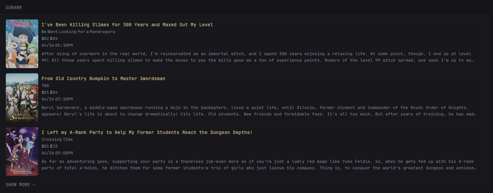

```yml
- type: custom-api
  title: Sonarr
  title-url: https://${SONARR_URL}
  cache: 30m
  options:
    collapse-after: 3
    show-grabbed: false
    timezone: +08
    # cover-proxy: https://${SONARR_URL}/cover
  template: |
    {{ $collapseAfter := .Options.IntOr "collapse-after" 5 }}
    {{ $showGrabbed := .Options.BoolOr "show-grabbed" false }}
    {{ $timezone := concat "2006-01-02T15:04:05" (.Options.StringOr "timezone" "+00") ":00" | parseTime "rfc3339" }}
    {{ $coverProxy := .Options.StringOr "cover-proxy" "" }} {{/* To avoid exposing the API Key */}}
    {{
      $sonarr := newRequest "https://${SONARR_URL}/api/v3/calendar"
        | withParameter "includeSeries" "true"
        | withParameter "start" (offsetNow "-24h" | startOfDay | formatTime "rfc3339")
        | withParameter "end" (offsetNow "24h" | endOfDay | formatTime "rfc3339")
        | withHeader "Accept" "application/json"
        | withHeader "x-api-key" "${SONARR_KEY}"
        | getResponse
    }}
    {{ $sonarrData := $sonarr.JSON.Array "" }}

    {{ $coverEndpoint := "https://${SONARR_URL}/api/v3/mediacover" }}
    {{ $apiKey := concat "?apikey=" "${SONARR_KEY}" }}
    
    <ul class="list list-gap-14 collapsible-container single-line-titles" data-collapse-after="{{ $collapseAfter }}">
      {{ $hasProxy := ne $coverProxy "" }}

      {{ $notificationCount := 0 }}
      {{ if eq (len ($sonarrData)) 0 }}
        <li>No release this day!</li>
      {{ end }}
      {{ range $sonarrData }}

      {{ $coverUrl := "" }}
      {{ if $hasProxy }}
        {{ $coverUrl = concat $coverProxy "/" (.String "seriesId") }}
      {{ else }}
        {{ $coverUrl = concat $coverEndpoint "/" (.String "seriesId") }}
      {{ end }}

      {{ $imageCoverUrl := concat $coverUrl "/poster-500.jpg" }}
      {{ if not $hasProxy }}
        {{ $imageCoverUrl = concat $imageCoverUrl $apiKey }}
      {{ end }}

      <li>
        <div class="flex gap-10 items-start thumbnail-container thumbnail-parent">
          <div>
            <div data-popover-type="html" data-popover-position="above" data-popover-show-delay="500" style="width: 10rem; height: 15rem; align-content: center;">
              <div data-popover-html>
                <div style="margin: 5px;">
                  <strong class="size-h4 color-primary" title="{{ .String "series.title" }}">{{ .String "series.title" }}</strong>
                  <div class="size-h4 text-truncate text-very-compact color-subdue" title="{{ .String "title" }}">{{ .String "title" }}</div>
                  <p class="margin-top-20" style="overflow-y: auto; text-align: justify; max-height: 20rem;">
                    {{ if ne (.String "series.overview") "" }}
                    {{ .String "series.overview" }}
                    {{ else }}
                    TBA
                    {{ end }}
                  </p>
                  {{ if gt (len (.Array "series.genres")) 0 }}
                  <ul class="attachments margin-top-20">
                    {{ range .Array "series.genres" }}
                      <li>{{ .String "" }}</li>
                    {{ end }}
                  </ul>
                  {{ end }}
                </div>
              </div>
              
            </div>
          </div>
          <div class="shrink min-width-0" style="height: 15rem; position: relative; padding-top: 5px; padding-right: 5px;">
            <strong class="size-h4 block text-truncate color-primary" title="{{ .String "series.title" }}">{{ .String "series.title" }}</strong>
            <div class="text-truncate text-very-compact" title="{{ .String "title" }}">{{ .String "title" }}</div>
            <div class="text-very-compact text-truncate">
              <span><span class="color-highlight">S</span>{{ .Int "seasonNumber" | printf "%02d" }}<span class="color-highlight"> E</span>{{ .Int "episodeNumber" | printf "%02d" }}</span>
            </div>
            <div class="text-very-compact text-truncate">
              {{ $airDateUtc := .String "airDateUtc" | parseTime "rfc3339" }}
              <span>{{ ($airDateUtc.In $timezone.Location).Format "01/02 03:04PM" }}</span>
            </div>
            {{ if $showGrabbed }}
            <div class="flex gap-10 items-center" style="position: absolute; bottom: 10px;">
              <a href="https://${SONARR_URL}/series/{{ .String "series.titleSlug" }}#" class="bookmarks-link size-h4 margin-top-5 color-primary" target="_blank" rel="noreferrer">
                <div style="{{ if .Bool "hasFile" }}color: var(--color-positive); border: 1px solid var(--color-positive);{{ else }}color: var(--color-negative); border: 1px solid var(--color-negative);{{ end }} font-weight: bold; padding: 2px 5px; border-radius: 3px; display: inline-block; margin-top: 5px;">
                  {{ if .Bool "hasFile" }}Grabbed{{ else }}Missing{{ end }}
                </div>
              </a>
            </div>
            {{ else }}
            <div class="text-truncate-2-lines margin-top-5">
              {{ .String "series.overview" }}
            </div>
            {{ end }}
          </div>
        </div>
      </li>
      {{ end }}
    </ul>
```

### Environment variables
- `SONARR_URL` - Your Sonarr URL, eg: your-sonarr-domain.com
- `SONARR_KEY` - Your Sonarr API key, it should be under Settings > General > Security

### User variables/options

| Options           | Short Description              |
| ----------------- | ------------------------------ |
| collapse-after    | Glance's collapsible container |
| show-grabbed      | This will show the grab status |
| timezone          | change `+05` to your timezone, eg: +9 will be `+09` |
| cover-proxy       | Avoids exposing the API key    |

- `cover-proxy` - This can be done through your proxy manager of choice. For Nginx Proxy Manager specifically, inside the `Advanced` tab:
    ```nginx
    location /cover/ {
        rewrite ^/cover/(.*)$ /api/v3/mediacover/$1?apikey=your-api-key-here break;
        proxy_pass $forward_scheme://$server:$port;
    }
    ```
    then set your coverProxy:
    ```go
    {{ $coverProxy := "https://${SONARR_URL}/cover" }}
    ```

- `show-grabbed` - will show the grab status and removes the Series overview/description. Still available upon hovering the thumbnail.
- `timezone` - change `+05` to your timezone, eg: +9 will be `+09`.


## Credits
[iwa](https://github.com/iwa) - at https://github.com/glanceapp/glance/pull/112