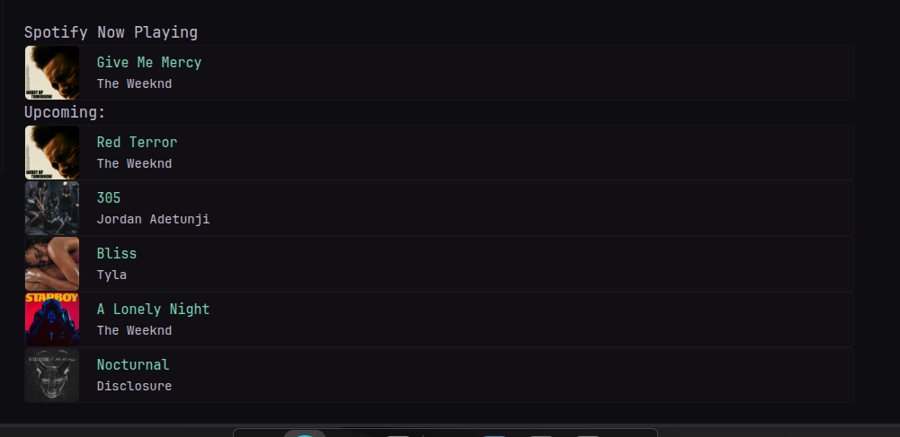

```yaml
- type: custom-api
          title: Spotify
          cache: 30s
          frameless: true
          url: https://${NOW_PLAYING}.web.val.run/
          template: |
            <div class="widget-content-frame flex flex-row justify-start items-center gap-20">
              <div>
                
              </div>
              <div class="flex grow flex-column justify-center" style="padding-right: 1rem">
                <div class="color-positive size-h4">{{ .JSON.String "shortenedName" }}</div>
                <div class="size-h4">{{ .JSON.String "formattedArtist"}}</div>
              </div>
            </div>
```

## Setup

A middle layer is required to handle Spotify API access - a working example is found [here](https://www.val.town/v/spren/NowPlayingGrabber). Three tokens from Spotify are required: `client_id`, `client_secret` and `refresh`. A placeholder icon (`spotify.svg`) is also required - add it to your assets folder.

### API setup

1. Fork the val linked above.
2. Log into [Spotify for Developers](https://developer.spotify.com/)
3. Navigate to the dashboard and create a new app, using `http://localhost:3000` (or whatever) as the callback.
4. Record the `client_id` and `client_secret` and add them as env variables for your val.
5. Grab a scope variable by navigating into this link: `https://accounts.spotify.com/en/authorize?client_id=<your_client_id>&response_type=code&redirect_uri=http%3A%2F%2Flocalhost:3000&scope=user-read-currently-playing`. It will redirect to a localhost url with this format: `http://localhost:3000/?code=<scope_variable>` - store this.
6. [Base64 encode](https://www.base64encode.org/) the string `client_id:clientsecret`.
7. [Run](https://reqbin.com/curl) the following cURL command: `curl -H "Authorization: Basic <base64_encoded_string>"
-d grant_type=authorization_code -d code=<scope_variable> -d redirect_uri=http%3A%2F%2Flocalhost:3000 https://accounts.spotify.com/api/token`
8. Record the `refresh_token` in the resultant `.json` file, and add as env variable.