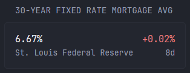

```yaml
- type: custom-api
  title: 30-Year Fixed Rate Mortgage Avg
  cache: 12h
  url: https://api.stlouisfed.org/fred/series/observations?series_id=MORTGAGE30US&api_key=${FRED_API_KEY}&file_type=json&sort_order=desc&limit=2
  template: |
    {{ $latest := .JSON.Float "observations.0.value" }}
    {{ $previous := .JSON.Float "observations.1.value" }}
    {{ $lastObserve := .JSON.String "observations.0.date" }}
    {{ $change := sub $latest $previous }}
    <div class="flex justify-between items-center gap-15">
      <div class="min-width-0">
        <a class="size-h3 block color-highlight" href="https://fred.stlouisfed.org/series/MORTGAGE30US" target="_blank" rel="noreferrer">
          {{ .JSON.String "observations.0.value" }}%
        </a>
        <div class="text-truncate">St. Louis Federal Reserve</div>
      </div>
      <div class="shrink-0">
        <div class="size-h3 text-right {{ if lt $change 0.0 }}color-positive{{ else if gt $change 0.0 }}color-negative{{ end }}">
          {{ printf "%+.2f" $change }}%
        </div>
        <div class="text-right" title="Last change: {{ $lastObserve }}" {{ $lastObserve | parseRelativeTime "DateOnly" }}>
        </div>
      </div>
    </div>
```

## Description
As configured, and with an API key, this custom widget will display the current 30-year fixed rate mortgage average for the US based on the St. Louis Federal Reserve's data.  It does so by comparing the last two observations (rate changes) and displaying the current value as well as the percent change between it and the previous observation.

The rate is a link to the series data on the St. Louis Federal Reserve website.  Below the delta is a relative time since the last rate change.  If you hover over that time, it will show the date of the last change (observation).

## Setup

1. Get an API key: https://fred.stlouisfed.org/docs/api/api_key.html
1. Set the environment variable `FRED_API_KEY` to your API key

### Choosing a different series
> Note: using a different series than `MORTGAGE30US` may require modifications to the Go template

1. Pick a series: https://fred.stlouisfed.org/tags/series
1. Grab the series ID from the series data URL
    1. Example: "The 30-Year Fixed Rate Mortgage Average in the United States" is https://fred.stlouisfed.org/series/MORTGAGE30US where `MORTGAGE30US` is the series ID
1. Swap the two instances of `MORTGAGE30US` for your series ID

## Environment variables
- `FRED_API_KEY` - your individual API key from https://fred.stlouisfed.org/docs/api/api_key.html