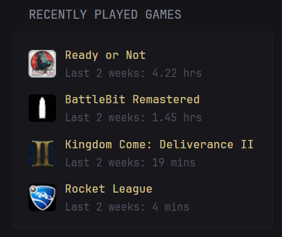
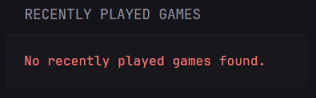

## Screenshots
#### Normal


#### Error


```yaml
- type: custom-api
  title: Recently Played Games
  cache: 1h
  url: http://api.steampowered.com/IPlayerService/GetRecentlyPlayedGames/v0001/?key=${STEAM_API_KEY}&steamid=${STEAM_USER}&format=json
  template: |
    <div>
      {{ if eq .Response.StatusCode 200 }}
        {{ $games := .JSON.Array "response.games" }}
        {{ if gt (len $games) 0 }}
          <ul class="list list-gap-10 collapsible-container" data-collapse-after="5">
            {{ range $games }}
              <li style="display: flex; align-items: center;">
                
                <div>
                  <span class="size-base color-primary">{{ .String "name" }}</span><br>
                  <span class="size-h5 color-subdue">
                    Last 2 weeks: 
                    {{ if gt (toFloat (.Int "playtime_2weeks")) 60.0 }}
                      {{ printf "%.2f hrs" (div (toFloat (.Int "playtime_2weeks")) 60.0) }}
                    {{ else }}
                      {{ .Int "playtime_2weeks" }} mins
                    {{ end }}
                  </span>
                </div>
              </li>
            {{ end }}
          </ul>
        {{ else }}
          <p class="color-negative">No recently played games found.</p>
        {{ end }}
      {{ else }}
        <p class="color-negative">An unexpected error occurred. Please try again later.</p>
      {{ end }}
    </div> 
```

## Environment variables

- `STEAM_API_KEY` - the Steam API key, which can be obtained from [here](https://steamcommunity.com/dev/apikey)
- `STEAM_USER` - the Steam User ID 64.
