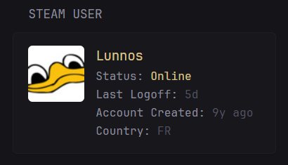
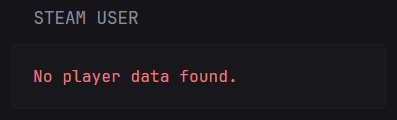

## Screenshots
#### Normal


#### Error


```yaml
- type: custom-api
  title: Steam User
  cache: 1h
  url: https://api.steampowered.com/ISteamUser/GetPlayerSummaries/v0002/?key=${STEAM_API_KEY}&steamids=${STEAM_USER}
  template: |
    <div class="steam-user-stats" style="display: flex; align-items: flex-start;">
      {{ $players := .JSON.Array "response.players" }}
      {{ if gt (len $players) 0 }}
        {{ $player := index $players 0 }}
        <div style="flex-shrink: 0; margin-right: 1em; display: flex; flex-direction: column; align-items: center;">
          <a href="{{ $player.String "profileurl" }}"></a>
        </div>
        <div>
          <h2 class="size-h3 color-primary">{{ $player.String "personaname" }}</h2>
          <p>Status: 
            {{ $status := $player.Int "personastate" }}
            {{ if eq $status 0 }}<span class="color-negative">Offline</span>{{ end }}
            {{ if eq $status 1 }}<span class="color-positive">Online</span>{{ end }}
            {{ if eq $status 2 }}<span class="color-highlight">Busy</span>{{ end }}
            {{ if eq $status 3 }}<span class="color-subdue">Away</span>{{ end }}
            {{ if eq $status 4 }}<span class="color-subdue">Snooze</span>{{ end }}
            {{ if eq $status 5 }}<span class="color-primary">Looking to trade</span>{{ end }}
            {{ if eq $status 6 }}<span class="color-primary">Looking to play</span>{{ end }}
          </p>
          <p>Last Logoff: <span class="color-subdue" data-dynamic-relative-time="{{ $player.Int "lastlogoff" }}"></span></p>
          <p>Account Created: <span class="color-subdue" data-dynamic-relative-time="{{ $player.Int "timecreated" }}"></span></p>
          <p>Country: <span class="color-subdue">{{ $player.String "loccountrycode" }}</span></p>
        </div>
      {{ else }}
        <p class="color-negative">No player data found.</p>
      {{ end }}
    </div>
```

## Environment variables

- `STEAM_API_KEY` - the Steam API key, which can be obtained from [here](https://steamcommunity.com/dev/apikey)
- `STEAM_USER` - the Steam User ID 64.
