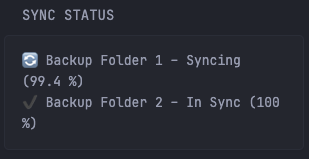

Need to replace <FOLDER_X_ID> with the Folder ID from your Syncthing instance:


```yaml
- type: custom-api
  title: "Sync Status"
  cache: 300s                 # refresh interval
  headers:                   # auth for *every* request
    X-API-Key: ${SYNCTHING_API_KEY}
  # ---------------- Main request: discover folders ----------------
  url: "${SYNCTHING_URL}/rest/system/config"
  # ---------------- Sub-requests: one per folder ------------------
  subrequests:
    <FOLDER_1_ID>:
      url: "${SYNCTHING_URL}/rest/db/completion"
      parameters: { folder: "<FOLDER_1_ID>" }
      headers:    { X-API-Key: ${SYNCTHING_API_KEY} }
    <FOLDER_2_ID>:
      url: "${SYNCTHING_URL}/rest/db/completion"
      parameters: { folder: "<FOLDER_2_ID>" }
      headers:    { X-API-Key: ${SYNCTHING_API_KEY} }
  # ---------------- Options visible to the template ---------------
  options:
    debug: false             # switch to true to show JSON <details>
    folders:
      - id: <FOLDER_1_ID>
        name: "Backup Folder 1"
        enabled: true
      - id: <FOLDER_2_ID>
        name: "Backup Folder 2"
        enabled: true
  # ---------------- Template defined earlier ----------------------
  template: |-
    <!-- Syncthing folder-by-folder progress --------------------------------- -->
    {{ $debug   := or (.Options.debug) false }}
    {{ $folders := .Options.folders }}

    {{ if ne .Response.StatusCode 200 }}
      <!-- The *main* request failed (e.g. /rest/system/config).               -->
      <p class="text-danger">⚠️ Syncthing API unreachable ({{ .Response.Status }})</p>
    {{ else }}
      <ul class="list">
        {{ range $folders }}
          {{ $id   := .id }}
          {{ $name := .name }}
          {{ if .enabled }}
            {{ $r := $.Subrequest $id }}
            {{ if eq $r.Response.StatusCode 200 }}
              {{ $comp := $r.JSON.Float "completion" }}
              <li>
                <span class="{{ if eq $comp 100.0 }}text-success{{ else if gt $comp 0.0 }}text-info{{ else }}text-danger{{ end }}">
                  {{ if eq $comp 100.0 }}✔️
                  {{ else if gt $comp 0.0 }}🔄
                  {{ else }}⚠️
                  {{ end }}
                  {{ $name }} – 
                  {{ if eq $comp 100.0 }}
                    In Sync (100 %)
                  {{ else if gt $comp 0.0 }}
                    Syncing ({{ printf "%.1f" $comp }} %)
                  {{ else }}
                    Unreachable
                  {{ end }}
                </span>
              </li>
            {{ else }}
              <!-- Sub-request didn’t return 200 -->
              <li><span class="text-danger">⚠️ {{ $name }} – Unreachable</span></li>
            {{ end }}
          {{ end }}
        {{ end }}
      </ul>
    {{ end }}

    {{/* ---------- OPTIONAL DEBUG BLOCK ---------- */}}
    {{ if $debug }}
      <details style="margin-top:0.5rem">
        <summary>Debug – raw Syncthing JSON</summary>
        <pre style="font-size:10px">
    {{ (printf "%+v" .JSON) }}
        </pre>
      </details>
    {{ end }}
```

## Environment variables

- `SYNCTHING_URL` - the URL of the Syncthing instance
- `SYNCTHING_API_KEY` - the API key of the server which can be found in `Settings -> General -> API Key`