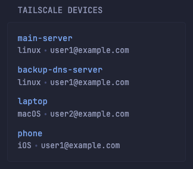

```yaml
- type: custom-api
  title: Tailscale Devices
  title-url: https://login.tailscale.com/admin/machines
  url: https://api.tailscale.com/api/v2/tailnet/-/devices
  headers:
    Authorization: Bearer ${TAILSCALE_API_KEY}
  cache: 10m
  template: |
    <style>
      .device-info-container {
        position: relative;
        overflow: hidden;
        height: 1.5em;
      }

      .device-info {
        display: flex;
        transition: transform 0.2s ease, opacity 0.2s ease;
      }

      .device-ip {
        position: absolute;
        top: 0;
        left: 0;
        transform: translateY(-100%);
        opacity: 0;
        transition: transform 0.2s ease, opacity 0.2s ease;
      }

      .device-info-container:hover .device-info {
        transform: translateY(100%);
        opacity: 0;
      }

      .device-info-container:hover .device-ip {
        transform: translateY(0);
        opacity: 1;
      }

      .update-indicator {
        width: 8px;
        height: 8px;
        border-radius: 50%;
        background-color: var(--color-primary);
        display: inline-block;
        margin-left: 4px;
        vertical-align: middle;
      }

      .offline-indicator {
        width: 8px;
        height: 8px;
        border-radius: 50%;
        background-color: var(--color-negative);
        display: inline-block;
        margin-left: 4px;
        vertical-align: middle;
      }

      .device-name-container {
        display: flex;
        align-items: center;
        gap: 8px;
      }

      .indicators-container {
        display: flex;
        align-items: center;
        gap: 4px;
      }
    </style>
    <ul class="list list-gap-10 collapsible-container" data-collapse-after="4">
      {{ range .JSON.Array "devices" }}
      <li>
        <div class="flex items-center gap-10">
          <div class="device-name-container grow">
            <span class="size-h4 block text-truncate color-primary">
              {{ findMatch "^([^.]+)" (.String "name") }}
            </span>
            <div class="indicators-container">
              {{ if (.Bool "updateAvailable") }}
              <span class="update-indicator" data-popover-type="text" data-popover-text="Update Available"></span>
              {{ end }}

              {{ $lastSeen := .String "lastSeen" | parseTime "rfc3339" }}
              {{ if not ($lastSeen.After (offsetNow "-10s")) }}
              {{ $lastSeenTimezoned := $lastSeen.In now.Location }}
              <span class="offline-indicator" data-popover-type="text"
                data-popover-text="Offline - Last seen {{ $lastSeenTimezoned.Format " Jan 2 3:04pm" }}"></span>
              {{ end }}

            </div>
          </div>
        </div>
        <div class="device-info-container">
          <ul class="list-horizontal-text device-info">
            <li>{{ .String "os" }}</li>
            <li>{{ .String "user" }}</li>
          </ul>
          <div class="device-ip">
            {{ .String "addresses.0"}}
          </div>
        </div>
      </li>
      {{ end }}
    </ul>

```

## Environment variables

- `TAILSCALE_API_KEY`: Your Tailscale API key
- `TZ`: For correct times, the widget uses the container's timezone. If not already supplied, you can use this variable to provide your timezone.
