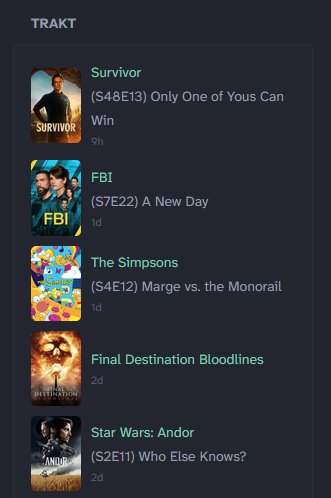

## Preview


This widget uses the Trakt API, therefore no paid Trakt subscription is required.

> [!NOTE]
>
> This widget uses synchronous API calls introduced in `Glance v0.8.0`.
> Ensure you update to at least this version.

## Environment variables
- `TRAKT_API_KEY` - Your Trakt API Key.  It is listed as the "Client ID" for any API app you create
- `TRAKT_USERNAME` - The Trakt username to show history for
- `TMDB_API_KEY` - TMDB API Key (to show thumbnail art). It is listed as the "API Key" on your TMDB API dashboard

## Options
These entries can be configured near the beginning of the `template` section of the Widget YAML:

| Setting | Description | Default | Type |
|:-------:|:----:|:--------:|:------------:|
| collapseAfter | Number of items to show before SHOW MORE appears | 3 | integer |
| showEpisodeNumber | Visibility for S##E## description on TV Shows | true | boolean |
| showMovieYear | Show year next to movie title | false | boolean |
| showTVYear | Show starting year next to TV Show title | false | boolean |

## Widget YAML
```
- type: custom-api
  title: Trakt
  cache: 30m
  url: https://api.trakt.tv/users/${TRAKT_USERNAME}/history
  parameters:
	type: shows,movies
	limit: 10
	sort: watched_at,desc
  headers:
	trakt-api-key: ${TRAKT_API_KEY}
	trakt-api-version: 2
	User-Agent: GlanceWidget
	Accept: application/json
  template: |
	{{/* USER VARIABLES BEGIN */}}
		{{/* Number of items to show before SHOW MORE appears */}}
		{{ $collapseAfter := 3 }}
		
		{{/* Set to false to hide S#E# episode numbers on TV Shows */}}
		{{ $showEpisodeNumber := true }}
		
		{{/* Set to true to show year on Movies */}}
		{{ $showMovieYear := false }}
		
		{{/* Set to true to show year on TV Shows */}}
		{{ $showTVYear := false }}
	{{/* USER VARIABLES END */}}
	
	<ul class="list list-gap-10 collapsible-container" data-collapse-after="{{ $collapseAfter }}">
	{{ range .JSON.Array "" }}

		{{ $tmdbID := "" }}
		{{ $tmdbData := "" }}
		{{ $mediaType := .String "type" }}
		{{ $tmdbPageUrl := "" }}
		{{ $imageUrlBase := "https://image.tmdb.org/t/p/w185" }}
		{{ $posterPath := "" }}
		{{ $posterUrl := "" }}

		{{ if eq $mediaType "episode" }}
			{{ $tmdbID = .String "show.ids.tmdb" }}
			{{
				$tmdbData = newRequest (concat "https://api.themoviedb.org/3/tv/" $tmdbID "?api_key=" "${TMDB_API_KEY}")
				| withHeader "Accept" "application/json"
				| getResponse
			}}
			{{ $tmdbPageUrl = concat "https://www.themoviedb.org/tv/" $tmdbID }}
		{{ else }}
			{{ $tmdbID = .String "movie.ids.tmdb" }}
			{{
				$tmdbData = newRequest (concat "https://api.themoviedb.org/3/movie/" $tmdbID "?api_key=" "${TMDB_API_KEY}")
				| withHeader "Accept" "application/json"
				| getResponse
			}}
			{{ $tmdbPageUrl = concat "https://www.themoviedb.org/movie/" $tmdbID }}
		{{ end }}

		{{ if $tmdbData }}
			{{ $posterPath = $tmdbData.JSON.String "poster_path" }}
			{{ if $posterPath }}
				{{ $posterUrl = concat $imageUrlBase $posterPath }}
			{{ end }}
		{{ end }}
	  
		<li class="flex items-center gap-10">
		  <a href={{ $tmdbPageUrl }} target="_blank">
		  
		  </a>
		  <div class="flex-1">
			<a href={{ $tmdbPageUrl }} target="_blank">
			<p class="color-positive size-h5">{{ .String "show.title" }}{{ .String "movie.title" }}
			{{ if eq (.String "type") "movie" }}
				{{ if $showMovieYear }}
				 ({{ .String "movie.year" }})
				{{ end }}
			{{ else }}
				{{ if $showTVYear }}
				 ({{ .String "show.year" }})
				{{ end }}
			{{ end }}
			</p>
			</a>
			<a href={{ $tmdbPageUrl }} target="_blank">
				{{ if eq (.String "type") "episode" }}
				<p class="size-h5">
				{{ if $showEpisodeNumber }}
				(S{{ .String "episode.season" }}E{{ .String "episode.number" }}) 
				{{ end }}
				{{ .String "episode.title" }}
				</p>
				{{ end }}
			 </a>
			<p class="size-h6">
				<span class="color-subdue" {{ .String "watched_at" | parseRelativeTime "2006-01-02T15:04:05.000Z" }}></span>
			</p>
		  </div>
		</li>
	  {{ end }}
	  </ul>
```
